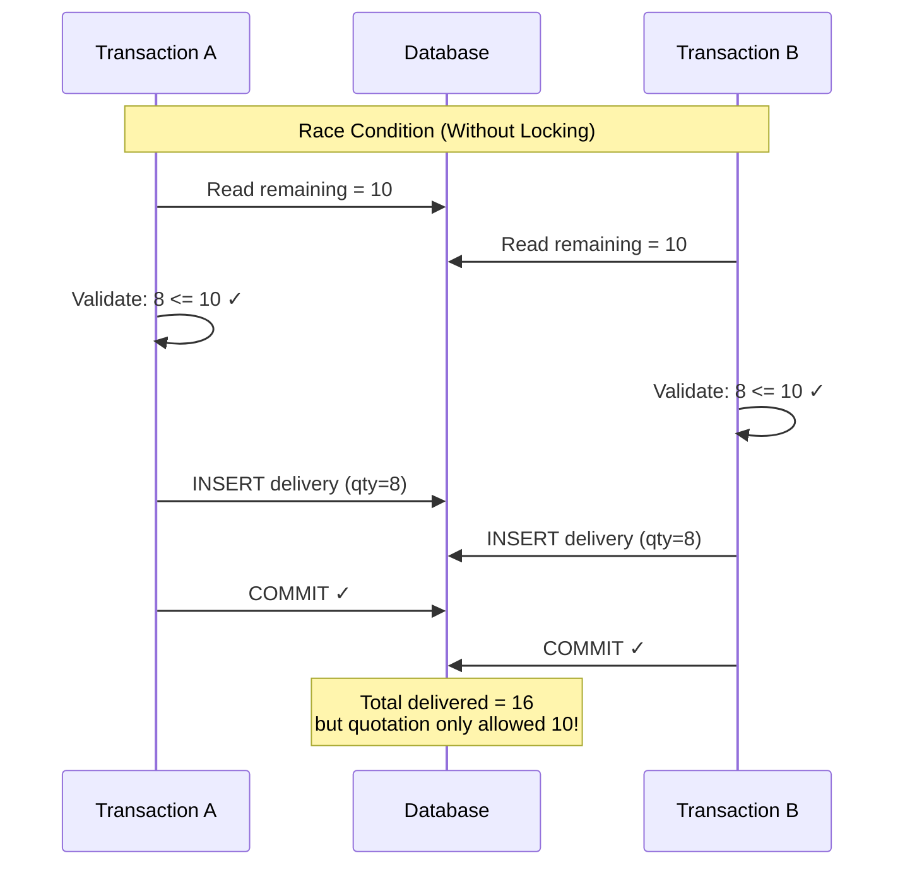
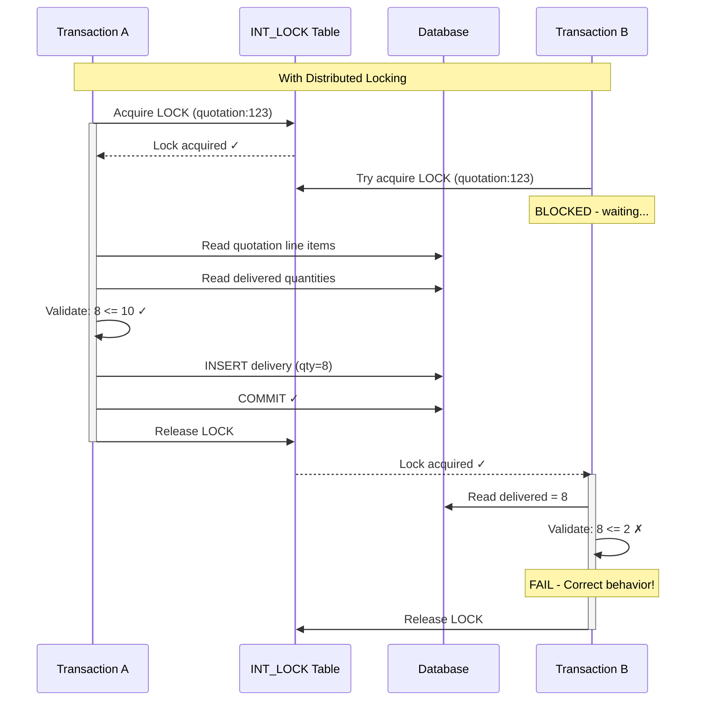
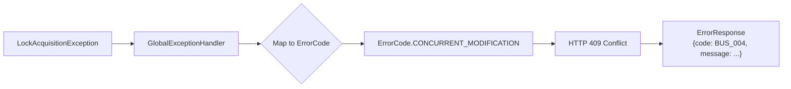
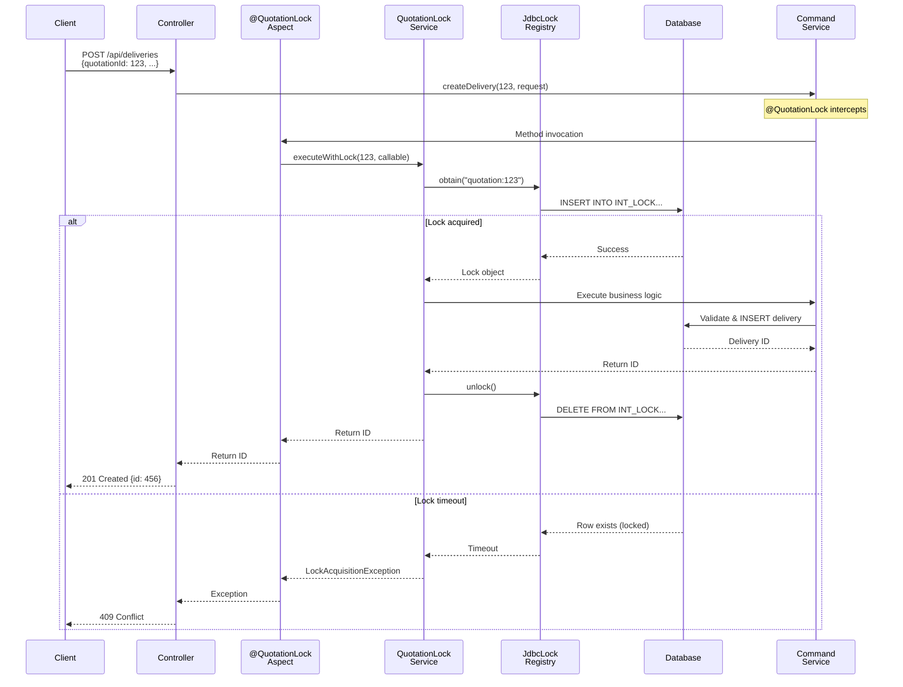
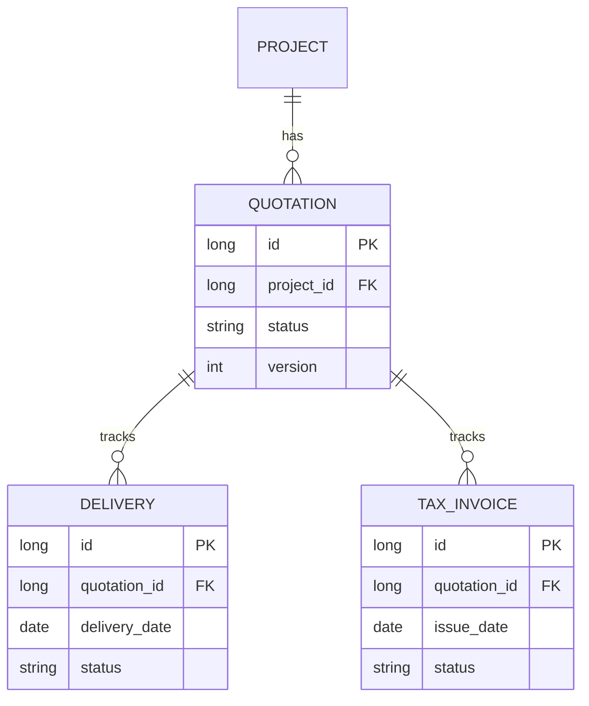
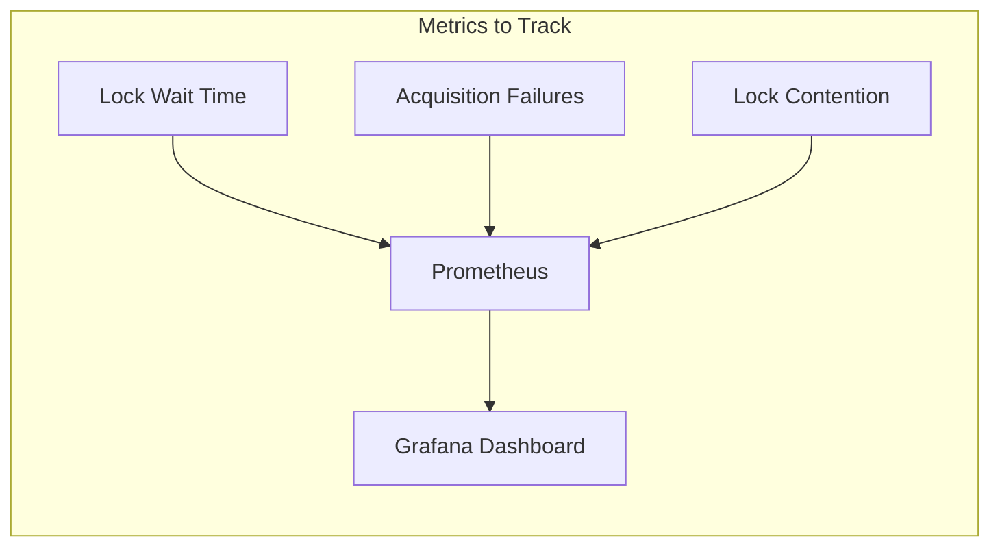

# Delivery and Invoice Concurrency Control Strategy

## Overview

This document describes the distributed locking strategy implemented to prevent race conditions during concurrent
delivery and invoice creation. The solution uses Spring Integration's `JdbcLockRegistry` with an **AOP annotation pattern**
that cleanly separates locking concerns from business logic.

## Architecture Overview

```mermaid
graph TB
    subgraph "API Layer"
        DC[DeliveryController]
        IC[InvoiceController]
    end

    subgraph "Service Layer"
        DCS[DeliveryCommandService]
        ICS[InvoiceCommandService]
    end

    subgraph "Lock Infrastructure"
        QLA[QuotationLockAspect<br/>@Around]
        QLS[QuotationLockService]
        LR[JdbcLockRegistry]
    end

    subgraph "Database"
        IL[(INT_LOCK Table)]
        DT[(Deliveries)]
        IT[(Tax Invoices)]
    end

    DC --> DCS
    IC --> ICS
    DCS -.->|@QuotationLock| QLA
    ICS -.->|@QuotationLock| QLA
    QLA --> QLS
    QLS --> LR
    LR --> IL
    DCS --> DT
    ICS --> IT
```

## Problem Statement

### The Race Condition

When recording a delivery or invoice, the system calculates remaining quantities:

```
Remaining Deliverable = Quotation Quantity - Already Delivered Quantity
Remaining Invoiceable = Delivered Quantity - Already Invoiced Quantity
```

Without proper synchronization, the following race condition can occur:



### Business Impact

- **Over-delivery**: Delivering more products than quoted
- **Over-invoicing**: Invoicing more than delivered
- **Financial discrepancy**: Accounts receivable inconsistencies
- **Inventory problems**: Stock levels become inconsistent

## Solution: Quotation-Level Distributed Locking

### Architecture Decision

We use **quotation-level locking** (not project-level) because:

| Aspect | Project-Level Lock | Quotation-Level Lock (Chosen) |
|--------|-------------------|------------------------------|
| **Granularity** | Coarse - blocks all quotations in project | Fine - only blocks operations on same quotation |
| **Validation Scope** | Mismatch - validation is quotation-scoped | Match - lock key matches validation queries |
| **Concurrency** | Low - different quotations blocked | High - different quotations can proceed |
| **Domain Alignment** | Weak - deliveries/invoices belong to quotations | Strong - domain model alignment |

### Lock Key Format

```
quotation:{quotationId}
```

Example: `quotation:123` locks all operations against quotation ID 123.

### How Locking Prevents Race Conditions



## Implementation

### Component Architecture

```mermaid
graph LR
    subgraph "Annotation Layer"
        QL[@QuotationLock]
        PL[@ProjectLock]
    end

    subgraph "AOP Layer"
        QLA[QuotationLockAspect]
        PLA[ProjectLockAspect]
    end

    subgraph "Service Layer"
        QLS[QuotationLockService]
        PLS[ProjectLockService]
    end

    subgraph "Spring Integration"
        LRC[LockRegistryConfig]
        JLR[JdbcLockRegistry]
    end

    subgraph "Database"
        ILT[(INT_LOCK)]
    end

    QL --> QLA
    PL --> PLA
    QLA --> QLS
    PLA --> PLS
    QLS --> JLR
    PLS --> JLR
    LRC --> JLR
    JLR --> ILT
```

### Key Components

```
shared/lock/
├── LockRegistryConfig.java        # Spring Integration JDBC configuration
├── QuotationLock.java             # Annotation for quotation-level locking
├── QuotationLockAspect.java       # AOP aspect that intercepts @QuotationLock
├── QuotationLockService.java      # Template API for quotation-level locking
├── ProjectLock.java               # Annotation for project-level locking (legacy)
├── ProjectLockAspect.java         # AOP aspect for @ProjectLock
├── ProjectLockService.java        # Template API for project-level locking
└── LockAcquisitionException.java  # Custom exception for lock failures
```

### 1. QuotationLock Annotation

**`QuotationLock.java`**

```java
@Target(ElementType.METHOD)
@Retention(RetentionPolicy.RUNTIME)
public @interface QuotationLock {
    /**
     * The name of the method parameter containing the quotation ID.
     * Defaults to "quotationId".
     */
    String quotationIdParam() default "quotationId";
}
```

### 2. QuotationLockAspect (AOP)

**`QuotationLockAspect.java`**

```java
@Aspect
@Component
@Order(0) // Execute before @Transactional
public class QuotationLockAspect {

    private final QuotationLockService quotationLockService;

    @Around("@annotation(quotationLock)")
    public Object aroundQuotationLock(ProceedingJoinPoint joinPoint,
                                       QuotationLock quotationLock) throws Throwable {
        Long quotationId = extractQuotationId(joinPoint, quotationLock.quotationIdParam());

        return quotationLockService.executeWithLock(quotationId, () -> {
            try {
                return joinPoint.proceed();
            } catch (RuntimeException | Error e) {
                throw e;
            } catch (Throwable e) {
                throw new RuntimeException("Unexpected checked exception", e);
            }
        });
    }
}
```

### 3. Lock Acquisition Flow

```mermaid
flowchart TD
    A[Method Call with @QuotationLock] --> B{Extract quotationId<br/>from parameters}
    B --> C[Build lock key:<br/>quotation:{id}]
    C --> D{Try acquire lock<br/>timeout: 5s}
    D -->|Success| E[Execute business logic]
    D -->|Timeout| F[Throw LockAcquisitionException]
    E --> G{Business logic<br/>completed?}
    G -->|Success| H[Release lock]
    G -->|Exception| I[Release lock]
    H --> J[Return result]
    I --> K[Propagate exception]
    F --> L[Return 409 Conflict]
```

### 4. Clean Business Logic

**`DeliveryCommandService.java`**

```java
@Service
@Transactional
public class DeliveryCommandService {

    /**
     * Creates a delivery with quotation-level locking.
     * Lock is acquired automatically via @QuotationLock annotation.
     */
    @QuotationLock
    public Long createDelivery(Long quotationId, CreateDeliveryRequest request, Long userId) {
        // Pure business logic - no locking awareness
        Quotation quotation = quotationRepository.findByIdWithLineItems(quotationId)
                .orElseThrow(() -> new ResourceNotFoundException("Quotation", quotationId));

        // Validate and create delivery
        Delivery delivery = quotation.createDelivery(quotationDeliveryGuard, ...);
        return deliveryRepository.save(delivery).getId();
    }

    /**
     * Reassigns a delivery to a different quotation.
     * Lock is acquired on the TARGET quotation to prevent over-delivery.
     */
    @QuotationLock
    public Long reassignToQuotation(Long deliveryId, Long quotationId) {
        // Business logic protected by quotation lock
        Delivery delivery = deliveryRepository.findById(deliveryId)...;
        Quotation quotation = quotationRepository.findById(quotationId)...;

        quotationDeliveryGuard.validateAndThrow(quotation, ...);
        delivery.reassignToQuotation(quotationId);
        return deliveryId;
    }
}
```

**`InvoiceCommandService.java`**

```java
@Service
@Transactional
public class InvoiceCommandService {

    /**
     * Creates an invoice with quotation-level locking.
     */
    @QuotationLock
    public Long createInvoice(Long quotationId, CreateInvoiceRequest request, Long userId) {
        // Pure business logic - no locking awareness
        Quotation quotation = quotationRepository.findByIdWithLineItems(quotationId)...;

        // Validate and create invoice
        TaxInvoice invoice = quotation.createInvoice(quotationInvoiceGuard, ...);
        return invoiceRepository.save(invoice).getId();
    }
}
```

### 5. Database Schema

**Flyway Migration: `V15__create_distributed_lock_table.sql`**

```sql
CREATE TABLE IF NOT EXISTS INT_LOCK
(
    LOCK_KEY     VARCHAR(255) NOT NULL,
    REGION       VARCHAR(100) NOT NULL,
    CLIENT_ID    VARCHAR(255) NOT NULL,
    CREATED_DATE TIMESTAMP    NOT NULL DEFAULT CURRENT_TIMESTAMP,
    CONSTRAINT INT_LOCK_PK PRIMARY KEY (LOCK_KEY, REGION)
);
```

### 6. Exception Handling



**`GlobalExceptionHandler.java`**

```java
@ExceptionHandler(LockAcquisitionException.class)
public ResponseEntity<ErrorResponse> handleLockAcquisitionFailure(
        LockAcquisitionException ex, WebRequest request) {

    ErrorResponse errorResponse = ErrorResponse.of(
            ErrorCode.CONCURRENT_MODIFICATION,
            ex.getMessage(),
            request.getDescription(false).replace("uri=", "")
    );

    return ResponseEntity.status(HttpStatus.CONFLICT).body(errorResponse);
}
```

## Configuration

### Lock Parameters

| Parameter       | Value              | Description                           |
|-----------------|--------------------|---------------------------------------|
| Lock TTL        | 30 seconds         | Maximum time a lock can be held       |
| Acquire Timeout | 5 seconds          | Maximum time to wait for lock         |
| Region          | `PROJECT`          | Namespace for all locks               |
| Lock Key Format | `quotation:{id}`   | Per-quotation granularity             |

### Why These Values?

- **TTL (30s)**: Long enough for complex validation, short enough to recover from crashes
- **Timeout (5s)**: Good UX balance - not too long to wait, fast-fail behavior
- **Per-quotation**: Correct granularity - validation queries are quotation-scoped

## API Changes

### Delivery Creation

**Before (project-scoped):**
```
POST /api/deliveries?projectId={projectId}
Body: { quotationId: 123, ... }
```

**After (quotation-scoped):**
```
POST /api/deliveries
Body: { quotationId: 123, ... }
```

The `quotationId` in the request body is now the primary identifier for both locking and validation.

### Invoice Creation

```
POST /api/invoices
Body: { quotationId: 123, ... }
```

## Request Flow Diagram



## Error Response

When lock acquisition fails, clients receive:

```json
{
  "timestamp": "2024-01-11T10:30:00",
  "status": 409,
  "code": "BUS_004",
  "message": "Another operation is in progress for quotation 123. Please try again.",
  "path": "/api/deliveries"
}
```

**Frontend handling:**

```typescript
if (error.status === 409 && error.code === 'BUS_004') {
    toast.warning('Another user is updating this quotation. Please try again.');
}
```

## Benefits of This Approach

### 1. Clean Separation of Concerns

```mermaid
graph TB
    subgraph "Without AOP"
        A1[Business Logic] --> A2[Lock Acquisition]
        A2 --> A3[Validation]
        A3 --> A4[Lock Release]
        A4 --> A5[Error Handling]
        style A2 fill:#f96
        style A4 fill:#f96
    end

    subgraph "With AOP (Current)"
        B1[Business Logic] --> B2[Validation]
        B3[@QuotationLock] -.->|Decorates| B1
        style B3 fill:#9f9
    end
```

- Business logic has no locking awareness
- Locking is declarative via annotations
- AOP handles cross-cutting concern

### 2. Domain Alignment

- Lock scope matches validation scope (quotation)
- More intuitive for developers
- Fewer accidental lock conflicts

### 3. Better Concurrency

- Different quotations in the same project can be processed concurrently
- Only truly conflicting operations are serialized

### 4. Testability

- Can mock `QuotationLockService` in unit tests
- Business logic testable without database locks

### 5. Consistency

- Both delivery and invoice operations use the same locking strategy
- Prevents mixed patterns and confusion

## Methods Using @QuotationLock

| Service | Method | Parameter |
|---------|--------|-----------|
| `DeliveryCommandService` | `createDelivery` | `quotationId` |
| `DeliveryCommandService` | `reassignToQuotation` | `quotationId` |
| `InvoiceCommandService` | `createInvoice` | `quotationId` |

## Migration from @ProjectLock

The `@ProjectLock` annotation is retained for backwards compatibility but `@QuotationLock` is preferred
for delivery and invoice operations. The key difference:

| Aspect | @ProjectLock | @QuotationLock |
|--------|--------------|----------------|
| Lock Key | `project:{projectId}` | `quotation:{quotationId}` |
| Parameter | `projectIdParam` | `quotationIdParam` |
| Use Case | Project-level operations | Delivery/Invoice operations |

## Quotation Version Tracking

Each delivery and invoice tracks the quotation version it was created against:

```java
// Delivery entity
@Column(name = "quotation_id")
private Long quotationId;

// TaxInvoice entity
@Column(name = "quotation_id")
private Long quotationId;
```

### Entity Relationship



### Conflict Detection

Before approving a new quotation version, check for conflicts:

```
GET /api/quotations/{id}/delivery-conflicts
```

### Delivery Reassignment

After approving a new quotation version, reassign deliveries:

```
POST /api/deliveries/{id}/reassign?quotationId={quotationId}
```

This endpoint also uses `@QuotationLock` to ensure consistent validation during reassignment.

## Future Considerations

### 1. Redis Backend

For multi-instance deployment:

```java
@Bean
@Profile("redis")
public RedisLockRegistry redisLockRegistry(RedisConnectionFactory factory) {
    return new RedisLockRegistry(factory, "QUOTATION");
}
```

### 2. Monitoring

Consider adding metrics:

- Lock wait time histogram
- Lock acquisition failure rate
- Concurrent lock contention per quotation



## References

- [Spring Integration Distributed Locks](https://docs.spring.io/spring-integration/reference/distributed-locks.html)
- [Spring Integration JDBC Lock Registry](https://docs.spring.io/spring-integration/reference/jdbc.html#jdbc-lock-registry)
