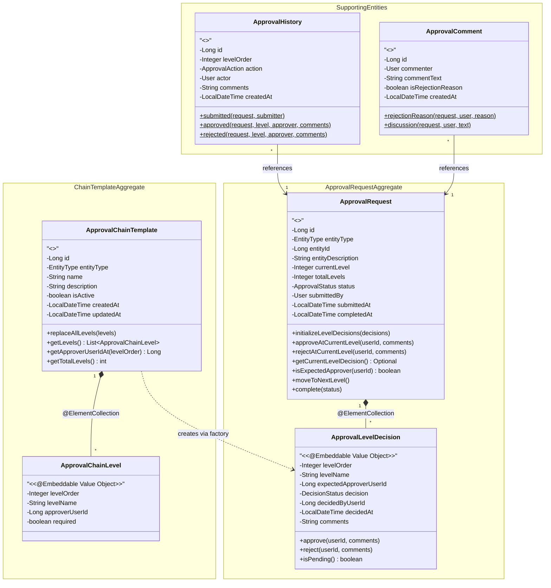
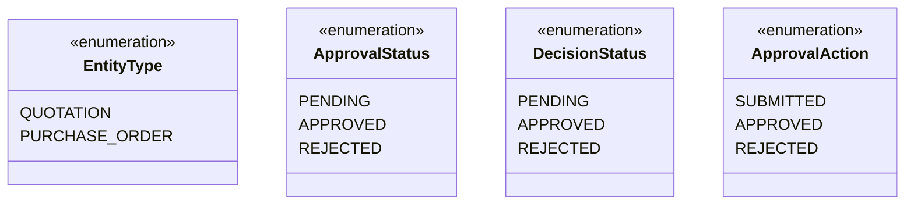
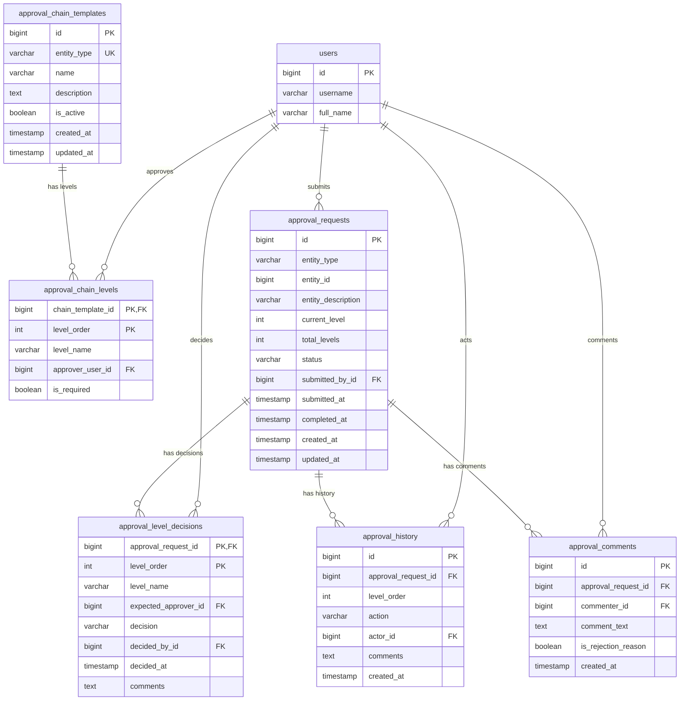
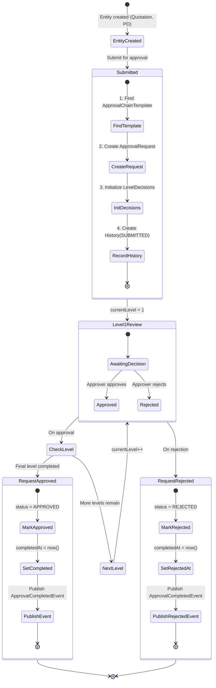
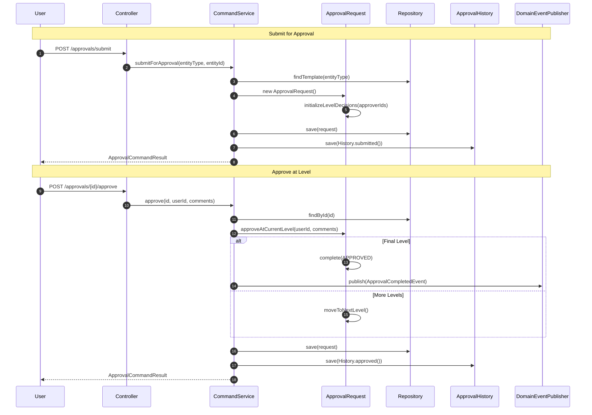

# Approval Domain Model

This document describes the domain model for the approval (결재) workflow system in WellKorea ERP.

## Overview

The approval system supports multi-level sequential approval workflows for business entities (e.g., Quotations, Purchase Orders). It follows Domain-Driven Design (DDD) principles with properly defined aggregate boundaries.

## Domain Diagram



## Enumerations



## Aggregates

### 1. ApprovalChainTemplate Aggregate (Configuration)

Defines the approval chain structure for an entity type. This is the **configuration** that determines how approval workflows should proceed.

| Component | Type | Description |
|-----------|------|-------------|
| `ApprovalChainTemplate` | Aggregate Root (@Entity) | Approval chain definition per entity type |
| `ApprovalChainLevel` | Value Object (@Embeddable) | Individual level in the chain (팀장, 부서장, 사장) |

**Key Characteristics:**
- One template per entity type (QUOTATION, PURCHASE_ORDER)
- Levels are ordered (1 → 2 → 3)
- Admin configures approvers for each level
- Changes affect future approval requests only

**Aggregate Methods:**
```java
// Replace all levels atomically
template.replaceAllLevels(List<ApprovalChainLevel> newLevels);

// Access levels (unmodifiable)
List<ApprovalChainLevel> levels = template.getLevels();

// Query specific level
Long approverId = template.getApproverUserIdAt(levelOrder);

// Factory method - creates level decisions for ApprovalRequest (snapshots level names)
List<ApprovalLevelDecision> decisions = template.createLevelDecisions();
```

### 2. ApprovalRequest Aggregate (Runtime Instance)

Tracks the approval workflow for a specific entity (e.g., Quotation #123). This is the **runtime instance** created when approval is initiated.

| Component | Type | Description |
|-----------|------|-------------|
| `ApprovalRequest` | Aggregate Root (@Entity) | Approval workflow instance |
| `ApprovalLevelDecision` | Value Object (@Embeddable) | Decision record at each level |

**Key Characteristics:**
- One active request per entity (unique constraint on entity_type + entity_id)
- Level decisions are immutable once made
- Status progresses: PENDING → APPROVED or REJECTED
- All operations go through the aggregate root
- **No FK to ApprovalChainTemplate** - completely decoupled after creation

**Aggregate Methods:**
```java
// Initialize decisions from factory-created list (snapshots level names from template)
request.initializeLevelDecisions(template.createLevelDecisions());

// Approve/reject at current level
request.approveAtCurrentLevel(userId, comments);
request.rejectAtCurrentLevel(userId, comments);

// Query methods
boolean canApprove = request.isExpectedApprover(userId);
Optional<ApprovalLevelDecision> decision = request.getCurrentLevelDecision();

// State transitions
request.moveToNextLevel();
request.complete(ApprovalStatus.APPROVED);
```

### 3. Supporting Entities (Separate Aggregates)

These entities reference ApprovalRequest but are managed independently:

| Entity | Purpose | Lifecycle |
|--------|---------|-----------|
| `ApprovalHistory` | Audit trail of actions | Created on each action (SUBMITTED, APPROVED, REJECTED) |
| `ApprovalComment` | Discussion/rejection reasons | Created by users during review |

## Value Objects (Embeddables)

### ApprovalChainLevel

```java
@Embeddable
public class ApprovalChainLevel {
    private Integer levelOrder;      // 1, 2, 3...
    private String levelName;        // "팀장", "부서장", "사장"
    private Long approverUserId;     // User ID (not @ManyToOne)
    private boolean required;        // Can this level be skipped?
}
```

**Table:** `approval_chain_levels`
- Composite PK: `(chain_template_id, level_order)`
- No separate ID column (part of aggregate)

### ApprovalLevelDecision

```java
@Embeddable
public class ApprovalLevelDecision {
    private Integer levelOrder;           // 1, 2, 3...
    private String levelName;             // "팀장", "부서장" (snapshot from template)
    private Long expectedApproverUserId;  // Who should approve
    private DecisionStatus decision;      // PENDING, APPROVED, REJECTED
    private Long decidedByUserId;         // Who actually decided
    private LocalDateTime decidedAt;      // When decision was made
    private String comments;              // Optional comments
}
```

**Table:** `approval_level_decisions`
- Composite PK: `(approval_request_id, level_order)`
- No separate ID column (part of aggregate)
- `level_name` is denormalized from chain template at creation time

## Database Schema



## Workflow Lifecycle



### Approval Flow Sequence



## JPA Mapping Strategy

### Why @Embeddable Instead of @Entity?

| Aspect | @Entity | @Embeddable (Chosen) |
|--------|---------|---------------------|
| Identity | Has own ID | Identified by parent + levelOrder |
| Lifecycle | Independent | Managed by aggregate root |
| Repository | Needs own repository | Uses parent repository |
| DDD Alignment | Separate aggregate | Value object in aggregate |
| Querying | Direct queries | Query through parent |

### Handling User References in @Embeddable

JPA `@Embeddable` cannot have `@ManyToOne` relationships. Solution:
- Store `userId` as `Long` in the embeddable
- Resolve User entities in QueryService with batch fetch

```java
// In QueryService - batch user resolution
List<Long> userIds = decisions.stream()
    .flatMap(d -> Stream.of(d.getExpectedApproverUserId(), d.getDecidedByUserId()))
    .filter(Objects::nonNull)
    .distinct()
    .toList();

Map<Long, User> usersById = userRepository.findAllById(userIds)
    .stream()
    .collect(Collectors.toMap(User::getId, Function.identity()));
```

## Package Structure

```
com/wellkorea/backend/approval/
├── api/
│   ├── ApprovalController.java
│   ├── AdminApprovalChainController.java
│   └── dto/
│       ├── command/     # Request DTOs
│       └── query/       # View DTOs
├── application/
│   ├── ApprovalCommandService.java    # Write operations
│   ├── ApprovalQueryService.java      # Read operations
│   └── ApprovalEventHandler.java      # Domain event handling
├── domain/
│   ├── ApprovalRequest.java           # Aggregate Root
│   ├── ApprovalChainTemplate.java     # Aggregate Root
│   ├── ApprovalHistory.java           # Entity
│   ├── ApprovalComment.java           # Entity
│   ├── ApprovalStatus.java            # Enum
│   ├── DecisionStatus.java            # Enum
│   ├── ApprovalAction.java            # Enum
│   ├── event/
│   │   └── ApprovalCompletedEvent.java
│   └── vo/
│       ├── ApprovalChainLevel.java    # @Embeddable
│       ├── ApprovalLevelDecision.java # @Embeddable
│       └── EntityType.java            # Enum
└── infrastructure/
    └── repository/
        ├── ApprovalRequestRepository.java
        ├── ApprovalChainTemplateRepository.java
        ├── ApprovalHistoryRepository.java
        └── ApprovalCommentRepository.java
```

## Design Decisions

### 1. Separate Configuration and Runtime Aggregates

**Decision:** ApprovalChainTemplate and ApprovalRequest are separate aggregates.

**Rationale:**
- Template changes should not affect in-progress approvals
- Different lifecycles: templates are long-lived, requests are transactional
- Clear separation of concerns

### 2. Level Decisions as @Embeddable

**Decision:** ApprovalLevelDecision is @Embeddable, not @Entity.

**Rationale:**
- Decisions have no identity outside their request
- Decisions are created and managed only through the aggregate root
- Simpler persistence (no separate repository needed)
- Enforces aggregate boundary

### 3. History and Comments as Separate Entities

**Decision:** ApprovalHistory and ApprovalComment are @Entity, not @Embeddable.

**Rationale:**
- They can grow unbounded (many comments per request)
- They have their own identity (audit trail)
- Querying history/comments independently is useful
- They reference ApprovalRequest but are not "part of" its core invariants

### 4. Denormalized Level Names (Factory Pattern)

**Decision:** `ApprovalLevelDecision` stores `levelName` directly, copied from template at creation time via factory method.

**Rationale:**
- ApprovalRequest becomes completely decoupled from ApprovalChainTemplate
- No cross-aggregate reference at runtime (proper DDD aggregate boundary)
- Level names are snapshot data - if template changes, existing requests keep original names
- Factory method `createLevelDecisions()` encapsulates the snapshot logic in the template

**Implementation:**
```java
// In ApprovalChainTemplate
public List<ApprovalLevelDecision> createLevelDecisions() {
    return levels.stream()
        .map(level -> new ApprovalLevelDecision(
            level.getLevelOrder(),
            level.getLevelName(),     // Snapshot!
            level.getApproverUserId()
        ))
        .toList();
}

// In CommandService
List<ApprovalLevelDecision> decisions = chainTemplate.createLevelDecisions();
request.initializeLevelDecisions(decisions);
```
