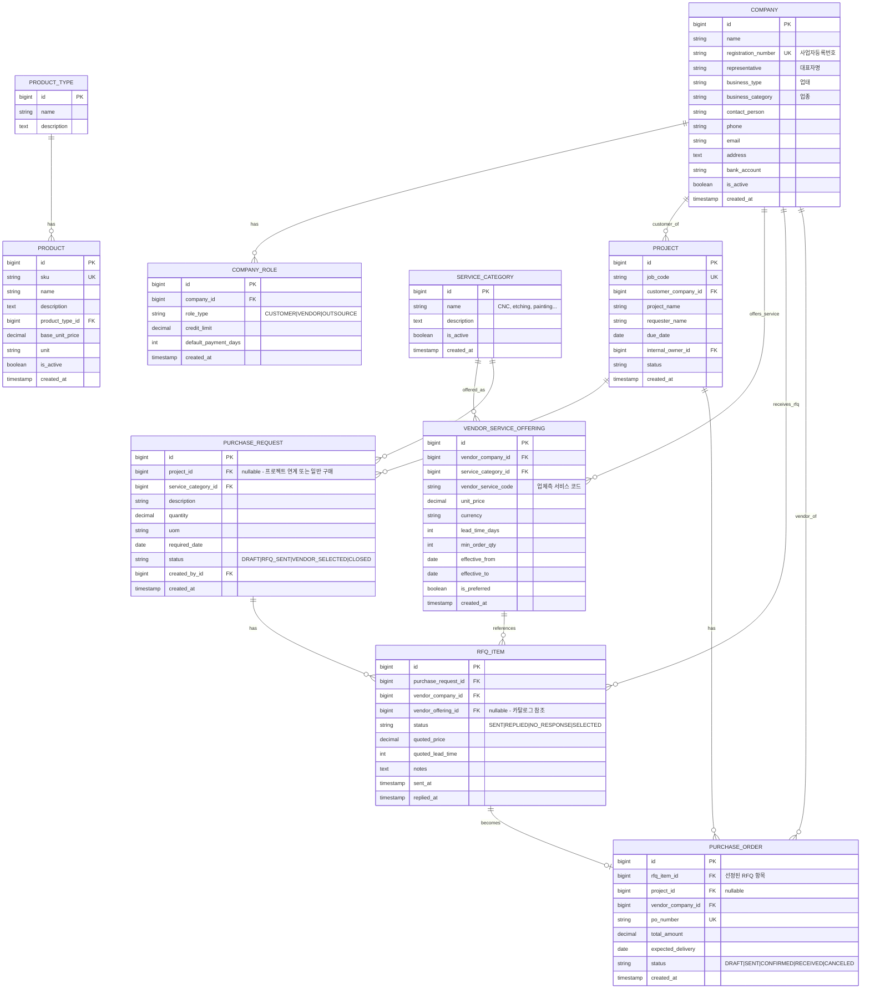

# Company Domain Model

## Overview

This document describes the domain model for companies, products, and procurement in the WellKorea ERP system. The unified company model supports multiple roles (Customer, Vendor, Outsourcing Partner) through a role-based design pattern.

### Key Concepts

- **Company**: A unified entity that can play multiple roles (customer, vendor, outsource partner)
- **Company Role**: Defines the specific role a company plays with role-specific attributes
- **Product**: Items sold to customers with pricing and categorization
- **Service Category**: Categories of outsourced services (CNC, painting, etc.)
- **Vendor Offering**: A vendor's specific service with pricing and lead times
- **Purchase Request / RFQ**: Request for quotation workflow for procurement

### Design Decisions

1. **Unified Company Model**: Instead of separate Customer, Vendor, and Outsourcing Partner tables, we use a single `COMPANY` table with a `COMPANY_ROLE` junction table. This allows:
   - A single company to be both a customer and a vendor
   - Centralized contact information management
   - Simplified reporting and analytics

2. **Role-Specific Attributes**: Each role type has specific attributes (e.g., `credit_limit` for customers, `lead_time_days` for vendor offerings)

3. **Service Catalog**: Vendor service offerings are linked to standardized service categories, enabling comparison and procurement workflows

## Domain Diagram

