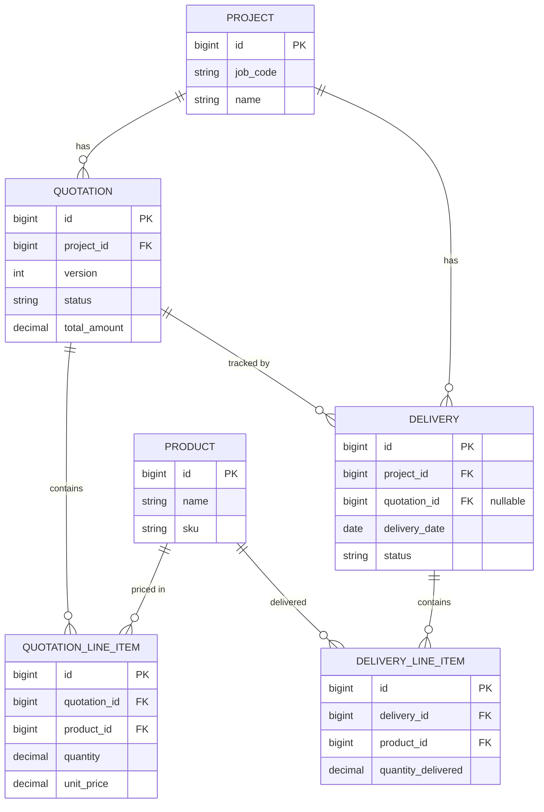
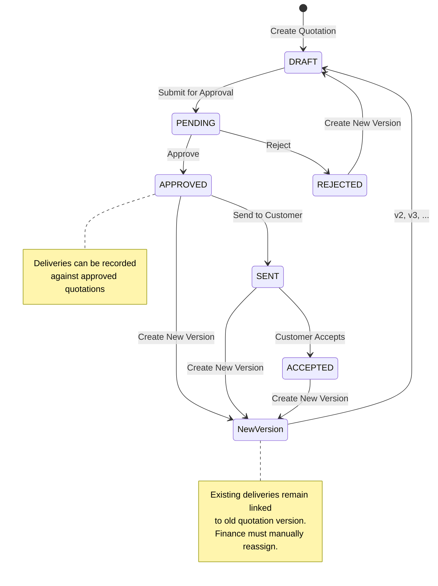
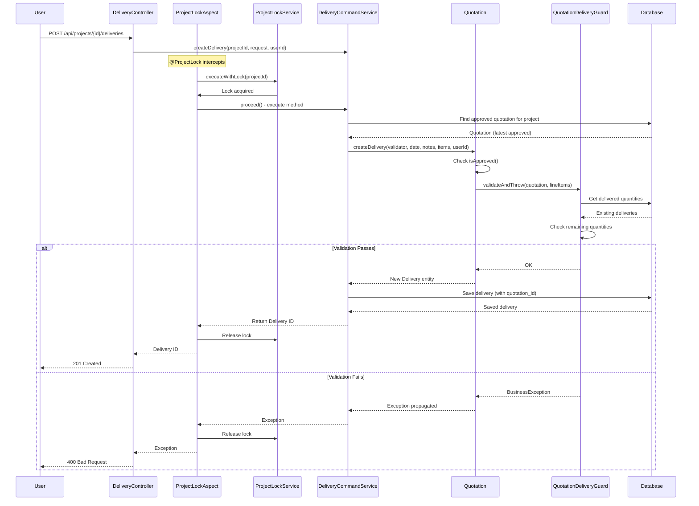
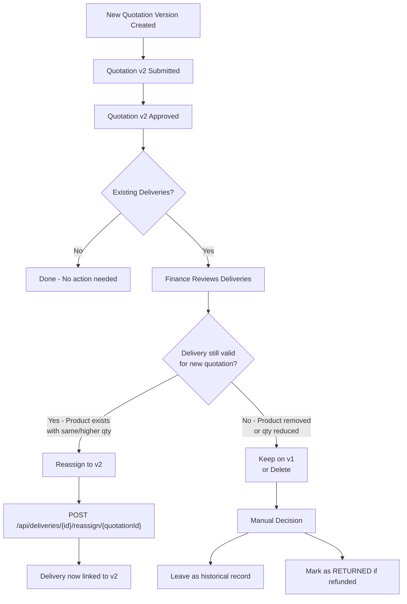

# Delivery-Quotation Relationship

This document explains how deliveries are linked to quotations and the workflow for managing deliveries when quotation
versions change.

## Overview

Each delivery is linked to a specific quotation version via `quotation_id`. This tracking enables:

- Audit trail of which quotation version each delivery was recorded against
- Manual reorganization when new quotation versions are approved
- Clear visibility into delivery history per quotation version

## Data Model



## Quotation Lifecycle and Delivery Impact



## Delivery Creation Flow



## Quotation Version Change Workflow

When a new quotation version is approved, existing deliveries are **not automatically reassigned**. Finance personnel
must manually decide how to handle them.



## API Endpoints for Delivery Management

### Query Deliveries

| Endpoint                               | Method | Description                                   |
|----------------------------------------|--------|-----------------------------------------------|
| `/api/projects/{projectId}/deliveries` | GET    | List all deliveries for a project             |
| `/api/deliveries/{id}`                 | GET    | Get delivery details including `quotation_id` |

### Delivery Status Transitions

| Endpoint                       | Method | Description                |
|--------------------------------|--------|----------------------------|
| `/api/deliveries/{id}/deliver` | POST   | Mark delivery as DELIVERED |
| `/api/deliveries/{id}/return`  | POST   | Mark delivery as RETURNED  |

### Reassignment Endpoints

| Endpoint                                      | Method | Description                                             |
|-----------------------------------------------|--------|---------------------------------------------------------|
| `/api/deliveries/{id}/reassign?quotationId=X` | POST   | Reassign single delivery to different quotation version |

## Business Rules

### Delivery Creation

1. A delivery can only be created against an **approved** quotation (status: APPROVED, SENT, or ACCEPTED)
2. The delivery quantity cannot exceed the remaining deliverable quantity (quotation qty - already delivered qty)
3. Only products in the approved quotation can be delivered
4. Distributed lock prevents race conditions during concurrent delivery creation

### Delivery Reassignment

1. Target quotation must be **approved**
2. Target quotation must belong to the **same project**
3. No quantity validation is performed during reassignment (manual decision)
4. Reassignment updates only the `quotation_id` reference

### Quotation Approval

1. New quotation versions are approved **without** validating against existing deliveries
2. This allows flexibility when quotation terms change after partial delivery
3. Finance personnel are responsible for reviewing and organizing deliveries manually

## Example Scenarios

### Scenario 1: Simple Delivery Recording

```
Project: WK2024-001
Quotation v1 (APPROVED): 100 units of Product A

Action: Record delivery of 30 units
Result: Delivery created with quotation_id = v1.id
        Remaining deliverable: 70 units
```

### Scenario 2: Quotation Update After Partial Delivery

```
Initial State:
- Quotation v1 (APPROVED): 100 units of Product A
- Delivery #1: 30 units (linked to v1)

Action: Customer requests change, new quotation v2 created with 80 units

After v2 Approved:
- Quotation v1: Still has Delivery #1 linked
- Quotation v2: No deliveries linked yet

Finance Decision:
- Delivery #1 (30 units) is still valid for v2 (30 < 80)
- POST /api/deliveries/1/reassign/v2.id
- Now v2 has 50 units remaining deliverable
```

### Scenario 3: Product Removed in New Version

```
Initial State:
- Quotation v1: Product A (100 units), Product B (50 units)
- Delivery #1: Product A (30 units), Product B (20 units)

Action: Customer removes Product B, new quotation v2 created

After v2 Approved:
- v2 only contains Product A (100 units)
- Delivery #1 contains Product B which is no longer in v2

Finance Decision Options:
1. Keep Delivery #1 on v1 as historical record
2. Partially reassign (if supported in future)
3. Mark Product B delivery as RETURNED if refunded
```

## Database View for Aggregated Quantities

The `v_delivered_quantities` view provides aggregated delivery data:

```sql
SELECT d.project_id,
       d.quotation_id,
       dli.product_id,
       SUM(dli.quantity_delivered) AS total_delivered
FROM deliveries d
         JOIN delivery_line_items dli ON d.id = dli.delivery_id
WHERE d.status != 'RETURNED'
GROUP BY d.project_id, d.quotation_id, dli.product_id;
```

This view is used by:

- `QuotationDeliveryGuard` to check remaining deliverable quantities
- Query services for delivery summary reports

## Summary

| Aspect                   | Behavior                                                                                      |
|--------------------------|-----------------------------------------------------------------------------------------------|
| Delivery-Quotation Link  | Each delivery stores `quotation_id` referencing the quotation version it was recorded against |
| New Quotation Approval   | No automatic validation against existing deliveries                                           |
| Delivery Reassignment    | Manual process via API endpoints                                                              |
| Over-delivery Prevention | Enforced at delivery creation time, not at quotation approval                                 |
| Historical Tracking      | Deliveries retain their original `quotation_id` unless explicitly reassigned                  |
