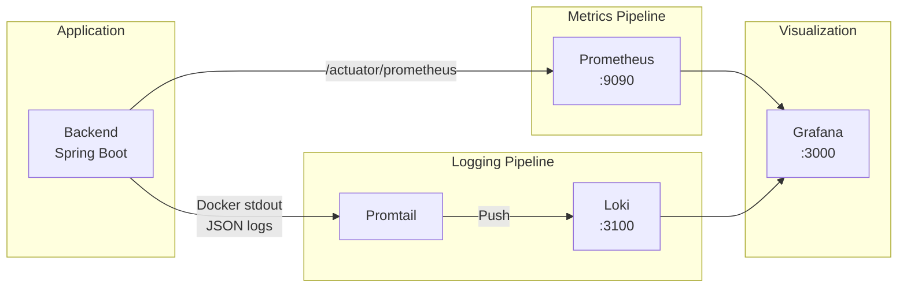
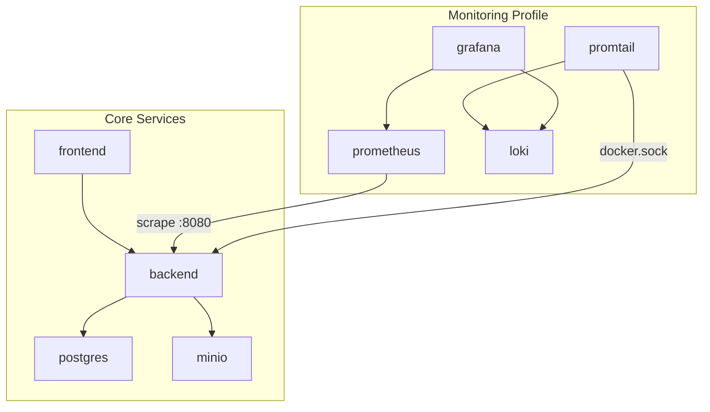
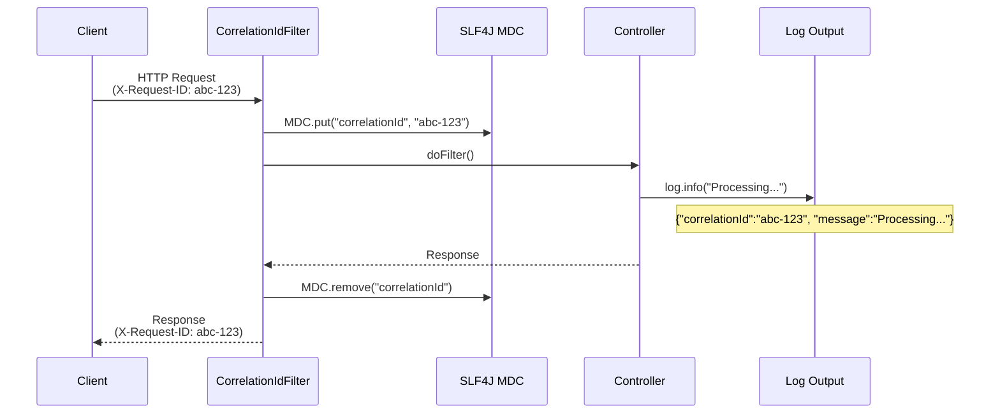

# Monitoring Stack: Structured Logging + Prometheus + Loki + Grafana

## Overview

WellKorea ERP includes an opt-in observability stack that provides:

- **Structured JSON logging** with request correlation IDs (MDC)
- **Prometheus** for metrics collection (scrapes Spring Boot Actuator)
- **Loki + Promtail** for centralized log aggregation
- **Grafana** for dashboards (metrics + logs)

All monitoring services use Docker Compose `profiles: [monitoring]` and are **not started by default**.

---

## Architecture

### Data Flow



### Docker Compose Service Topology



### Request Correlation ID Flow



If no `X-Request-ID` header is provided, the filter generates a UUID automatically.

---

## Components

### CorrelationIdFilter

- **Location**: `backend/src/.../shared/config/CorrelationIdFilter.java`
- Servlet filter at `Ordered.HIGHEST_PRECEDENCE` — runs before JWT authentication
- Reads `X-Request-ID` header or generates UUID
- Sets `MDC.put("correlationId", id)`, cleans up in `finally` block
- Echoes correlation ID back in response header

### Logback Configuration

- **Location**: `backend/src/main/resources/logback-spring.xml`
- **Dev/Test profiles**: Human-readable console output with `[correlationId]` field
- **Prod profile**: JSON via `LogstashEncoder` (stdout + rolling file)
  - JSON fields: `@timestamp`, `level`, `logger_name`, `thread_name`, `message`, `correlationId`, `stack_trace`

### Prometheus

- **Config**: `monitoring/prometheus/prometheus.yml`
- Scrapes `backend:8080/actuator/prometheus` every 15 seconds
- 15-day local retention
- Collects JVM metrics, HTTP request metrics, and custom application metrics

### Loki

- **Config**: `monitoring/loki/loki-config.yml`
- Filesystem-based storage with TSDB schema v13
- 7-day log retention
- 3 MB/s ingestion rate limit

### Promtail

- **Config**: `monitoring/promtail/promtail-config.yml`
- Docker service discovery via `/var/run/docker.sock`
- Filters containers by compose project label
- Parses JSON logs from backend: extracts `level`, `logger`, `correlationId` as Loki labels

### Grafana

- **Provisioning**: `monitoring/grafana/provisioning/`
  - Auto-provisions Prometheus and Loki datasources
  - Auto-loads dashboards from `monitoring/grafana/dashboards/`
- **Pre-built dashboard**: `jvm-metrics.json`
  - HTTP request rate, p95/p99 latency, error rate (4xx/5xx)
  - JVM heap/non-heap memory usage
  - Thread count (live, daemon, peak)
  - GC pause duration
  - Loki log stream panel

---

## Usage

### Starting the Monitoring Stack

```bash
# Local development — core services only (default)
docker compose -f docker-compose.local.yml up -d

# Local development — with monitoring
docker compose -f docker-compose.local.yml --profile monitoring up -d

# Production — with monitoring
docker compose -f docker-compose.prod.yml --profile monitoring up -d
```

### Accessing Grafana

| Environment | URL | Credentials |
|-------------|-----|-------------|
| Local | http://localhost:3000 | admin / admin |
| Production | http://127.0.0.1:3001 (behind host Nginx) | From `.env` |

### Querying Logs in Grafana

1. Open Grafana → **Explore**
2. Select **Loki** datasource
3. Example queries:
   ```logql
   # All backend logs
   {service="backend"}

   # Filter by log level
   {service="backend", level="ERROR"}

   # Search by correlation ID
   {service="backend"} |= "abc-123"

   # Filter by logger
   {service="backend", logger="com.wellkorea.backend.core.auth"}
   ```

### Viewing Metrics

1. Open Grafana → **Dashboards** → **WellKorea ERP** folder
2. Select **WellKorea ERP - JVM & HTTP Metrics**
3. Or use **Explore** → **Prometheus** with PromQL:
   ```promql
   # Request rate by endpoint
   rate(http_server_requests_seconds_count[5m])

   # p99 latency
   histogram_quantile(0.99, rate(http_server_requests_seconds_bucket[5m]))

   # JVM heap usage
   jvm_memory_used_bytes{area="heap"}
   ```

### Testing Correlation IDs

```bash
# Send request with explicit correlation ID
curl -H "X-Request-ID: test-123" http://localhost:8080/actuator/health -v

# Check response header contains X-Request-ID: test-123
# Check logs contain correlationId=test-123
```

---

## Configuration Reference

### Environment Variables

| Variable | Default (local) | Default (prod) | Description |
|----------|-----------------|----------------|-------------|
| `GRAFANA_PORT` | `3000` | N/A (127.0.0.1:3001) | Grafana web UI port |
| `GRAFANA_ADMIN_USER` | `admin` | (required) | Grafana admin username |
| `GRAFANA_ADMIN_PASSWORD` | `admin` | (required) | Grafana admin password |

### File Layout

```
monitoring/
├── prometheus/
│   └── prometheus.yml           # Scrape configuration
├── loki/
│   └── loki-config.yml          # Loki server configuration
├── promtail/
│   └── promtail-config.yml      # Log shipping configuration
└── grafana/
    ├── provisioning/
    │   ├── datasources/
    │   │   └── datasources.yml  # Auto-provision Prometheus + Loki
    │   └── dashboards/
    │       └── dashboards.yml   # Dashboard folder configuration
    └── dashboards/
        └── jvm-metrics.json     # Pre-built JVM/HTTP dashboard
```

---

## Troubleshooting

### Prometheus not scraping metrics

1. Verify the backend `/actuator/prometheus` endpoint is accessible:
   ```bash
   curl http://localhost:8080/actuator/prometheus
   ```
2. Check Prometheus targets: http://localhost:9090/targets
3. Ensure the backend container is healthy and on the same Docker network

### Loki not receiving logs

1. Check Promtail logs:
   ```bash
   docker compose -f docker-compose.local.yml logs promtail
   ```
2. Verify Docker socket is mounted: Promtail needs read access to `/var/run/docker.sock`
3. Check that the compose project name matches the regex in `promtail-config.yml`

### Grafana datasource errors

1. Verify Prometheus is reachable from Grafana: the datasource URL should be `http://prometheus:9090` (Docker service name, not localhost)
2. Similarly for Loki: `http://loki:3100`
3. Check Grafana logs:
   ```bash
   docker compose -f docker-compose.local.yml logs grafana
   ```

### Correlation ID not appearing in logs

1. Ensure `CorrelationIdFilter` is registered as a Spring `@Component`
2. Verify logback-spring.xml includes `%X{correlationId}` (dev) or `LogstashEncoder` with `includeMdcKeyName` (prod)
3. Check that no other filter is clearing MDC before the request completes
