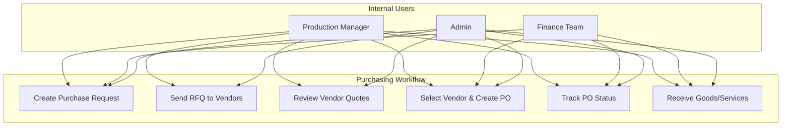
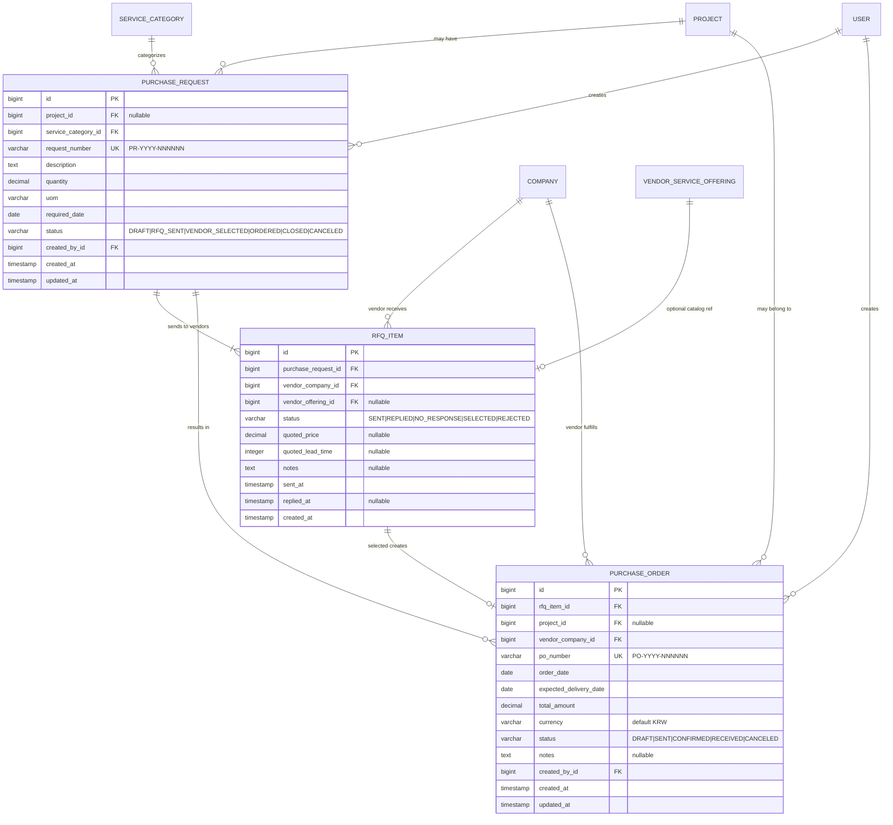
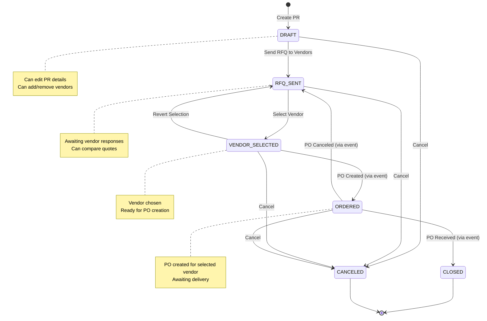
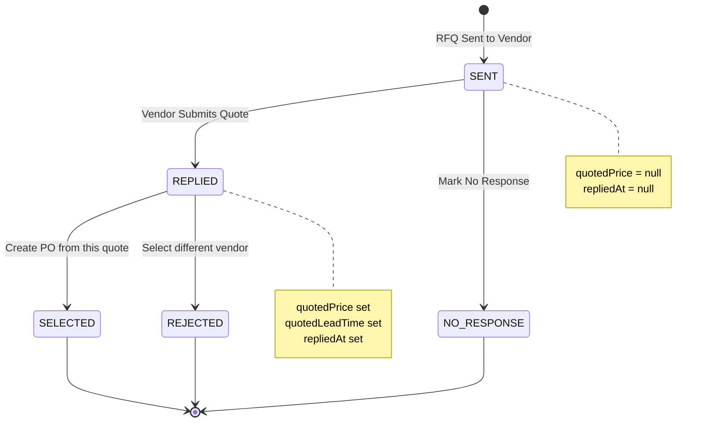
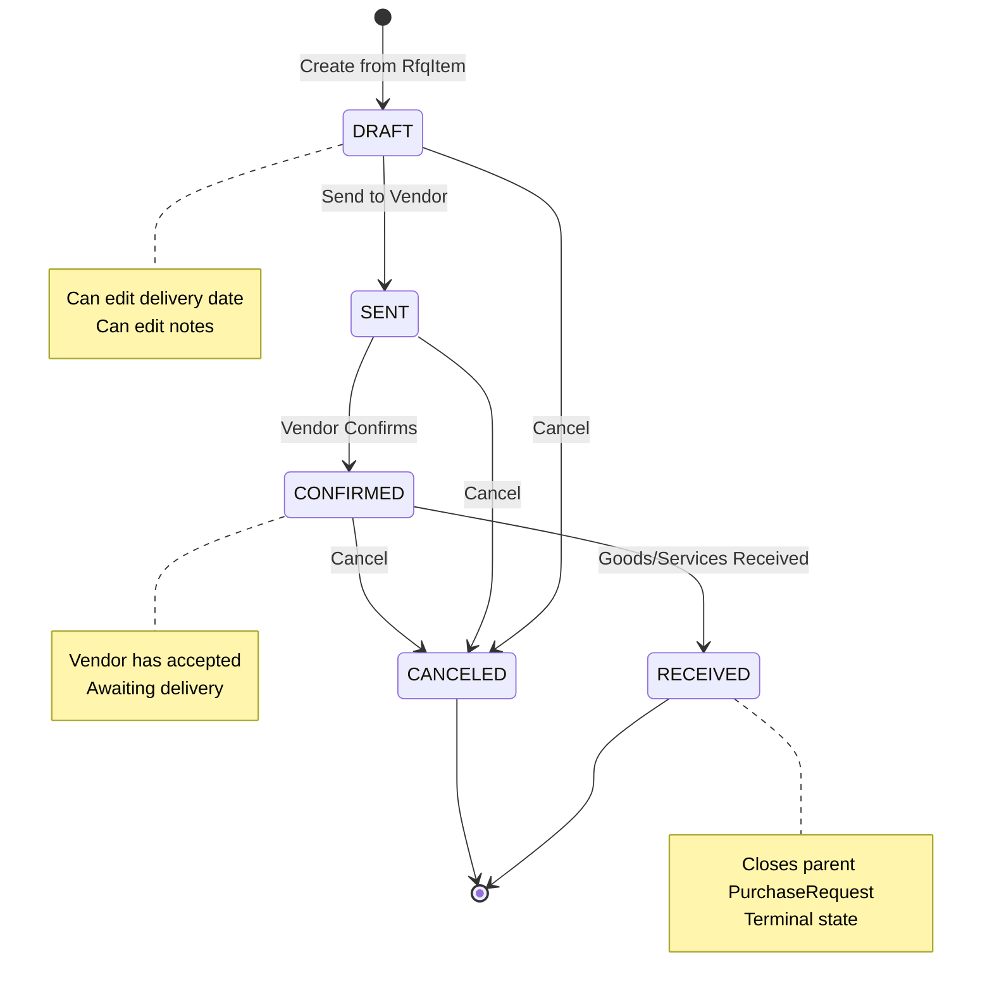
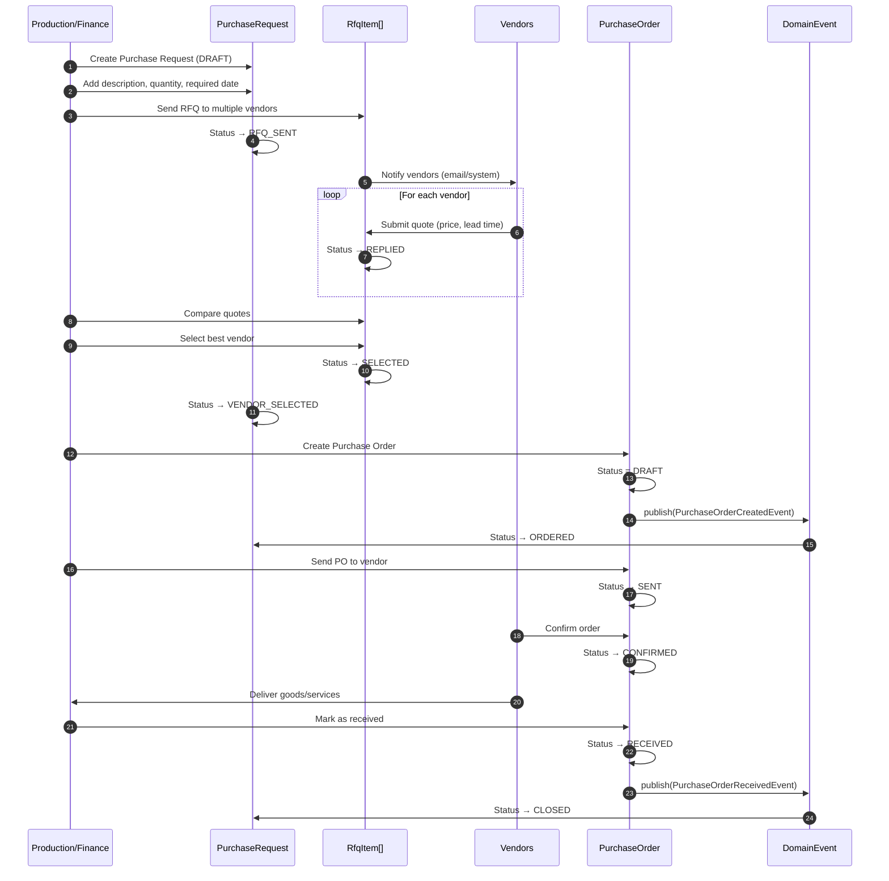
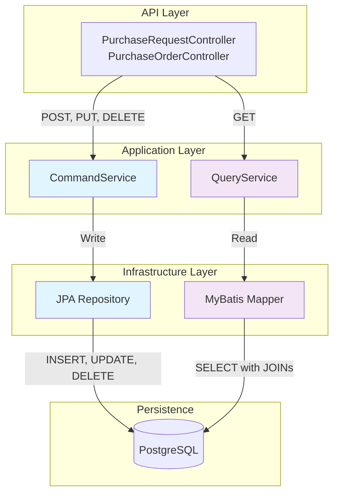
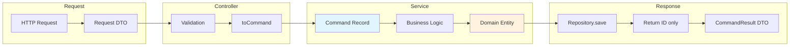
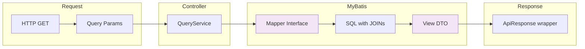
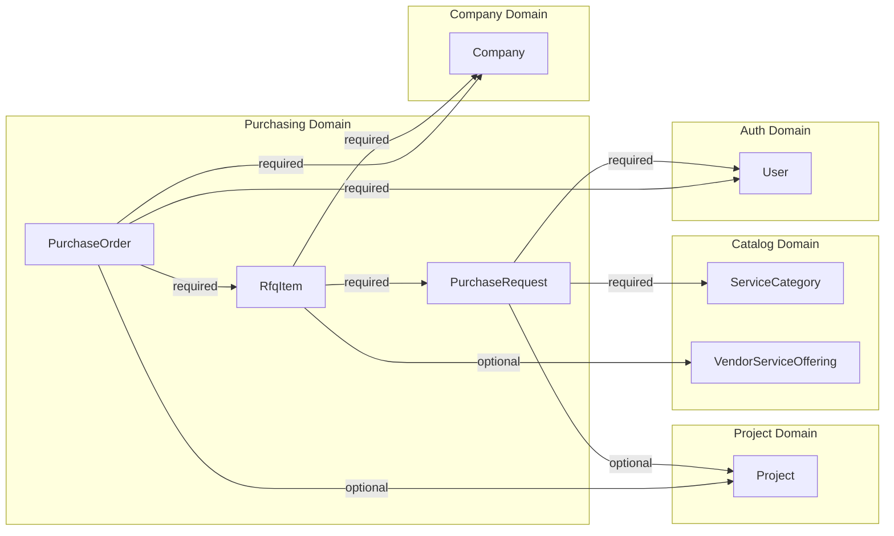

# Purchasing & Outsourcing Domain

> **Module**: US8 - Purchasing & Vendor Service Management
> **Status**: Implementation Complete (Pending Review)
> **Last Updated**: 2026-01-15

## Table of Contents

1. [Overview](#overview)
2. [Business Context](#business-context)
3. [Domain Model](#domain-model)
4. [Workflow & State Machines](#workflow--state-machines)
5. [Architecture](#architecture)
6. [API Reference](#api-reference)
7. [Database Schema](#database-schema)
8. [Integration Points](#integration-points)
9. [Known Issues & Recommendations](#known-issues--recommendations)

---

## Overview

The Purchasing domain handles the complete procurement lifecycle from internal purchase requests through vendor RFQ (Request for Quotation) management to final purchase orders. This enables WellKorea to:

- Create internal requests for materials or outsourced services
- Send RFQs to multiple vendors simultaneously
- Compare vendor quotes and select the best offer
- Generate and track purchase orders
- Monitor delivery status

### Key Entities

| Entity | Purpose | Number Format |
|--------|---------|---------------|
| **PurchaseRequest** | Internal request for materials/services | `PR-YYYY-NNNNNN` |
| **RfqItem** | Individual RFQ sent to a specific vendor | N/A (child of PR) |
| **PurchaseOrder** | Official order to selected vendor | `PO-YYYY-NNNNNN` |

---

## Business Context

### Use Cases



### Business Rules

1. **Purchase Request Creation**
   - Must specify a service category (e.g., "Laser Cutting", "Raw Materials")
   - Can optionally be linked to a specific project
   - Requires quantity, unit of measure, and required date

2. **RFQ Process**
   - RFQs can be sent to multiple vendors simultaneously
   - Only one vendor can be selected (SELECTED) per purchase request
   - Database constraint enforces single selection

3. **Purchase Order Creation**
   - Can only be created from a REPLIED or SELECTED RfqItem
   - Expected delivery date must be on or after order date
   - Total amount is taken from vendor's quoted price

4. **Access Control (RBAC)**
   - **ADMIN, FINANCE, PRODUCTION**: Full CRUD access
   - **SALES**: Read-only access

---

## Domain Model

### Entity Relationship Diagram



### Domain Classes

```
com.wellkorea.backend.purchasing/
├── domain/
│   ├── PurchaseRequest.java          # Aggregate root
│   ├── PurchaseRequestStatus.java    # Status enum
│   ├── RfqItem.java                  # Child entity
│   ├── RfqItemStatus.java            # Status enum
│   ├── PurchaseOrder.java            # Aggregate root
│   └── PurchaseOrderStatus.java      # Status enum
├── application/
│   ├── PurchaseRequestCommandService.java
│   ├── PurchaseRequestQueryService.java
│   ├── PurchaseOrderCommandService.java
│   ├── PurchaseOrderQueryService.java
│   └── *Command.java                 # Internal command records
├── api/
│   ├── PurchaseRequestController.java
│   ├── PurchaseOrderController.java
│   └── dto/
│       ├── command/                  # Request DTOs, CommandResult
│       └── query/                    # View DTOs (Summary, Detail)
└── infrastructure/
    ├── persistence/                  # JPA Repositories
    └── mapper/                       # MyBatis mappers for queries
```

---

## Workflow & State Machines

### Purchase Request Lifecycle



### RFQ Item Lifecycle



### Purchase Order Lifecycle



### End-to-End Process Flow



---

## Architecture

### CQRS Pattern Implementation



### Command Flow



### Query Flow



---

## API Reference

### Purchase Request Endpoints

| Method | Endpoint | Description | Access |
|--------|----------|-------------|--------|
| `GET` | `/api/purchase-requests` | List all (paginated) | All |
| `GET` | `/api/purchase-requests?projectId={id}` | Filter by project | All |
| `GET` | `/api/purchase-requests?status={status}` | Filter by status | All |
| `GET` | `/api/purchase-requests/{id}` | Get detail view | All |
| `POST` | `/api/purchase-requests` | Create new PR | Admin, Finance, Production |
| `PUT` | `/api/purchase-requests/{id}` | Update PR (DRAFT only) | Admin, Finance, Production |
| `POST` | `/api/purchase-requests/{id}/send-rfq` | Send RFQ to vendors | Admin, Finance, Production |
| `DELETE` | `/api/purchase-requests/{id}` | Cancel PR | Admin, Finance, Production |

### Purchase Order Endpoints

| Method | Endpoint | Description | Access |
|--------|----------|-------------|--------|
| `GET` | `/api/purchase-orders` | List all (paginated) | All |
| `GET` | `/api/purchase-orders?vendorId={id}` | Filter by vendor | All |
| `GET` | `/api/purchase-orders?status={status}` | Filter by status | All |
| `GET` | `/api/purchase-orders/{id}` | Get detail view | All |
| `POST` | `/api/purchase-orders` | Create from RfqItem | Admin, Finance, Production |
| `PUT` | `/api/purchase-orders/{id}` | Update PO (DRAFT only) | Admin, Finance, Production |
| `POST` | `/api/purchase-orders/{id}/send` | Send to vendor | Admin, Finance, Production |
| `POST` | `/api/purchase-orders/{id}/confirm` | Vendor confirmed | Admin, Finance, Production |
| `POST` | `/api/purchase-orders/{id}/receive` | Mark as received | Admin, Finance, Production |
| `DELETE` | `/api/purchase-orders/{id}` | Cancel PO | Admin, Finance, Production |

### Request/Response Examples

#### Create Purchase Request

```json
// POST /api/purchase-requests
// Request
{
  "serviceCategoryId": 1,
  "projectId": 42,
  "description": "Steel plates for project ABC",
  "quantity": 100.00,
  "uom": "EA",
  "requiredDate": "2026-02-15"
}

// Response (201 Created)
{
  "success": true,
  "data": {
    "id": 123,
    "message": "Purchase request created successfully"
  }
}
```

#### Send RFQ to Vendors

```json
// POST /api/purchase-requests/123/send-rfq
// Request
{
  "vendorIds": [10, 15, 22]
}

// Response (200 OK)
{
  "success": true,
  "data": {
    "id": 123,
    "message": "RFQ sent to 3 vendors"
  }
}
```

#### Create Purchase Order

```json
// POST /api/purchase-orders
// Request
{
  "rfqItemId": 456,
  "orderDate": "2026-01-20",
  "expectedDeliveryDate": "2026-02-10",
  "notes": "Deliver to warehouse B"
}

// Response (201 Created)
{
  "success": true,
  "data": {
    "id": 789,
    "message": "Purchase order created successfully"
  }
}
```

---

## Database Schema

### Tables

```sql
-- Purchase Requests
CREATE TABLE purchase_requests (
    id                  BIGSERIAL PRIMARY KEY,
    project_id          BIGINT REFERENCES projects(id),
    service_category_id BIGINT NOT NULL REFERENCES service_categories(id),
    request_number      VARCHAR(50) NOT NULL UNIQUE,
    description         TEXT NOT NULL,
    quantity            DECIMAL(10,2) NOT NULL,
    uom                 VARCHAR(20),
    required_date       DATE NOT NULL,
    status              VARCHAR(20) NOT NULL DEFAULT 'DRAFT',
    created_by_id       BIGINT NOT NULL REFERENCES users(id),
    created_at          TIMESTAMP NOT NULL DEFAULT CURRENT_TIMESTAMP,
    updated_at          TIMESTAMP NOT NULL DEFAULT CURRENT_TIMESTAMP
);

-- RFQ Items
CREATE TABLE rfq_items (
    id                  BIGSERIAL PRIMARY KEY,
    purchase_request_id BIGINT NOT NULL REFERENCES purchase_requests(id) ON DELETE CASCADE,
    vendor_company_id   BIGINT NOT NULL REFERENCES companies(id),
    vendor_offering_id  BIGINT REFERENCES vendor_service_offerings(id),
    status              VARCHAR(20) NOT NULL DEFAULT 'SENT',
    quoted_price        DECIMAL(15,2),
    quoted_lead_time    INTEGER,
    notes               TEXT,
    sent_at             TIMESTAMP,
    replied_at          TIMESTAMP,
    created_at          TIMESTAMP NOT NULL DEFAULT CURRENT_TIMESTAMP
);

-- Unique constraint: only one SELECTED RFQ per purchase request
CREATE UNIQUE INDEX idx_rfq_items_one_selected
    ON rfq_items(purchase_request_id)
    WHERE status = 'SELECTED';

-- Purchase Orders
CREATE TABLE purchase_orders (
    id                     BIGSERIAL PRIMARY KEY,
    rfq_item_id            BIGINT NOT NULL REFERENCES rfq_items(id),
    project_id             BIGINT REFERENCES projects(id),
    vendor_company_id      BIGINT NOT NULL REFERENCES companies(id),
    po_number              VARCHAR(50) NOT NULL UNIQUE,
    order_date             DATE NOT NULL,
    expected_delivery_date DATE NOT NULL,
    total_amount           DECIMAL(15,2) NOT NULL,
    currency               VARCHAR(3) DEFAULT 'KRW',
    status                 VARCHAR(20) NOT NULL DEFAULT 'DRAFT',
    notes                  TEXT,
    created_by_id          BIGINT NOT NULL REFERENCES users(id),
    created_at             TIMESTAMP NOT NULL DEFAULT CURRENT_TIMESTAMP,
    updated_at             TIMESTAMP NOT NULL DEFAULT CURRENT_TIMESTAMP,

    CONSTRAINT chk_po_delivery_after_order
        CHECK (expected_delivery_date >= order_date)
);
```

### Indexes

```sql
-- Purchase Requests
CREATE INDEX idx_purchase_requests_project ON purchase_requests(project_id);
CREATE INDEX idx_purchase_requests_service_category ON purchase_requests(service_category_id);
CREATE INDEX idx_purchase_requests_status ON purchase_requests(status);

-- RFQ Items
CREATE INDEX idx_rfq_items_purchase_request ON rfq_items(purchase_request_id);
CREATE INDEX idx_rfq_items_vendor ON rfq_items(vendor_company_id);
CREATE INDEX idx_rfq_items_status ON rfq_items(status);

-- Purchase Orders
CREATE INDEX idx_purchase_orders_rfq_item ON purchase_orders(rfq_item_id);
CREATE INDEX idx_purchase_orders_vendor ON purchase_orders(vendor_company_id);
CREATE INDEX idx_purchase_orders_status ON purchase_orders(status);
```

---

## Integration Points

### Existing Domain Dependencies



### Future Integration Points

1. **Invoice Domain**: Create invoices from received POs for accounts payable
2. **Inventory Domain**: Update stock levels when PO is received
3. **Notification Domain**: Email vendors when RFQ is sent, notify users when vendor replies
4. **Approval Workflow**: Add approval chain for POs above certain amounts
5. **Reporting**: Vendor performance metrics, procurement analytics

---

## Known Issues & Recommendations

### Resolved Issues

The following issues were identified and fixed:

1. ~~**PurchaseOrder Entity Has Broken Mapping**~~ - **FIXED**: Removed the invalid `purchaseRequest` field that incorrectly mapped to `project_id`. Navigate via `purchaseOrder.getRfqItem().getPurchaseRequest()` instead.

2. ~~**RfqItem Missing `updatedAt` Field**~~ - **FIXED**: Added `updatedAt` field with `@PreUpdate` hook for audit consistency.

3. ~~**Invalid purchaseOrders Relationship**~~ - **FIXED**: Removed the `purchaseOrders` list from PurchaseRequest since there's no direct FK relationship. PurchaseOrders are accessed through RfqItems.

### Outstanding Issues

#### 4. Missing RFQ Reply Management

**Problem**: Domain methods exist (`RfqItem.recordReply()`, `markNoResponse()`, `reject()`) but no service layer or API endpoints for vendors to actually submit quotes.

**Recommendation**: Implement `RfqCommandService`, `RfqQueryService`, and `RfqController` for:
- `POST /api/rfq-items/{id}/reply` - Vendor submits quote
- `POST /api/rfq-items/{id}/no-response` - Mark as no response
- `POST /api/rfq-items/{id}/reject` - Reject vendor quote

### Medium Priority Issues

#### 5. Number Generation Race Condition

**Problem**: `findMaxSequenceForYear()` + increment pattern is not thread-safe under concurrent load.

**Recommendation**: Use PostgreSQL sequence or optimistic locking with retry.

#### 6. Query Service Design Inconsistency

**Problem**: PurchaseRequestQueryService has multiple methods (`listByProjectId`, `listByStatus`) while QuotationQueryService uses single method with optional filters.

**Recommendation**: Consolidate to single method for consistency:
```java
listPurchaseRequests(PurchaseRequestStatus status, Long projectId, Pageable pageable)
```

---

## Testing

### Integration Tests

- `PurchaseRequestControllerTest.java` - Full RBAC and endpoint testing
- `PurchaseOrderControllerTest.java` - State transition and validation testing

### Test Categories

1. **RBAC Tests**: Verify Admin/Finance/Production can write, Sales can only read
2. **Validation Tests**: Required fields, status constraints, date constraints
3. **State Machine Tests**: Valid and invalid status transitions
4. **Business Rule Tests**: Single vendor selection, delivery date validation

---

## Changelog

| Version | Date | Changes |
|---------|------|---------|
| 1.1.0 | 2026-01-19 | Added ORDERED status to PurchaseRequest state machine; PO creation now triggers VENDOR_SELECTED → ORDERED via PurchaseOrderCreatedEvent |
| 1.0.0 | 2026-01-15 | Initial implementation - PR, RFQ, PO entities |

---

## References

- [CQRS Pattern](../architecture/cqrs-pattern.md) (if exists)
- [Database Migration V19](../../backend/src/main/resources/db/migration/V19__create_purchasing_domain.sql)
- [Quotation Domain](./quotation-domain.md) (reference implementation)
