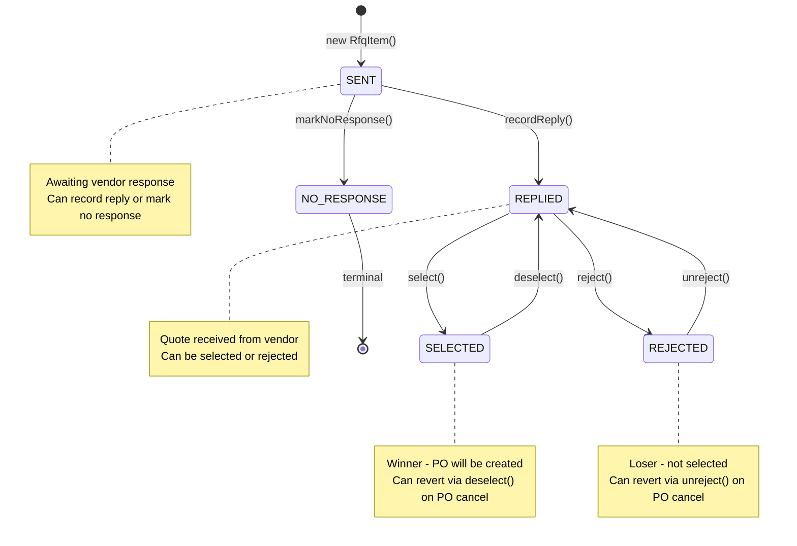
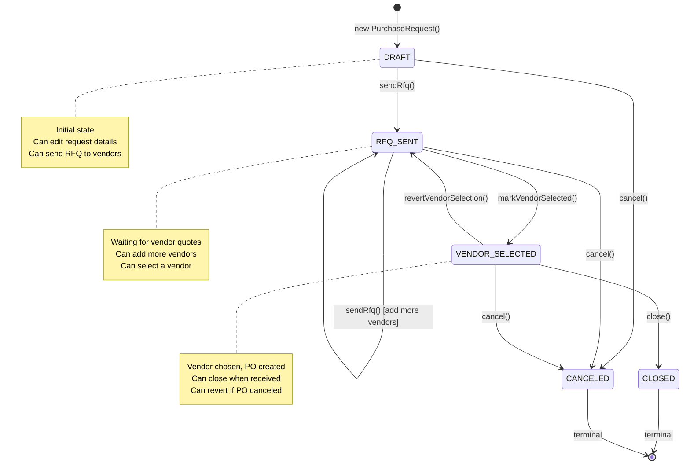
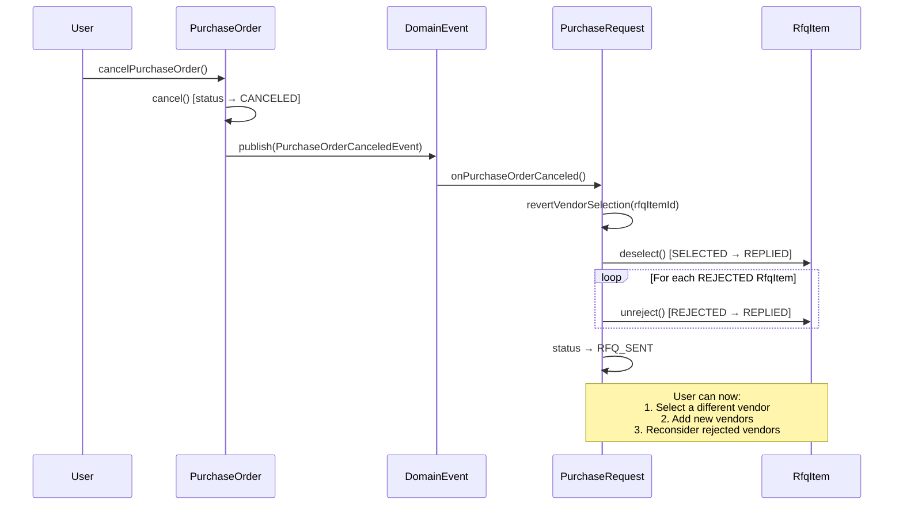

# Purchasing Domain State Machines

This document describes the finite state machines (FSM) for the purchasing domain entities: `RfqItem` and `PurchaseRequest`.

## Overview

The purchasing workflow follows this high-level flow:
1. Create a Purchase Request (DRAFT)
2. Send RFQs to multiple vendors (RFQ_SENT)
3. Vendors reply with quotes (RfqItem: SENT → REPLIED)
4. Select one vendor (VENDOR_SELECTED, RfqItem: SELECTED)
5. Create Purchase Order
6. If PO is canceled, revert to allow re-selection
7. Close when PO is received (CLOSED)

---

## RfqItem State Machine

The `RfqItem` represents an individual RFQ sent to a specific vendor. Each RfqItem tracks its lifecycle from sending to vendor selection.

### States

| State | Description |
|-------|-------------|
| `SENT` | Initial state - RFQ sent to vendor, awaiting response |
| `REPLIED` | Vendor has replied with a quoted price |
| `NO_RESPONSE` | Vendor did not respond (terminal state) |
| `SELECTED` | This vendor's quote was chosen for PO |
| `REJECTED` | This vendor's quote was not selected |

### State Diagram

### Transition Methods

| Method | From State | To State | Trigger |
|--------|-----------|----------|---------|
| `recordReply(price, leadTime, notes)` | SENT | REPLIED | Vendor submits quote |
| `markNoResponse()` | SENT | NO_RESPONSE | Vendor deadline passed |
| `select()` | REPLIED | SELECTED | User selects this vendor |
| `reject()` | REPLIED | REJECTED | User rejects this vendor |
| `deselect()` | SELECTED | REPLIED | PO canceled - revert selection |
| `unreject()` | REJECTED | REPLIED | PO canceled - allow reconsideration |

### Invalid Transitions (throw IllegalStateException)

- Cannot `recordReply()` from any state except SENT
- Cannot `markNoResponse()` from any state except SENT
- Cannot `select()` from any state except REPLIED
- Cannot `reject()` from any state except REPLIED
- Cannot `deselect()` from any state except SELECTED
- Cannot `unreject()` from any state except REJECTED

---

## PurchaseRequest State Machine

The `PurchaseRequest` is the aggregate root that contains multiple `RfqItem` entities. It orchestrates the overall purchasing workflow.

### States

| State | Description |
|-------|-------------|
| `DRAFT` | Initial state - request created, can edit |
| `RFQ_SENT` | RFQs sent to vendors, awaiting quotes |
| `VENDOR_SELECTED` | A vendor has been selected, PO created |
| `CLOSED` | PO received, workflow complete (terminal) |
| `CANCELED` | Request canceled (terminal) |

### State Diagram

### Transition Methods

| Method | From State | To State | Trigger |
|--------|-----------|----------|---------|
| `sendRfq()` | DRAFT | RFQ_SENT | Initial RFQ send |
| `sendRfq()` | RFQ_SENT | RFQ_SENT | Add more vendors (idempotent) |
| `markVendorSelected()` | RFQ_SENT | VENDOR_SELECTED | User selects vendor |
| `close()` | VENDOR_SELECTED | CLOSED | PO received |
| `cancel()` | DRAFT, RFQ_SENT, VENDOR_SELECTED | CANCELED | User cancels |
| `revertVendorSelection()` | VENDOR_SELECTED | RFQ_SENT | PO canceled |

### Guard Conditions

| Method | Guard Condition |
|--------|-----------------|
| `canSendRfq()` | status == DRAFT \|\| status == RFQ_SENT |
| `canCancel()` | status != CLOSED && status != CANCELED |
| `canUpdate()` | status == DRAFT |

---

## Combined Workflow: PO Cancellation Revert

When a Purchase Order is canceled, the following cascade occurs:

### State Changes Summary

| Entity | Before Cancel | After Cancel |
|--------|--------------|--------------|
| PurchaseOrder | DRAFT/SENT/CONFIRMED | CANCELED |
| PurchaseRequest | VENDOR_SELECTED | RFQ_SENT |
| Selected RfqItem | SELECTED | REPLIED |
| Rejected RfqItems | REJECTED | REPLIED |
| Other RfqItems | (unchanged) | (unchanged) |

---

## Test Scenarios

### RfqItem Test Cases

1. **Happy Path: SENT → REPLIED → SELECTED**
   - Create RfqItem (SENT)
   - Record reply with quote (REPLIED)
   - Select vendor (SELECTED)

2. **Happy Path: SENT → REPLIED → REJECTED**
   - Create RfqItem (SENT)
   - Record reply with quote (REPLIED)
   - Reject vendor (REJECTED)

3. **Revert Path: SELECTED → REPLIED**
   - SELECTED item can be deselected
   - Returns to REPLIED for re-evaluation

4. **Revert Path: REJECTED → REPLIED**
   - REJECTED item can be unrejected
   - Returns to REPLIED for re-evaluation

5. **Terminal Path: SENT → NO_RESPONSE**
   - Vendor doesn't respond
   - NO_RESPONSE is terminal (no further transitions)

6. **Invalid Transitions**
   - Cannot select from SENT (must have quote first)
   - Cannot reject from SENT
   - Cannot record reply from REPLIED (already replied)
   - Cannot deselect from REPLIED
   - Cannot unreject from SELECTED

### PurchaseRequest Test Cases

1. **Happy Path: DRAFT → RFQ_SENT → VENDOR_SELECTED → CLOSED**
   - Create request (DRAFT)
   - Send RFQ (RFQ_SENT)
   - Select vendor (VENDOR_SELECTED)
   - Close when received (CLOSED)

2. **Add More Vendors: RFQ_SENT → RFQ_SENT**
   - Already in RFQ_SENT
   - Send RFQ again (idempotent, stays RFQ_SENT)

3. **Revert Path: VENDOR_SELECTED → RFQ_SENT**
   - PO canceled
   - Revert vendor selection
   - Can select again or add vendors

4. **Add Vendors When All Items NO_RESPONSE/REJECTED**
   - All existing RfqItems are in NO_RESPONSE or REJECTED status
   - PR remains in RFQ_SENT (not terminal)
   - User can add new vendors via sendRfq()
   - New vendors can be quoted and selected

5. **Cancel from Any Non-Terminal State**
   - DRAFT → CANCELED
   - RFQ_SENT → CANCELED
   - VENDOR_SELECTED → CANCELED

6. **Invalid Transitions**
   - Cannot close from RFQ_SENT (must select vendor first)
   - Cannot revert from RFQ_SENT
   - Cannot cancel from CLOSED
   - Cannot send RFQ from VENDOR_SELECTED

---

## Implementation Files

| File | Description |
|------|-------------|
| `RfqItem.java` | RfqItem entity with state transitions |
| `RfqItemStatus.java` | Status enum |
| `PurchaseRequest.java` | Aggregate root with orchestration |
| `PurchaseRequestStatus.java` | Status enum |
| `PurchaseOrderCanceledEvent.java` | Domain event for PO cancellation |
| `PurchaseRequestEventHandler.java` | Event handler for revert |
