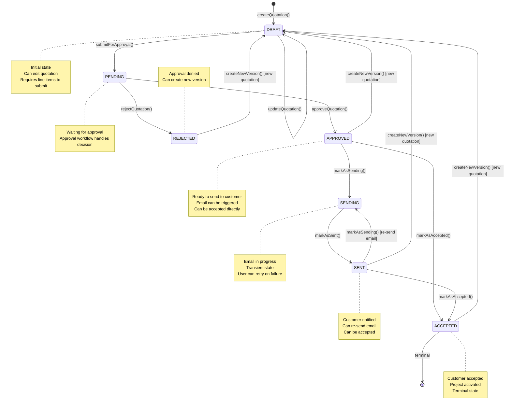
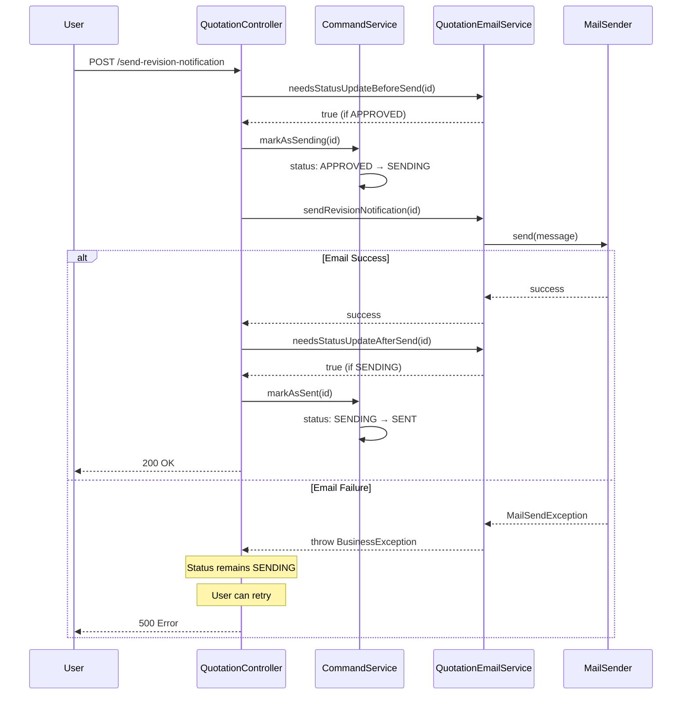
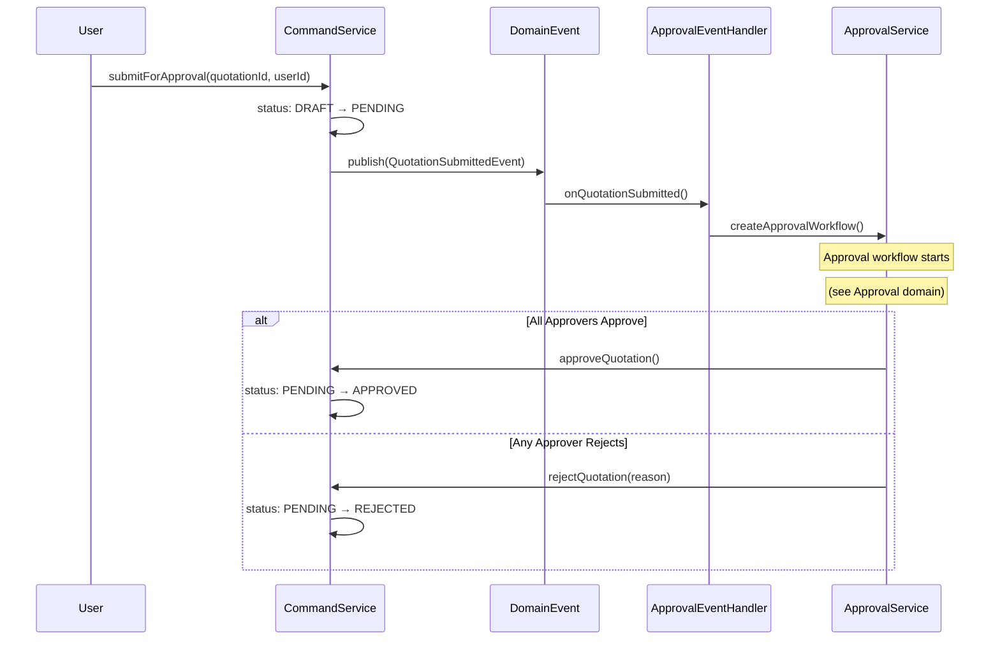
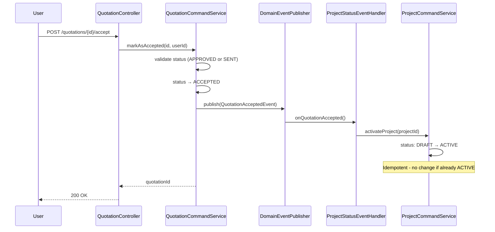
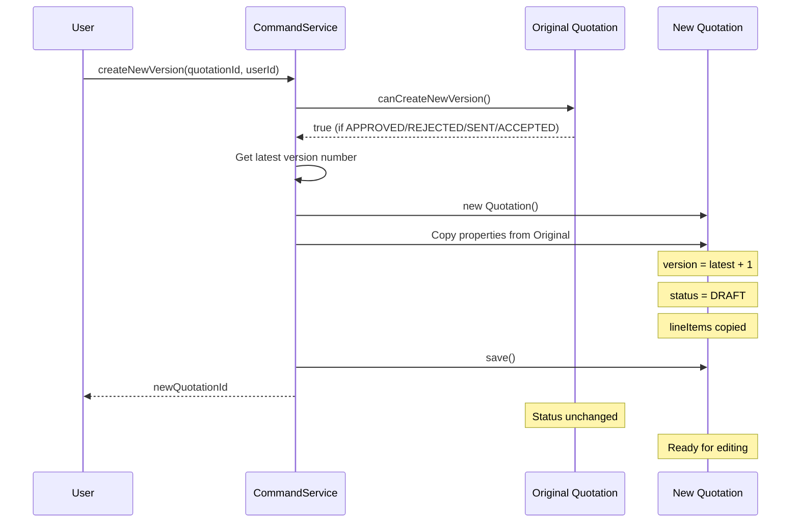

# Quotation Domain State Machine

This document describes the finite state machine (FSM) for the `Quotation` entity, including the approval workflow and email notification flow.

## Overview

The quotation workflow follows this high-level flow:
1. Create a Quotation (DRAFT)
2. Submit for approval (PENDING)
3. Approvers review and approve/reject (APPROVED or REJECTED)
4. Send email to customer (SENDING → SENT)
5. Customer accepts the quotation (ACCEPTED)

If rejected, a new version can be created from the rejected quotation, starting the cycle again.

---

## Quotation State Machine

The `Quotation` represents a price proposal for a project, subject to internal approval before being sent to the customer.

### States

| State | Description |
|-------|-------------|
| `DRAFT` | Initial state - quotation is being created/edited |
| `PENDING` | Submitted for approval - waiting for approval workflow |
| `APPROVED` | Approved by all required approvers, ready to send |
| `REJECTED` | Rejected by an approver during approval workflow |
| `SENDING` | Email is being sent to customer (transient state) |
| `SENT` | Email successfully sent to customer |
| `ACCEPTED` | Customer has accepted the quotation (terminal) |

### State Diagram

### Transition Methods

| Method | From State | To State | Trigger |
|--------|-----------|----------|---------|
| `createQuotation()` | (new) | DRAFT | User creates quotation |
| `updateQuotation()` | DRAFT | DRAFT | User edits quotation |
| `submitForApproval()` | DRAFT | PENDING | User submits for approval |
| `approveQuotation()` | PENDING | APPROVED | Approval workflow completes |
| `rejectQuotation()` | PENDING | REJECTED | Approver rejects |
| `markAsSending()` | APPROVED, SENT | SENDING | Email send initiated |
| `markAsSent()` | SENDING | SENT | Email sent successfully |
| `markAsAccepted()` | APPROVED, SENT | ACCEPTED | User confirms customer acceptance |
| `createNewVersion()` | APPROVED, REJECTED, SENT, ACCEPTED | DRAFT (new) | User creates revision |

### Guard Conditions

| Method | Guard Condition |
|--------|-----------------|
| `canBeEdited()` | status == DRAFT |
| `canBeSubmitted()` | status == DRAFT && lineItems.size() > 0 |
| `canGeneratePdf()` | status != DRAFT |
| `canCreateNewVersion()` | status in (APPROVED, REJECTED, SENT, ACCEPTED) |
| `canSendEmail()` | status in (APPROVED, SENDING, SENT, ACCEPTED) |

### Invalid Transitions (throw BusinessException)

- Cannot `updateQuotation()` from any state except DRAFT
- Cannot `submitForApproval()` from any state except DRAFT
- Cannot `approveQuotation()` from any state except PENDING
- Cannot `rejectQuotation()` from any state except PENDING
- Cannot `markAsSending()` from any state except APPROVED or SENT
- Cannot `markAsSent()` from any state except SENDING
- Cannot `markAsAccepted()` from any state except APPROVED or SENT
- Cannot `createNewVersion()` from DRAFT or PENDING

---

## Combined Workflow: Email Notification

When sending a quotation email to a customer, the status transitions through SENDING to SENT:

### State Changes Summary

| Scenario | Before Send | During Send | After Success | After Failure |
|----------|-------------|-------------|---------------|---------------|
| First send | APPROVED | SENDING | SENT | SENDING (retry) |
| Re-send | SENT | SENDING | SENT | SENDING (retry) |

### Error Handling

When email sending fails:
1. Status remains in `SENDING` state
2. User can retry the operation
3. On retry, `needsStatusUpdateBeforeSend()` returns false (already SENDING)
4. Email is re-attempted
5. On success, status transitions to `SENT`

---

## Combined Workflow: Approval Process

The approval workflow is triggered by a domain event when a quotation is submitted:

---

## Combined Workflow: Customer Acceptance

When a customer accepts a quotation, the status changes to ACCEPTED and a domain event triggers project activation:

### Domain Event: QuotationAcceptedEvent

| Field | Type | Description |
|-------|------|-------------|
| `quotationId` | Long | ID of the accepted quotation |
| `projectId` | Long | ID of the associated project |
| `acceptedByUserId` | Long | ID of the user who recorded the acceptance |

### Side Effects

1. **Project Activation**: When a quotation is accepted, the associated project is automatically activated (status: DRAFT → ACTIVE)
2. **Delivery/Invoice Enablement**: Only quotations in **ACCEPTED** status allow delivery and invoice creation in the frontend. The backend's `isApproved()` method returns true for SENT or ACCEPTED, but the frontend enforces the stricter ACCEPTED-only requirement to ensure customer confirmation before fulfillment.

---

## Versioning: Create New Version

When a quotation needs revision (after rejection, or after customer feedback on a sent quotation):

### Version Relationship

| Original Status | Original After | New Quotation Status | Version |
|-----------------|----------------|---------------------|---------|
| APPROVED | APPROVED (unchanged) | DRAFT | n + 1 |
| REJECTED | REJECTED (unchanged) | DRAFT | n + 1 |
| SENT | SENT (unchanged) | DRAFT | n + 1 |
| ACCEPTED | ACCEPTED (unchanged) | DRAFT | n + 1 |

Note: Creating a new version does NOT change the original quotation's status. The original becomes a historical record.

---

## Test Scenarios

### Happy Path Test Cases

1. **DRAFT → PENDING → APPROVED → SENDING → SENT**
   - Create quotation with line items (DRAFT)
   - Submit for approval (PENDING)
   - Approve quotation (APPROVED)
   - Send email (SENDING → SENT)

2. **DRAFT → PENDING → REJECTED → New Version**
   - Create quotation (DRAFT)
   - Submit for approval (PENDING)
   - Reject quotation (REJECTED)
   - Create new version (new DRAFT)
   - Edit and resubmit

3. **SENT → New Version → APPROVED → SENT**
   - Customer requests changes on sent quotation
   - Create new version (new DRAFT)
   - Update and resubmit
   - Approve and send again

### Email Retry Test Cases

4. **Email Failure and Retry**
   - Status: APPROVED
   - Attempt send → fails → SENDING
   - Retry send → succeeds → SENT

5. **Re-send from SENT Status**
   - Status: SENT (already sent)
   - Trigger send again → email sent
   - Status remains SENT

### Guard Condition Test Cases

6. **Cannot Edit Non-DRAFT**
   - Try to update PENDING quotation → BusinessException
   - Try to update APPROVED quotation → BusinessException

7. **Cannot Submit Without Line Items**
   - DRAFT quotation with no line items
   - Try to submit → BusinessException

8. **Cannot Create Version from DRAFT/PENDING**
   - Try to create version from DRAFT → BusinessException
   - Try to create version from PENDING → BusinessException

9. **Cannot Approve Non-PENDING**
   - Try to approve DRAFT → BusinessException
   - Try to approve APPROVED → BusinessException

10. **Cannot Send from DRAFT/PENDING/REJECTED**
    - Try to send from DRAFT → BusinessException
    - Try to send from PENDING → BusinessException
    - Try to send from REJECTED → BusinessException

### Invalid Transition Test Cases

11. **Invalid State Transitions**
    - markAsSending() from SENT → BusinessException
    - markAsSent() from APPROVED → BusinessException
    - submitForApproval() from PENDING → BusinessException

---

## Implementation Files

| File | Description |
|------|-------------|
| `QuotationStatus.java` | Status enum (DRAFT, PENDING, APPROVED, REJECTED, SENDING, SENT, ACCEPTED) |
| `Quotation.java` | Entity with guard methods (canBeEdited, canBeSubmitted, isApproved, etc.) |
| `QuotationCommandService.java` | State transition methods (markAsSending, markAsSent, markAsAccepted) |
| `QuotationEmailService.java` | Email sending with status helpers |
| `QuotationController.java` | REST endpoints orchestrating transitions |
| `QuotationSubmittedEvent.java` | Domain event for approval workflow |
| `QuotationAcceptedEvent.java` | Domain event for customer acceptance |
| `ApprovalEventHandler.java` | Handles approval workflow creation |
| `ProjectStatusEventHandler.java` | Handles project activation on quotation acceptance |

---

## Frontend Status Display

| Status | English Label | Korean Label | Badge Color |
|--------|---------------|--------------|-------------|
| DRAFT | Draft | 작성중 | steel |
| PENDING | Pending | 결재중 | warning |
| APPROVED | Approved | 승인됨 | info |
| SENDING | Sending | 발송중 | copper |
| SENT | Sent | 발송완료 | purple |
| ACCEPTED | Accepted | 수락됨 | success |
| REJECTED | Rejected | 반려됨 | danger |

### Frontend Business Rules

| Rule | Condition |
|------|-----------|
| `canEdit()` | status === DRAFT |
| `canSubmit()` | status === DRAFT && lineItems.length > 0 |
| `canApprove()` | status === PENDING |
| `canReject()` | status === PENDING |
| `canSend()` | status === APPROVED && !isExpired |
| `canAccept()` | status in (APPROVED, SENT) |
| `canCreateNewVersion()` | status in (APPROVED, REJECTED, SENT, ACCEPTED) |
| `canGeneratePdf()` | status !== DRAFT |
| `isSending()` | status === SENDING |
| `isTerminal()` | status in (ACCEPTED, REJECTED) |

---

## Delivery and Invoice Prerequisites

Deliveries and invoices can only be created when the project has an **ACCEPTED** quotation. This is a stricter requirement than the backend's `isApproved()` check (which returns true for SENT or ACCEPTED).

### Rationale

The frontend enforces ACCEPTED-only to ensure:
1. Customer has explicitly confirmed acceptance of the quotation
2. No deliveries or invoices are created prematurely (before customer confirmation)
3. Clear audit trail of customer acceptance before fulfillment begins

### Implementation Files

| File | Purpose |
|------|---------|
| `widgets/delivery-panel/DeliveryPanel.tsx` | Filters quotations by ACCEPTED status |
| `widgets/delivery-panel/ui/DeliveryCreateModal.tsx` | Requires ACCEPTED quotation to create delivery |
| `widgets/invoice-panel/InvoicePanel.tsx` | Filters quotations by ACCEPTED status |
| `widgets/invoice-panel/ui/InvoiceCreateModal.tsx` | Requires ACCEPTED quotation to create invoice |
| `pages/deliveries/DeliveryCreatePage.tsx` | Standalone delivery creation page |
| `pages/invoices/create/InvoiceCreatePage.tsx` | Standalone invoice creation page |

### Empty State Messages

When no ACCEPTED quotation exists, users see:
- **Title**: "No Accepted Quotation"
- **Message**: "A quotation must be accepted by the customer before recording deliveries/creating invoices."

### Backend vs Frontend Comparison

| Check | Backend (`isApproved()`) | Frontend Query Filter |
|-------|--------------------------|----------------------|
| Valid statuses | SENT, ACCEPTED | ACCEPTED only |
| Purpose | API validation | UI gating |
| Strictness | Permissive | Restrictive |
