# Frontend Authentication Architecture

> Complete guide to the event-driven authentication system in WellKorea ERP frontend

**Last Updated**: 2025-12-12
**Status**: ✅ Production Ready
**Tech Stack**: React 19, TypeScript 5.9, Zustand, Axios

---

## Table of Contents

1. [Overview](#overview)
2. [Architecture Diagram](#architecture-diagram)
3. [Layer Responsibilities](#layer-responsibilities)
4. [Event-Driven Design](#event-driven-design)
5. [Token Refresh Mechanism](#token-refresh-mechanism)
6. [Implementation Details](#implementation-details)
7. [Usage Examples](#usage-examples)
8. [Migration Guide](#migration-guide)
9. [Testing Strategy](#testing-strategy)
10. [Security Considerations](#security-considerations)
11. [Troubleshooting](#troubleshooting)

---

## Overview

The authentication system is built on an **event-driven architecture** with clear separation of concerns across five layers:

```
Components → Hooks → Stores → Services → API
```

### Key Features

- ✅ **Event-Driven**: Services emit events, stores subscribe reactively
- ✅ **Token Refresh Queue**: Prevents race conditions on concurrent 401s
- ✅ **Type Safe**: Full TypeScript coverage with strict mode
- ✅ **SSR Safe**: Guards for browser-only APIs
- ✅ **Testable**: Each layer independently mockable
- ✅ **Zero Circular Dependencies**: Uses dynamic imports where needed

### Design Principles

1. **Separation of Concerns**: Each layer has a single responsibility
2. **Unidirectional Data Flow**: Events flow upward, state flows downward
3. **Dependency Injection**: HttpClient receives dependencies via constructor
4. **Backend Alignment**: DTO transformations normalize backend responses
5. **Performance**: Minimal re-renders via Zustand's selector pattern

---

## Architecture Diagram

```mermaid
graph TB
    subgraph Frontend["🎨 FRONTEND LAYERS"]
        subgraph Components["📦 Components Layer"]
            LoginPage["LoginPage.tsx"]
            ProtectedRoute["ProtectedRoute.tsx"]
            UserManagement["UserManagementPage.tsx"]
        end

        subgraph Hooks["🎣 Hooks Layer"]
            useAuth["useAuth()"]
        end

        subgraph Stores["🗃️ Stores Layer"]
            authStore["authStore<br/>(Zustand)"]
            authEvents["authEvents<br/>(Event Emitter)"]
        end

        subgraph Services["⚙️ Services Layer"]
            authService["authService<br/>• login()<br/>• logout()<br/>• getCurrentUser()"]
            userService["userService<br/>• getUsers()<br/>• createUser()<br/>• updateUser()"]
            auditService["auditService<br/>• getAuditLogs()"]
        end

        subgraph API["🌐 API Layer"]
            httpClient["httpClient<br/>(Axios)"]
            requestInterceptor["Request Interceptor<br/>Inject: Authorization Bearer"]
            responseInterceptor["Response Interceptor<br/>• Catch 401<br/>• Queue Requests<br/>• Refresh Token<br/>• Retry Queued"]
        end
    end

    subgraph Backend["☁️ BACKEND (Spring Boot)"]
        AuthController["AuthenticationController<br/>POST /api/auth/login<br/>POST /api/auth/refresh<br/>POST /api/auth/logout"]
        AuthServiceBackend["AuthenticationService<br/>• login() → Generate JWT<br/>• refreshToken() → Validate + Blacklist<br/>• logout() → Blacklist"]
        TokenBlacklist[("Token Blacklist")]
    end

    %% Component to Hook connections
    LoginPage -->|uses| useAuth
    ProtectedRoute -->|uses| useAuth
    UserManagement -->|uses| useAuth

    %% Hook to Store connections
    useAuth -->|wraps| authStore

    %% Store to Event connections
    authStore -.->|subscribes to| authEvents

    %% Service to Event connections
    authService -->|emits events| authEvents

    %% Service to API connections
    authService -->|calls| httpClient
    userService -->|calls| httpClient
    auditService -->|calls| httpClient

    %% API internal flow
    httpClient --> requestInterceptor
    httpClient --> responseInterceptor

    %% API to Backend connections
    requestInterceptor -->|HTTP + JWT| AuthController
    responseInterceptor -->|POST /auth/refresh| AuthController

    %% Backend internal connections
    AuthController --> AuthServiceBackend
    AuthServiceBackend <-.->|read/write| TokenBlacklist

    %% Styling
    classDef componentStyle fill:#e1f5ff,stroke:#0288d1,stroke-width:2px
    classDef hookStyle fill:#fff9c4,stroke:#f57f17,stroke-width:2px
    classDef storeStyle fill:#f3e5f5,stroke:#7b1fa2,stroke-width:2px
    classDef serviceStyle fill:#e8f5e9,stroke:#388e3c,stroke-width:2px
    classDef apiStyle fill:#fff3e0,stroke:#f57c00,stroke-width:2px
    classDef backendStyle fill:#fce4ec,stroke:#c2185b,stroke-width:2px

    class LoginPage,ProtectedRoute,UserManagement componentStyle
    class useAuth hookStyle
    class authStore,authEvents storeStyle
    class authService,userService,auditService serviceStyle
    class httpClient,requestInterceptor,responseInterceptor apiStyle
    class AuthController,AuthServiceBackend,TokenBlacklist backendStyle
```



---

## Layer Responsibilities

### 1. Components Layer (`src/components/`, `src/pages/`)

**Responsibility**: UI rendering and user interaction

**What it does**:
- Renders UI based on auth state
- Calls auth actions (login, logout)
- Uses `useAuth()` hook for clean API

**What it DOESN'T do**:
- ❌ Direct API calls
- ❌ Token management
- ❌ Business logic

**Example**:
```tsx
function LoginPage() {
  const { login, isAuthenticated } = useAuth();

  const handleSubmit = async (credentials: LoginRequest) => {
    await login(credentials);
  };

  // Component auto-updates when isAuthenticated changes
}
```

---

### 2. Hooks Layer (`src/hooks/`)

**Responsibility**: Provide clean, reusable React hooks

**What it does**:
- Wraps Zustand store for ergonomics
- Future: React Query hooks for data fetching

**Files**:
- `useAuth.ts`: Convenience wrapper around `useAuthStore`

**Example**:
```tsx
export function useAuth() {
  return useAuthStore();
}

// Usage in components:
const { user, login, logout, hasRole } = useAuth();
```

---

### 3. Stores Layer (`src/stores/`)

**Responsibility**: Global state management

**What it does**:
- Manages authentication state (user, token, isAuthenticated)
- Subscribes to auth events from services
- Provides state selectors and actions
- Initializes from localStorage on app start

**What it DOESN'T do**:
- ❌ API calls (delegates to services)
- ❌ Business logic (delegates to services)

**Key File**: `authStore.ts`

**State**:
```typescript
interface AuthState {
  user: User | null;
  accessToken: string | null;
  isAuthenticated: boolean;
  isLoading: boolean;
}
```

**Actions**:
```typescript
interface AuthActions {
  login: (credentials: LoginRequest) => Promise<void>;
  logout: () => void;
  hasRole: (role: RoleName) => boolean;
  hasAnyRole: (roles: RoleName[]) => boolean;
  setUser: (user: User, accessToken: string) => void;
  clearAuth: () => void;
}
```

**Event Subscription** (bottom of `authStore.ts`):
```typescript
authEvents.subscribe((event) => {
  switch (event.type) {
    case 'login':
      useAuthStore.setState({
        user: event.payload.user,
        accessToken: event.payload.accessToken,
        isAuthenticated: true,
        isLoading: false,
      });
      break;

    case 'logout':
    case 'unauthorized':
      useAuthStore.getState().clearAuth();
      break;

    case 'refresh':
      useAuthStore.setState({
        accessToken: event.payload.accessToken,
      });
      break;
  }
});
```

---

### 4. Services Layer (`src/services/`)

**Responsibility**: Business logic and data transformations

**What it does**:
- Makes API calls via `httpClient`
- Transforms DTOs → Domain models
- Normalizes data (email.toLowerCase(), trim whitespace)
- Emits events for state changes
- Type narrowing (string → number, string → Date)

**What it DOESN'T do**:
- ❌ Direct state management
- ❌ Component-specific logic

**Files**:
- `auth/authService.ts`: Authentication operations + events
- `users/userService.ts`: User CRUD operations
- `audit/auditService.ts`: Audit log operations

**Example - authService.ts**:
```typescript
export const authService = {
  async login(credentials: LoginRequest): Promise<LoginResponse> {
    const response = await httpClient.post<LoginResponse>('/auth/login', credentials);

    // Normalize data
    const normalized = {
      ...response,
      user: {
        ...response.user,
        email: response.user.email.toLowerCase(),
        fullName: response.user.fullName.trim(),
      },
    };

    // Emit event for stores to react
    authEvents.emit({
      type: 'login',
      payload: {
        user: normalized.user,
        accessToken: normalized.accessToken
      }
    });

    return normalized;
  },

  async logout(): Promise<void> {
    await httpClient.post('/auth/logout');
    authEvents.emit({ type: 'logout' });
  },
};
```

**Example - userService.ts** (DTO transformation):
```typescript
function transformUserDetails(dto: UserDetails): UserDetails {
  return {
    ...dto,
    email: dto.email.toLowerCase(),      // Normalize email
    fullName: dto.fullName.trim(),       // Trim whitespace
    createdAt: dto.createdAt,            // Keep as string
    lastLoginAt: dto.lastLoginAt,
  };
}

export const userService = {
  async getUsers(params?: UserListParams): Promise<PaginatedUsers> {
    const response = await httpClient.requestWithMeta<UserDetails[]>({
      method: 'GET',
      url: '/users',
      params,
    });

    return {
      data: response.data.map(transformUserDetails),
      pagination: response.metadata as unknown as PaginationMetadata,
    };
  },
};
```

**Example - auditService.ts** (Type narrowing):
```typescript
interface AuditLogEntryDto {
  entityId: string | null; // Backend returns string
  // ... other fields
}

function transformAuditLogEntry(dto: AuditLogEntryDto): AuditLogEntry {
  return {
    ...dto,
    entityId: dto.entityId ? parseInt(dto.entityId, 10) : null, // string → number
  };
}
```

---

### 5. API Layer (`src/api/`)

**Responsibility**: Low-level HTTP operations

**What it does**:
- Axios instance configuration
- Token injection (request interceptor)
- Token refresh on 401 (response interceptor)
- Queue mechanism for concurrent requests
- ApiResponse<T> unwrapping

**What it DOESN'T do**:
- ❌ Business logic
- ❌ Data transformations (that's services' job)

**Files**:
- `httpClient.ts`: Core HTTP client class
- `tokenStore.ts`: Token storage abstraction
- `types.ts`: API type definitions
- `index.ts`: Singleton instance + wiring

**Key Features**:

1. **Request Interceptor** (injects token):
```typescript
this.client.interceptors.request.use(config => {
  const tokens = this.tokenStore.getTokens();
  if (tokens?.accessToken) {
    config.headers = config.headers ?? {};
    config.headers.Authorization = `Bearer ${tokens.accessToken}`;
  }
  return config;
});
```

2. **Response Interceptor** (handles 401):
```typescript
this.client.interceptors.response.use(
  response => response,
  async (error: AxiosError) => {
    const is401 = error.response?.status === 401;

    if (!is401 || originalRequest._retry) {
      return Promise.reject(apiError);
    }

    originalRequest._retry = true;

    // Queue requests if refresh in progress
    if (this.isRefreshing) {
      return new Promise((resolve, reject) => {
        this.pendingQueue.push({ resolve, reject });
      }).then(() => this.client.request(originalRequest));
    }

    // Start refresh
    this.isRefreshing = true;

    try {
      const newTokens = await this.refreshToken(tokens.accessToken);
      this.tokenStore.setTokens(newTokens);

      // Flush queue (success)
      this.pendingQueue.forEach(p => p.resolve(undefined));
      this.pendingQueue = [];

      return this.client.request(originalRequest);
    } catch (refreshError) {
      // Flush queue (failure)
      this.pendingQueue.forEach(p => p.reject(refreshError));
      this.pendingQueue = [];

      this.tokenStore.clear();
      this.onUnauthorized?.();

      return Promise.reject(refreshError);
    } finally {
      this.isRefreshing = false;
    }
  }
);
```

3. **Separate Refresh Client** (prevents interceptor loops):
```typescript
// Main client with interceptors
this.client = axios.create({ baseURL, timeout: 30000 });

// Refresh client WITHOUT interceptors
this.refreshClient = axios.create({ baseURL, timeout: 15000 });
```

4. **ApiResponse<T> Unwrapping**:
```typescript
// Backend returns: ApiResponse<T> = { success: true, data: T, metadata: {} }

async request<T>(config: AxiosRequestConfig): Promise<T> {
  const response = await this.client.request<ApiResponse<T>>(config);
  return response.data.data; // Unwrap to T
}

async requestWithMeta<T>(config: AxiosRequestConfig): Promise<ApiResponse<T>> {
  const response = await this.client.request<ApiResponse<T>>(config);
  return response.data; // Return full ApiResponse<T>
}
```

---

## Event-Driven Design

### Why Events?

**Problem**: Direct coupling between services and stores creates circular dependencies and tight coupling.

**Solution**: Services emit events, stores subscribe. Clean separation, no circular dependencies.

### Event Types

```typescript
type AuthEvent =
  | { type: 'login'; payload: { user: User; accessToken: string } }
  | { type: 'logout' }
  | { type: 'refresh'; payload: { accessToken: string } }
  | { type: 'unauthorized' };
```

### AuthEventEmitter

Located in `src/services/auth/authService.ts`:

```typescript
class AuthEventEmitter {
  private listeners: AuthEventListener[] = [];

  subscribe(listener: AuthEventListener): () => void {
    this.listeners.push(listener);
    return () => {
      this.listeners = this.listeners.filter(l => l !== listener);
    };
  }

  emit(event: AuthEvent): void {
    this.listeners.forEach(listener => {
      try {
        listener(event);
      } catch (error) {
        console.error('Error in auth event listener:', error);
      }
    });
  }
}

export const authEvents = new AuthEventEmitter();
```

### Event Flow Example

```
1. authService.login() → API call succeeds
2. authService emits: { type: 'login', payload: { user, accessToken } }
3. authStore receives event (via subscription)
4. authStore updates state
5. Components using useAuth() re-render
```

### Subscription Lifecycle

**When**: Module initialization (when `authStore.ts` is first imported)

**Where**: Bottom of `src/stores/authStore.ts`

```typescript
authEvents.subscribe((event) => {
  switch (event.type) {
    case 'login':
      useAuthStore.setState({ /* ... */ });
      break;
    // ... other cases
  }
});
```

**Note**: Subscription is never unsubscribed - this is intentional for SPA lifetime. For test environments, consider calling the unsubscribe function returned by `subscribe()`.

---

## Token Refresh Mechanism

### The Problem: Race Conditions

When multiple API requests receive 401 simultaneously, naive implementations cause:
- Multiple concurrent refresh requests
- Token thrashing (tokens invalidated mid-refresh)
- Wasted network requests

### The Solution: Token Refresh Queue

**Mechanism**:
1. First 401: Start refresh, set `isRefreshing = true`
2. Subsequent 401s: Queue requests, wait for refresh
3. Refresh succeeds: Flush queue, retry all queued requests
4. Refresh fails: Reject queue, clear auth, redirect to login

**Implementation** (in `httpClient.ts`):

```typescript
private isRefreshing = false;
private pendingQueue: PendingRequest[] = [];

// In response interceptor:
if (this.isRefreshing) {
  // Queue this request
  return new Promise((resolve, reject) => {
    this.pendingQueue.push({ resolve, reject });
  }).then(() => this.client.request(originalRequest));
}

// Start refresh
this.isRefreshing = true;

try {
  const newTokens = await this.refreshToken(tokens.accessToken);
  this.tokenStore.setTokens(newTokens);

  // Flush queue (all requests retry)
  this.pendingQueue.forEach(p => p.resolve(undefined));
  this.pendingQueue = [];

  return this.client.request(originalRequest);
} finally {
  this.isRefreshing = false;
}
```

### Why Separate Refresh Client?

**Problem**: If refresh endpoint uses the same client with interceptors, you get infinite loops:
```
Refresh fails → 401 → Interceptor catches → Calls refresh → 401 → ∞
```

**Solution**: Dedicated `refreshClient` WITHOUT interceptors:
```typescript
// Main client (with interceptors)
this.client = axios.create({ baseURL, timeout: 30000 });

// Refresh client (NO interceptors)
this.refreshClient = axios.create({ baseURL, timeout: 15000 });

// Refresh uses dedicated client
private async refreshToken(currentAccessToken: string): Promise<Tokens> {
  const response = await this.refreshClient.post('/auth/refresh', undefined, {
    headers: { Authorization: `Bearer ${currentAccessToken}` },
  });
  return response.data.data;
}
```

### Backend Integration

**Endpoint**: `POST /api/auth/refresh`

**Request**:
```http
POST /api/auth/refresh
Authorization: Bearer eyJhbGc...oldToken
```

**Response**:
```json
{
  "success": true,
  "data": {
    "accessToken": "eyJhbGc...newToken",
    "refreshToken": null,
    "user": {
      "id": 1,
      "username": "admin",
      "fullName": "Administrator",
      "email": "admin@example.com",
      "roles": ["ROLE_ADMIN"]
    }
  }
}
```

**Backend Behavior** (AuthenticationService.java):
1. Validates current token
2. Checks if token is blacklisted
3. Loads user and verifies active status
4. Generates new JWT token
5. **Blacklists old token** (prevents replay attacks)
6. Returns new token + user info

---

## Implementation Details

### Circular Dependency Prevention

**Problem**:
```
api/httpClient.ts imports from api/index.ts
services/auth/authService.ts imports httpClient from @/api
If api/index.ts imports authService → circular dependency
```

**Solution**: Dynamic import in `api/index.ts`:

```typescript
const onUnauthorized = () => {
  // Dynamic import prevents circular dependency
  import('@/services/auth/authService').then(({ authEvents }) => {
    authEvents.emit({ type: 'unauthorized' });
  }).catch(err => {
    console.error('Failed to emit unauthorized event:', err);
  });

  navigation.redirectToLogin();
};

export const httpClient = new HttpClient(BASE_URL, tokenStore, onUnauthorized);
```

### TypeScript Strict Mode Compliance

**Issue**: `erasableSyntaxOnly` mode disallows constructor parameter properties.

**Error**:
```typescript
// ❌ Error: This syntax is not allowed when 'erasableSyntaxOnly' is enabled
constructor(
  baseURL: string,
  private readonly tokenStore: TokenStore
) { }
```

**Fix**: Move to class fields:
```typescript
// ✅ Correct
export class HttpClient {
  private readonly tokenStore: TokenStore;

  constructor(baseURL: string, tokenStore: TokenStore) {
    this.tokenStore = tokenStore;
  }
}
```

### Pagination Type Casting

**Issue**: TypeScript strict mode requires explicit casting for `metadata`.

**Error**:
```typescript
// ❌ Error: Conversion may be a mistake
const pagination = response.metadata as PaginationMetadata;
```

**Fix**: Intermediate `as unknown` cast:
```typescript
// ✅ Correct
const pagination = response.metadata as unknown as PaginationMetadata;
```

### SSR-Safe Storage

**Issue**: `localStorage` doesn't exist in Node.js/SSR environments.

**Solution**: Guard in `authStorage.ts`:
```typescript
const isBrowser = typeof window !== 'undefined';

export const authStorage = {
  getAccessToken(): string | null {
    if (!isBrowser) return null;
    return localStorage.getItem(KEYS.ACCESS_TOKEN);
  },
  // ... other methods
};
```

---

## Usage Examples

### Example 1: Login Flow

```tsx
// LoginPage.tsx
import { useAuth } from '@/hooks';
import { useState } from 'react';

function LoginPage() {
  const { login, isAuthenticated } = useAuth();
  const [credentials, setCredentials] = useState({ username: '', password: '' });
  const [error, setError] = useState<string | null>(null);

  const handleSubmit = async (e: React.FormEvent) => {
    e.preventDefault();
    setError(null);

    try {
      await login(credentials);
      // Component auto-redirects when isAuthenticated becomes true
    } catch (err) {
      setError('Login failed. Please check your credentials.');
    }
  };

  if (isAuthenticated) {
    return <Navigate to="/dashboard" />;
  }

  return (
    <form onSubmit={handleSubmit}>
      <input
        type="text"
        value={credentials.username}
        onChange={(e) => setCredentials({ ...credentials, username: e.target.value })}
      />
      <input
        type="password"
        value={credentials.password}
        onChange={(e) => setCredentials({ ...credentials, password: e.target.value })}
      />
      {error && <div className="error">{error}</div>}
      <button type="submit">Login</button>
    </form>
  );
}
```

### Example 2: Protected Route

```tsx
// ProtectedRoute.tsx
import { useAuth } from '@/hooks';
import { Navigate } from 'react-router-dom';

interface Props {
  children: React.ReactNode;
  requiredRoles?: RoleName[];
}

function ProtectedRoute({ children, requiredRoles }: Props) {
  const { isAuthenticated, hasAnyRole } = useAuth();

  if (!isAuthenticated) {
    return <Navigate to="/login" />;
  }

  if (requiredRoles && !hasAnyRole(requiredRoles)) {
    return <Navigate to="/forbidden" />;
  }

  return <>{children}</>;
}

// Usage:
<ProtectedRoute requiredRoles={['ROLE_ADMIN']}>
  <AdminDashboard />
</ProtectedRoute>
```

### Example 3: Using Services in Components

```tsx
// UserManagementPage.tsx
import { userService } from '@/services';
import { useState, useEffect } from 'react';

function UserManagementPage() {
  const [users, setUsers] = useState<UserDetails[]>([]);
  const [loading, setLoading] = useState(true);

  useEffect(() => {
    loadUsers();
  }, []);

  const loadUsers = async () => {
    try {
      setLoading(true);
      const result = await userService.getUsers({ page: 0, size: 10 });
      setUsers(result.data);
    } catch (error) {
      console.error('Failed to load users:', error);
    } finally {
      setLoading(false);
    }
  };

  const handleDeleteUser = async (id: number) => {
    try {
      await userService.deleteUser(id);
      await loadUsers(); // Reload list
    } catch (error) {
      console.error('Failed to delete user:', error);
    }
  };

  if (loading) return <div>Loading...</div>;

  return (
    <div>
      {users.map(user => (
        <div key={user.id}>
          <span>{user.fullName} ({user.email})</span>
          <button onClick={() => handleDeleteUser(user.id)}>Delete</button>
        </div>
      ))}
    </div>
  );
}
```

### Example 4: Role-Based UI

```tsx
// DashboardPage.tsx
import { useAuth } from '@/hooks';

function DashboardPage() {
  const { user, hasRole } = useAuth();

  return (
    <div>
      <h1>Welcome, {user?.fullName}</h1>

      {hasRole('ROLE_ADMIN') && (
        <section>
          <h2>Admin Panel</h2>
          <Link to="/admin/users">Manage Users</Link>
        </section>
      )}

      {hasRole('ROLE_FINANCE') && (
        <section>
          <h2>Finance</h2>
          <Link to="/invoices">View Invoices</Link>
        </section>
      )}
    </div>
  );
}
```

### Example 5: Logout

```tsx
// Navigation.tsx
import { useAuth } from '@/hooks';

function Navigation() {
  const { user, logout } = useAuth();

  const handleLogout = () => {
    logout(); // authStore.logout() → authService.logout() → emits 'logout' event
    // Component auto-redirects when isAuthenticated becomes false
  };

  return (
    <nav>
      <span>Logged in as: {user?.username}</span>
      <button onClick={handleLogout}>Logout</button>
    </nav>
  );
}
```

---

## Migration Guide

### Phase 1: Remove AuthContext Provider

**Before** (`App.tsx`):
```tsx
import { AuthProvider } from '@/contexts/AuthContext';

function App() {
  return (
    <AuthProvider>
      <RouterProvider router={router} />
    </AuthProvider>
  );
}
```

**After** (`App.tsx`):
```tsx
// No provider needed! Zustand works without context
function App() {
  return <RouterProvider router={router} />;
}
```

### Phase 2: Update Component Imports

**Before**:
```tsx
import { useAuth } from '@/contexts/AuthContext';
```

**After**:
```tsx
import { useAuth } from '@/hooks';
```

**Note**: API is identical! Components don't need changes beyond import path.

### Phase 3: Update Service Imports

**Before**:
```tsx
import { userApi } from '@/services';

const users = await userApi.getUsers({ page: 0, size: 10 });
```

**After**:
```tsx
import { userService } from '@/services';

const result = await userService.getUsers({ page: 0, size: 10 });
const users = result.data; // Now returns { data, pagination }
```

**Key Differences**:
- Services return structured responses: `{ data, pagination }`
- Old APIs returned raw arrays
- Update destructuring accordingly

### Phase 4: Delete Deprecated Files

After migration is complete and tested:

```bash
# Delete old context
rm src/contexts/AuthContext.tsx

# Delete deprecated services (if not already renamed)
rm src/services/api.ts
rm src/services/apiService.ts

# Update barrel exports
# Edit src/services/index.ts and remove deprecated exports
```

### Phase 5: Update Tests

**Before**:
```tsx
import { AuthContext } from '@/contexts/AuthContext';
import { render } from '@testing-library/react';

const mockAuth = { user: null, login: jest.fn(), logout: jest.fn() };

render(
  <AuthContext.Provider value={mockAuth}>
    <LoginPage />
  </AuthContext.Provider>
);
```

**After**:
```tsx
import { useAuthStore } from '@/stores';
import { render } from '@testing-library/react';

// Mock Zustand store
jest.mock('@/stores', () => ({
  useAuthStore: jest.fn(),
}));

beforeEach(() => {
  (useAuthStore as jest.Mock).mockReturnValue({
    user: null,
    isAuthenticated: false,
    login: jest.fn(),
    logout: jest.fn(),
  });
});

render(<LoginPage />);
```

**Mocking Services**:
```tsx
import { authService } from '@/services';

jest.mock('@/services', () => ({
  authService: {
    login: jest.fn(),
    logout: jest.fn(),
  },
}));

test('login success', async () => {
  (authService.login as jest.Mock).mockResolvedValue({
    accessToken: 'token',
    refreshToken: null,
    user: { id: 1, username: 'test' },
  });

  // ... test logic
});
```

---

## Testing Strategy

### Unit Tests

#### Testing Services
```tsx
// authService.test.ts
import { authService, authEvents } from '@/services/auth/authService';
import { httpClient } from '@/api';

jest.mock('@/api');

describe('authService', () => {
  it('emits login event on successful login', async () => {
    const mockResponse = {
      accessToken: 'token123',
      refreshToken: null,
      user: { id: 1, username: 'test', email: 'TEST@EXAMPLE.COM', fullName: '  John  ' },
    };

    (httpClient.post as jest.Mock).mockResolvedValue(mockResponse);

    const eventListener = jest.fn();
    authEvents.subscribe(eventListener);

    const result = await authService.login({ username: 'test', password: 'pass' });

    // Verify normalization
    expect(result.user.email).toBe('test@example.com'); // lowercase
    expect(result.user.fullName).toBe('John'); // trimmed

    // Verify event emitted
    expect(eventListener).toHaveBeenCalledWith({
      type: 'login',
      payload: expect.objectContaining({
        accessToken: 'token123',
        user: expect.objectContaining({ username: 'test' }),
      }),
    });
  });
});
```

#### Testing Stores
```tsx
// authStore.test.ts
import { useAuthStore } from '@/stores/authStore';
import { authEvents } from '@/services/auth/authService';

describe('authStore', () => {
  beforeEach(() => {
    useAuthStore.getState().clearAuth();
  });

  it('updates state when login event is emitted', () => {
    expect(useAuthStore.getState().isAuthenticated).toBe(false);

    authEvents.emit({
      type: 'login',
      payload: {
        user: { id: 1, username: 'test', fullName: 'Test', email: 'test@example.com', roles: [] },
        accessToken: 'token123',
      },
    });

    const state = useAuthStore.getState();
    expect(state.isAuthenticated).toBe(true);
    expect(state.user?.username).toBe('test');
    expect(state.accessToken).toBe('token123');
  });

  it('clears state when logout event is emitted', () => {
    // Setup authenticated state
    useAuthStore.getState().setUser(
      { id: 1, username: 'test', fullName: 'Test', email: 'test@example.com', roles: [] },
      'token123'
    );

    expect(useAuthStore.getState().isAuthenticated).toBe(true);

    authEvents.emit({ type: 'logout' });

    const state = useAuthStore.getState();
    expect(state.isAuthenticated).toBe(false);
    expect(state.user).toBeNull();
    expect(state.accessToken).toBeNull();
  });
});
```

#### Testing HttpClient
```tsx
// httpClient.test.ts
import { HttpClient } from '@/api/httpClient';
import MockAdapter from 'axios-mock-adapter';
import axios from 'axios';

describe('HttpClient', () => {
  let client: HttpClient;
  let mockAxios: MockAdapter;
  let tokenStore: TokenStore;
  let onUnauthorized: jest.Mock;

  beforeEach(() => {
    tokenStore = {
      getTokens: jest.fn(() => ({ accessToken: 'token123', refreshToken: null })),
      setTokens: jest.fn(),
      clear: jest.fn(),
    };
    onUnauthorized = jest.fn();
    client = new HttpClient('http://localhost:8080/api', tokenStore, onUnauthorized);
    mockAxios = new MockAdapter(axios);
  });

  it('injects Authorization header on requests', async () => {
    mockAxios.onGet('/users').reply(200, { success: true, data: [] });

    await client.get('/users');

    expect(mockAxios.history.get[0].headers?.Authorization).toBe('Bearer token123');
  });

  it('queues concurrent 401 requests', async () => {
    // First request returns 401
    mockAxios.onGet('/endpoint1').replyOnce(401);
    // Second request also returns 401
    mockAxios.onGet('/endpoint2').replyOnce(401);
    // Refresh succeeds
    mockAxios.onPost('/auth/refresh').reply(200, {
      success: true,
      data: { accessToken: 'newToken', refreshToken: null, user: {} },
    });
    // Retry requests succeed
    mockAxios.onGet('/endpoint1').reply(200, { success: true, data: 'data1' });
    mockAxios.onGet('/endpoint2').reply(200, { success: true, data: 'data2' });

    const [result1, result2] = await Promise.all([
      client.get('/endpoint1'),
      client.get('/endpoint2'),
    ]);

    expect(result1).toBe('data1');
    expect(result2).toBe('data2');
    expect(tokenStore.setTokens).toHaveBeenCalledWith({
      accessToken: 'newToken',
      refreshToken: null,
    });
  });
});
```

### Integration Tests

```tsx
// auth-flow.integration.test.ts
import { renderHook, act, waitFor } from '@testing-library/react';
import { useAuth } from '@/hooks';
import { authService } from '@/services';
import { httpClient } from '@/api';

jest.mock('@/api');

describe('Complete Auth Flow Integration', () => {
  it('login → state update → logout', async () => {
    const mockLoginResponse = {
      accessToken: 'token123',
      refreshToken: null,
      user: { id: 1, username: 'test', fullName: 'Test User', email: 'test@example.com', roles: ['ROLE_USER'] },
    };

    (httpClient.post as jest.Mock).mockImplementation((url) => {
      if (url === '/auth/login') return Promise.resolve(mockLoginResponse);
      if (url === '/auth/logout') return Promise.resolve();
      throw new Error('Unexpected URL');
    });

    const { result } = renderHook(() => useAuth());

    // Initial state
    expect(result.current.isAuthenticated).toBe(false);

    // Login
    await act(async () => {
      await result.current.login({ username: 'test', password: 'pass' });
    });

    // Wait for event to propagate
    await waitFor(() => {
      expect(result.current.isAuthenticated).toBe(true);
    });

    expect(result.current.user?.username).toBe('test');
    expect(result.current.hasRole('ROLE_USER')).toBe(true);

    // Logout
    act(() => {
      result.current.logout();
    });

    await waitFor(() => {
      expect(result.current.isAuthenticated).toBe(false);
    });

    expect(result.current.user).toBeNull();
  });
});
```

### E2E Tests

```typescript
// e2e/auth-flow.spec.ts
import { test, expect } from '@playwright/test';

test.describe('Authentication Flow', () => {
  test('complete login → navigate → logout flow', async ({ page }) => {
    // Navigate to app
    await page.goto('/');

    // Should redirect to login
    await expect(page).toHaveURL('/login');

    // Fill login form
    await page.fill('input[name="username"]', 'admin');
    await page.fill('input[name="password"]', 'admin123');
    await page.click('button[type="submit"]');

    // Should redirect to dashboard
    await expect(page).toHaveURL('/dashboard');
    await expect(page.locator('h1')).toContainText('Welcome');

    // Navigate to protected page
    await page.click('a[href="/users"]');
    await expect(page).toHaveURL('/users');

    // Logout
    await page.click('button:has-text("Logout")');

    // Should redirect to login
    await expect(page).toHaveURL('/login');
  });

  test('token refresh on 401', async ({ page, context }) => {
    // Login first
    await page.goto('/login');
    await page.fill('input[name="username"]', 'admin');
    await page.fill('input[name="password"]', 'admin123');
    await page.click('button[type="submit"]');
    await expect(page).toHaveURL('/dashboard');

    // Intercept API calls
    let refreshCalled = false;
    await page.route('**/api/auth/refresh', (route) => {
      refreshCalled = true;
      route.fulfill({
        status: 200,
        body: JSON.stringify({
          success: true,
          data: {
            accessToken: 'newToken123',
            refreshToken: null,
            user: { id: 1, username: 'admin', fullName: 'Admin', email: 'admin@example.com', roles: ['ROLE_ADMIN'] },
          },
        }),
      });
    });

    // Simulate 401 by manipulating token
    await context.addCookies([{ name: 'accessToken', value: 'expired', domain: 'localhost', path: '/' }]);

    // Make request that will 401
    await page.click('a[href="/users"]');

    // Should have called refresh
    await page.waitForTimeout(1000);
    expect(refreshCalled).toBe(true);

    // Should still be authenticated
    await expect(page).toHaveURL('/users');
  });
});
```

---

## Security Considerations

### 1. Token Storage

**Current**: Tokens stored in `localStorage`

**Risks**:
- ❌ Vulnerable to XSS attacks
- ❌ Accessible to any JavaScript on the page

**Mitigations**:
- ✅ Content Security Policy (CSP) headers
- ✅ Regular security audits
- ✅ Input sanitization

**Future Improvements**:
- Consider `httpOnly` cookies for refresh tokens
- Implement token rotation on every refresh
- Add token fingerprinting (IP, User-Agent)

### 2. Token Refresh

**Current Implementation**:
- ✅ Old token blacklisted after refresh (backend)
- ✅ Refresh queue prevents race conditions
- ✅ Separate refresh client prevents interceptor loops
- ✅ Failed refresh clears auth state

**Limitations**:
- ⚠️ No refresh token rotation (refreshToken always null)
- ⚠️ No sliding expiration

**Future Improvements**:
- Implement refresh token rotation
- Add sliding session expiration
- Rate limit refresh attempts

### 3. XSS Prevention

**Current**:
- ✅ React auto-escapes JSX
- ✅ No `dangerouslySetInnerHTML` usage

**Recommendations**:
- Add CSP headers: `Content-Security-Policy: default-src 'self'`
- Sanitize user-generated content
- Regular dependency audits: `npm audit`

### 4. CSRF Protection

**Current**:
- ✅ Backend uses Spring Security CSRF tokens
- ✅ Custom `Authorization` header (not cookies)

**Note**: Custom headers (like `Authorization: Bearer`) provide CSRF protection since they can't be set by simple forms.

### 5. Token Expiration

**Backend**: JWT tokens expire after configured duration

**Frontend**:
- ✅ Automatic refresh on 401
- ✅ Logout on failed refresh
- ✅ Clear expired tokens from localStorage

### 6. Logout Security

**Current**:
- ✅ Backend blacklists token on logout
- ✅ Frontend clears localStorage
- ✅ Emits events to clear all state

**Limitation**:
- ⚠️ Other tabs with same token remain authenticated until next API call

**Future Improvement**:
- Implement BroadcastChannel for cross-tab logout
- Add session management with server-side tracking

---

## Troubleshooting

### Issue: "Token refresh infinite loop"

**Symptoms**: Network tab shows endless `/auth/refresh` requests

**Causes**:
1. Refresh endpoint using main client with interceptors
2. Refresh endpoint returning 401

**Solutions**:
1. Verify `refreshToken()` uses `this.refreshClient` (NOT `this.client`)
2. Check backend `/auth/refresh` endpoint is working
3. Verify `_retry` flag is set to prevent loops

```typescript
// ✅ Correct
private async refreshToken(token: string): Promise<Tokens> {
  return this.refreshClient.post('/auth/refresh', ...);
}

// ❌ Wrong
private async refreshToken(token: string): Promise<Tokens> {
  return this.client.post('/auth/refresh', ...); // Will trigger interceptor!
}
```

---

### Issue: "State not updating after login"

**Symptoms**: `useAuth()` returns `isAuthenticated: false` after successful login

**Causes**:
1. Event not emitted by service
2. Store not subscribed to events
3. Event subscription happens after module initialization

**Solutions**:
1. Verify `authService.login()` emits event:
```typescript
authEvents.emit({ type: 'login', payload: { user, accessToken } });
```

2. Verify subscription in `authStore.ts`:
```typescript
authEvents.subscribe((event) => { /* ... */ });
```

3. Check for errors in console (event listener errors are caught and logged)

---

### Issue: "Queued requests returning `true` instead of data"

**Symptoms**: After token refresh, some API calls return `true` instead of expected data

**Cause**: Queue resolving with wrong value

**Solution**: Verify queue resolution in `httpClient.ts:130`:
```typescript
// ✅ Correct - resolve with undefined
this.pendingQueue.forEach(p => p.resolve(undefined));

// ❌ Wrong - resolve with true
this.pendingQueue.forEach(p => p.resolve(true));
```

---

### Issue: "TypeScript error: erasableSyntaxOnly"

**Symptoms**: Build fails with "This syntax is not allowed when 'erasableSyntaxOnly' is enabled"

**Cause**: Constructor parameter properties

**Solution**: Move to class fields:
```typescript
// ❌ Error
constructor(private readonly foo: string) {}

// ✅ Correct
private readonly foo: string;
constructor(foo: string) {
  this.foo = foo;
}
```

---

### Issue: "Pagination metadata type error"

**Symptoms**: TypeScript error about converting `Record<string, unknown>` to `PaginationMetadata`

**Solution**: Add intermediate cast:
```typescript
const pagination = response.metadata as unknown as PaginationMetadata;
```

---

### Issue: "Circular dependency warning"

**Symptoms**: Webpack/Vite warns about circular dependencies

**Solution**: Verify dynamic import in `api/index.ts`:
```typescript
const onUnauthorized = () => {
  // Must be dynamic import
  import('@/services/auth/authService').then(({ authEvents }) => {
    authEvents.emit({ type: 'unauthorized' });
  });
};
```

---

### Issue: "localStorage is not defined (SSR)"

**Symptoms**: Server-side rendering fails with "localStorage is not defined"

**Cause**: Accessing `localStorage` during SSR

**Solution**: Add guards in `authStorage.ts`:
```typescript
const isBrowser = typeof window !== 'undefined';

export const authStorage = {
  getAccessToken(): string | null {
    if (!isBrowser) return null;
    return localStorage.getItem(KEYS.ACCESS_TOKEN);
  },
};
```

---

## Summary

This authentication architecture provides:

✅ **Event-Driven**: Clean separation between services and state
✅ **Race-Condition Safe**: Token refresh queue prevents concurrency issues
✅ **Type Safe**: Full TypeScript coverage with strict mode
✅ **Testable**: Each layer independently mockable
✅ **Maintainable**: Clear responsibilities per layer
✅ **Production Ready**: Verified against backend implementation

**Next Steps**:
1. Migrate remaining components from AuthContext to useAuth hook
2. Delete deprecated files after migration
3. Update tests for new architecture
4. Consider implementing refresh token rotation
5. Add BroadcastChannel for cross-tab logout

**Related Documentation**:
- [Service Management Architecture](./service-management.md)
- [CI/CD Setup](./ci-cd-setup.md)
- [Keycloak Migration](./keycloak-migration.md)
