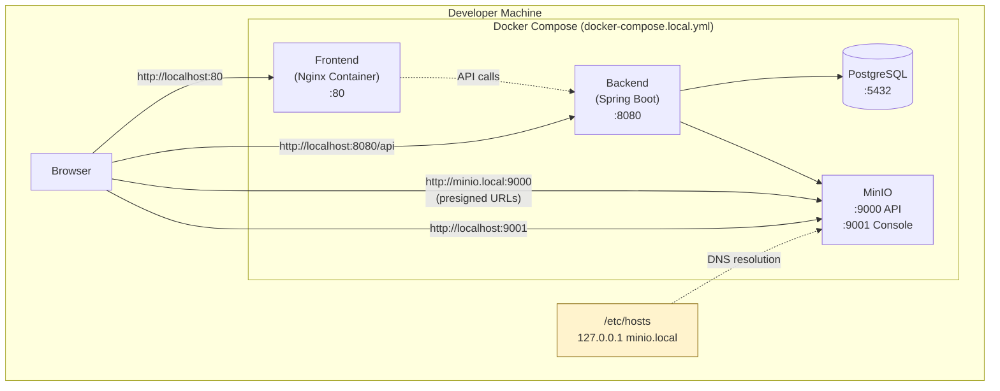
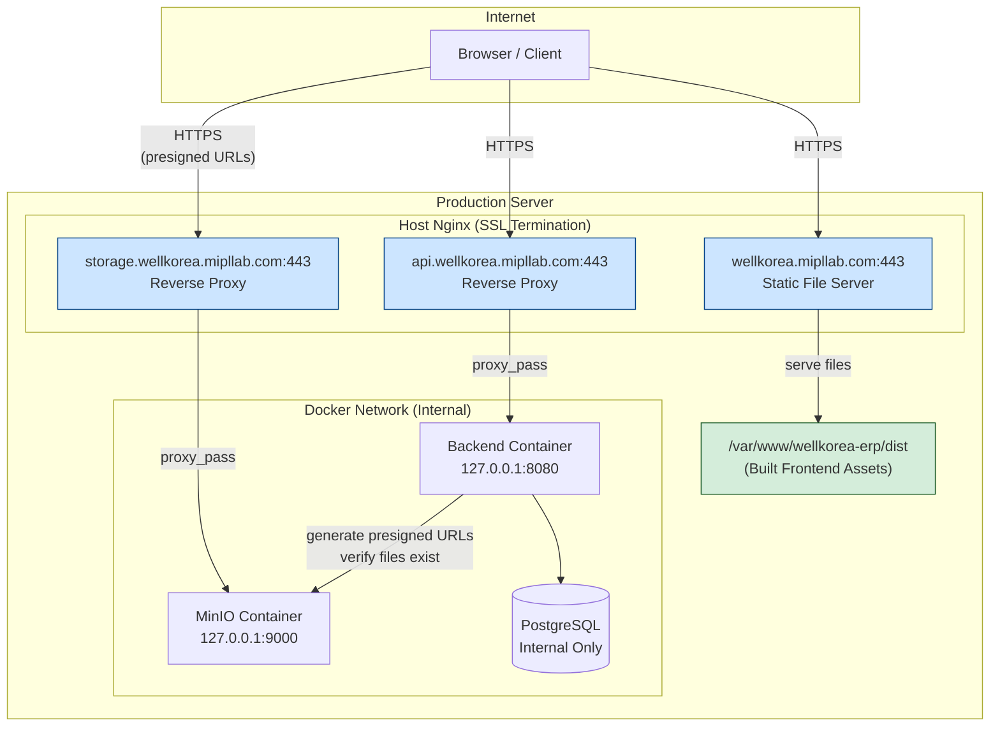
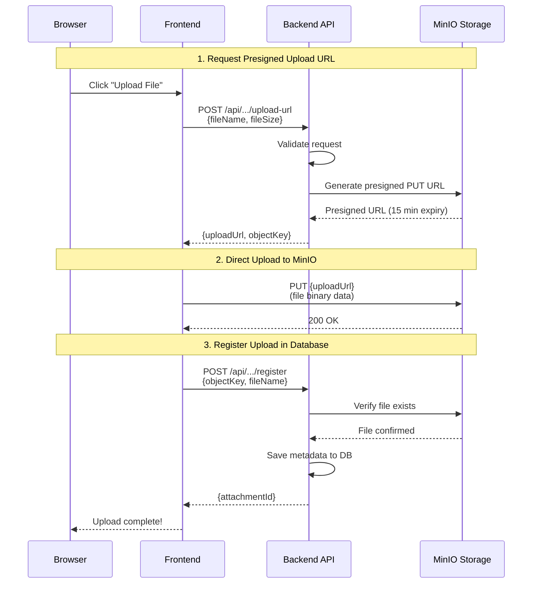

# WellKorea ERP - Deployment Guide

This document describes the deployment architecture and setup for WellKorea ERP in both local development and production environments.

## Table of Contents

- [Architecture Overview](#architecture-overview)
- [Local Development](#local-development)
- [Production Deployment](#production-deployment)
- [Nginx Configuration](#nginx-configuration)
- [SSL/TLS Setup](#ssltls-setup)
- [Troubleshooting](#troubleshooting)

---

## Architecture Overview

### Local Development Architecture



**Key Points:**
- All services run in Docker containers
- Ports exposed directly to localhost
- MinIO uses `minio.local` hostname for presigned URL compatibility
- Frontend container serves built React assets via Nginx

---

### Production Architecture



**Key Points:**
- Host Nginx handles SSL termination for all three subdomains
- Docker containers bind to `127.0.0.1` only (not publicly accessible)
- Frontend is NOT a container - Nginx serves static files directly
- MinIO console (port 9001) is not exposed externally

---

### Request Flow: File Upload



---

## Local Development

### Prerequisites

1. Docker and Docker Compose installed
2. `/etc/hosts` entry for MinIO:
   ```
   127.0.0.1 minio.local
   ```

### Setup

```bash
# 1. Copy environment file
cp .env.local.example .env

# 2. Start all services
docker compose -f docker-compose.local.yml up -d

# 3. Check status
docker compose -f docker-compose.local.yml ps

# 4. View logs
docker compose -f docker-compose.local.yml logs -f backend
```

### Service URLs

| Service | URL | Purpose |
|---------|-----|---------|
| Frontend | http://localhost:80 | React application |
| Backend API | http://localhost:8080 | REST API |
| Swagger UI | http://localhost:8080/swagger-ui.html | API documentation |
| MinIO Console | http://localhost:9001 | Storage admin UI |
| PostgreSQL | localhost:5432 | Database (use any SQL client) |

### Stopping Services

```bash
# Stop services (keep data)
docker compose -f docker-compose.local.yml down

# Stop and remove all data
docker compose -f docker-compose.local.yml down -v
```

---

## Production Deployment

### Prerequisites

1. Server with Docker and Docker Compose
2. Nginx installed on host
3. SSL certificates for:
   - `wellkorea.mipllab.com`
   - `api.wellkorea.mipllab.com`
   - `storage.wellkorea.mipllab.com`
4. DNS records pointing all subdomains to server IP

### Deployment Steps

#### 1. Prepare Environment

```bash
# Clone repository
git clone <repository-url> /opt/wellkorea-erp
cd /opt/wellkorea-erp

# Create production environment file
cp .env.prod.example .env

# Edit .env with production values
vim .env
```

#### 2. Build and Deploy Frontend

```bash
# Build frontend assets
cd frontend
npm ci
npm run build

# Copy to Nginx serving directory
sudo mkdir -p /var/www/wellkorea-erp
sudo cp -r dist/* /var/www/wellkorea-erp/
sudo chown -R www-data:www-data /var/www/wellkorea-erp
```

#### 3. Start Docker Services

```bash
cd /opt/wellkorea-erp

# Build and start services
docker compose -f docker-compose.prod.yml up -d --build

# Verify services are healthy
docker compose -f docker-compose.prod.yml ps
```

#### 4. Configure Nginx

See [Nginx Configuration](#nginx-configuration) section below.

#### 5. Verify Deployment

```bash
# Check backend health
curl http://127.0.0.1:8080/actuator/health

# Check MinIO health
curl http://127.0.0.1:9000/minio/health/live

# Test external access (after Nginx setup)
curl https://api.wellkorea.mipllab.com/actuator/health
```

---

## Nginx Configuration

Create the following Nginx configuration files on the production server.

### Frontend (wellkorea.mipllab.com)

```nginx
# /etc/nginx/sites-available/wellkorea-frontend

server {
    listen 80;
    server_name wellkorea.mipllab.com;
    return 301 https://$server_name$request_uri;
}

server {
    listen 443 ssl http2;
    server_name wellkorea.mipllab.com;

    ssl_certificate /etc/letsencrypt/live/wellkorea.mipllab.com/fullchain.pem;
    ssl_certificate_key /etc/letsencrypt/live/wellkorea.mipllab.com/privkey.pem;

    # SSL configuration
    ssl_protocols TLSv1.2 TLSv1.3;
    ssl_ciphers ECDHE-ECDSA-AES128-GCM-SHA256:ECDHE-RSA-AES128-GCM-SHA256;
    ssl_prefer_server_ciphers off;

    # Security headers
    add_header X-Frame-Options "SAMEORIGIN" always;
    add_header X-Content-Type-Options "nosniff" always;
    add_header X-XSS-Protection "1; mode=block" always;
    add_header Strict-Transport-Security "max-age=31536000; includeSubDomains" always;

    root /var/www/wellkorea-erp;
    index index.html;

    # Gzip compression
    gzip on;
    gzip_vary on;
    gzip_min_length 1024;
    gzip_types text/plain text/css text/xml text/javascript application/javascript application/json;

    # SPA routing - serve index.html for all routes
    location / {
        try_files $uri $uri/ /index.html;
    }

    # Cache static assets
    location ~* \.(jpg|jpeg|png|gif|ico|css|js|svg|woff|woff2|ttf|eot)$ {
        expires 1y;
        add_header Cache-Control "public, immutable";
    }

    # Health check for monitoring
    location /health {
        access_log off;
        return 200 "healthy\n";
        add_header Content-Type text/plain;
    }
}
```

### Backend API (api.wellkorea.mipllab.com)

```nginx
# /etc/nginx/sites-available/wellkorea-api

server {
    listen 80;
    server_name api.wellkorea.mipllab.com;
    return 301 https://$server_name$request_uri;
}

server {
    listen 443 ssl http2;
    server_name api.wellkorea.mipllab.com;

    ssl_certificate /etc/letsencrypt/live/api.wellkorea.mipllab.com/fullchain.pem;
    ssl_certificate_key /etc/letsencrypt/live/api.wellkorea.mipllab.com/privkey.pem;

    ssl_protocols TLSv1.2 TLSv1.3;
    ssl_ciphers ECDHE-ECDSA-AES128-GCM-SHA256:ECDHE-RSA-AES128-GCM-SHA256;
    ssl_prefer_server_ciphers off;

    # Security headers
    add_header X-Frame-Options "DENY" always;
    add_header X-Content-Type-Options "nosniff" always;
    add_header Strict-Transport-Security "max-age=31536000; includeSubDomains" always;

    # Request size limit for file uploads
    client_max_body_size 100M;

    location / {
        proxy_pass http://127.0.0.1:8080;
        proxy_http_version 1.1;

        proxy_set_header Host $host;
        proxy_set_header X-Real-IP $remote_addr;
        proxy_set_header X-Forwarded-For $proxy_add_x_forwarded_for;
        proxy_set_header X-Forwarded-Proto $scheme;

        # WebSocket support (if needed)
        proxy_set_header Upgrade $http_upgrade;
        proxy_set_header Connection "upgrade";

        # Timeouts
        proxy_connect_timeout 60s;
        proxy_send_timeout 60s;
        proxy_read_timeout 60s;
    }
}
```

### MinIO Storage (storage.wellkorea.mipllab.com)

```nginx
# /etc/nginx/sites-available/wellkorea-storage

server {
    listen 80;
    server_name storage.wellkorea.mipllab.com;
    return 301 https://$server_name$request_uri;
}

server {
    listen 443 ssl http2;
    server_name storage.wellkorea.mipllab.com;

    ssl_certificate /etc/letsencrypt/live/storage.wellkorea.mipllab.com/fullchain.pem;
    ssl_certificate_key /etc/letsencrypt/live/storage.wellkorea.mipllab.com/privkey.pem;

    ssl_protocols TLSv1.2 TLSv1.3;
    ssl_ciphers ECDHE-ECDSA-AES128-GCM-SHA256:ECDHE-RSA-AES128-GCM-SHA256;
    ssl_prefer_server_ciphers off;

    # Important: Large file upload support
    client_max_body_size 100M;

    # Disable buffering for streaming uploads
    proxy_buffering off;
    proxy_request_buffering off;

    location / {
        proxy_pass http://127.0.0.1:9000;
        proxy_http_version 1.1;

        proxy_set_header Host $host;
        proxy_set_header X-Real-IP $remote_addr;
        proxy_set_header X-Forwarded-For $proxy_add_x_forwarded_for;
        proxy_set_header X-Forwarded-Proto $scheme;

        # Required for MinIO presigned URLs
        proxy_set_header X-NginX-Proxy true;

        # Timeouts for large file transfers
        proxy_connect_timeout 300s;
        proxy_send_timeout 300s;
        proxy_read_timeout 300s;
    }
}
```

### Enable Sites

```bash
# Create symlinks
sudo ln -s /etc/nginx/sites-available/wellkorea-frontend /etc/nginx/sites-enabled/
sudo ln -s /etc/nginx/sites-available/wellkorea-api /etc/nginx/sites-enabled/
sudo ln -s /etc/nginx/sites-available/wellkorea-storage /etc/nginx/sites-enabled/

# Test configuration
sudo nginx -t

# Reload Nginx
sudo systemctl reload nginx
```

---

## SSL/TLS Setup

### Using Let's Encrypt (Recommended)

```bash
# Install Certbot
sudo apt install certbot python3-certbot-nginx

# Obtain certificates (run for each subdomain)
sudo certbot --nginx -d wellkorea.mipllab.com
sudo certbot --nginx -d api.wellkorea.mipllab.com
sudo certbot --nginx -d storage.wellkorea.mipllab.com

# Verify auto-renewal
sudo certbot renew --dry-run
```

### Using Wildcard Certificate

If you have a wildcard certificate for `*.mipllab.com`:

```bash
# Copy certificates
sudo cp fullchain.pem /etc/ssl/certs/mipllab.com.pem
sudo cp privkey.pem /etc/ssl/private/mipllab.com.key

# Update Nginx configs to use:
# ssl_certificate /etc/ssl/certs/mipllab.com.pem;
# ssl_certificate_key /etc/ssl/private/mipllab.com.key;
```

---

## Troubleshooting

### Backend Container Won't Start

```bash
# Check logs
docker compose -f docker-compose.prod.yml logs backend

# Common issues:
# - Database connection failed: Check POSTGRES_* environment variables
# - Port already in use: Check if another service uses port 8080
```

### MinIO Presigned URLs Not Working

1. **Verify MINIO_URL**: Must match the external URL exactly
   ```bash
   # In .env
   MINIO_URL=https://storage.wellkorea.mipllab.com
   ```

2. **Check Nginx proxy headers**: Ensure `X-Forwarded-Proto` is set

3. **Test MinIO directly**:
   ```bash
   curl http://127.0.0.1:9000/minio/health/live
   ```

### Frontend Shows Blank Page

1. Check if files exist:
   ```bash
   ls -la /var/www/wellkorea-erp/
   ```

2. Check Nginx error logs:
   ```bash
   sudo tail -f /var/log/nginx/error.log
   ```

3. Verify SPA routing (should serve index.html for all routes)

### Database Connection Issues

```bash
# Check if PostgreSQL is running
docker compose -f docker-compose.prod.yml ps postgres

# Test connection from backend container
docker compose -f docker-compose.prod.yml exec backend \
  wget -qO- http://localhost:8080/actuator/health
```

---

## Maintenance Commands

```bash
# View all logs
docker compose -f docker-compose.prod.yml logs -f

# View specific service logs
docker compose -f docker-compose.prod.yml logs -f backend

# Restart a service
docker compose -f docker-compose.prod.yml restart backend

# Update and redeploy
git pull
docker compose -f docker-compose.prod.yml up -d --build

# Backup PostgreSQL
docker compose -f docker-compose.prod.yml exec postgres \
  pg_dump -U $POSTGRES_USER $POSTGRES_DB > backup.sql

# Access MinIO console (via SSH tunnel)
ssh -L 9001:localhost:9001 user@production-server
# Then open http://localhost:9001 in browser
```
