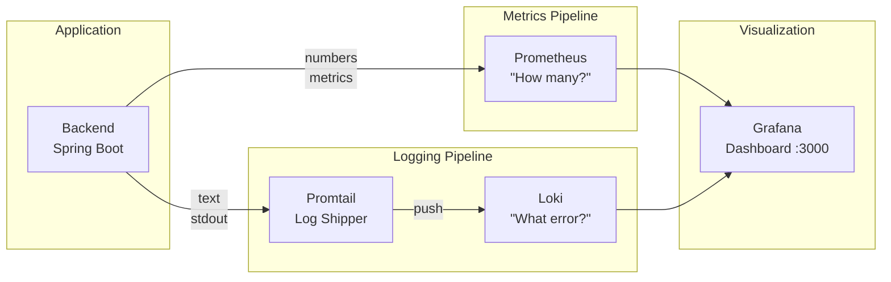

# Monitoring Guide for Newcomers

A beginner-friendly guide to understanding and using the WellKorea ERP monitoring stack. No prior Prometheus/Loki/Grafana experience required.

---

## What is Monitoring and Why Do We Need It?

Imagine you're running a restaurant. You'd want to know:
- How many customers are coming in? (traffic)
- How long are they waiting for food? (latency)
- Are orders getting messed up? (errors)
- Is the kitchen overwhelmed? (resource usage)

**Monitoring** answers the same questions for our application:

| Real World | Application Equivalent |
|------------|----------------------|
| Customer count | Request rate |
| Wait time | Response latency |
| Wrong orders | Error rate |
| Kitchen capacity | Memory/CPU usage |

### Metrics vs Logs

There are two types of monitoring data:

**Metrics** = Numbers that change over time
- "50 requests per second"
- "Memory at 512 MB"
- "p99 latency is 200ms"

**Logs** = Text messages from the application
- "User john@example.com logged in"
- "ERROR: Database connection failed"
- "Order #12345 created successfully"

---

## Our Monitoring Stack (Overview)

We use four tools that work together:



| Tool | What it does | Analogy |
|------|--------------|---------|
| **Prometheus** | Collects numbers (metrics) every 15 seconds | A reporter asking "How many requests now?" |
| **Loki** | Stores and searches log text | A filing cabinet for all messages |
| **Promtail** | Ships logs from Docker to Loki | A mail carrier delivering logs |
| **Grafana** | Shows everything in pretty dashboards | The control panel to see it all |

---

## Quick Start (Step-by-Step)

### Step 1: Start the monitoring stack

```bash
# From the project root directory
docker compose -f docker-compose.local.yml --profile monitoring up -d
```

This starts: postgres, minio, backend, frontend + prometheus, loki, promtail, grafana

### Step 2: Open Grafana

Open your browser to: **http://localhost:3000**

Login credentials:
- Username: `admin`
- Password: `admin`

(You'll be prompted to change the password — you can skip this for local development)

### Step 3: Navigate to the dashboard

1. Click the **hamburger menu** (☰) in the top-left
2. Click **Dashboards**
3. Open **WellKorea ERP** folder
4. Click **WellKorea ERP - JVM & HTTP Metrics**

### Step 4: Generate some traffic

The dashboard needs data to display. Make some API calls:

```bash
# Health check
curl http://localhost:8080/actuator/health

# Hit the API a few times
for i in {1..10}; do curl -s http://localhost:8080/actuator/health > /dev/null; done
```

Wait 30-60 seconds, then refresh Grafana to see the data appear.

---

## Common Tasks (with Examples)

### "I want to see if the server is healthy"

**Look at:** HTTP Request Rate panel (top-left)

- If you see lines moving, requests are coming in = server is responding
- Flat line at zero = no traffic (or server is down)

**Quick check via terminal:**
```bash
curl http://localhost:8080/actuator/health
# Expected: {"status":"UP"}
```

### "I want to find slow API endpoints"

**Look at:** HTTP Response Latency (p95/p99) panel (top-middle)

- p95 = 95% of requests are faster than this value
- p99 = 99% of requests are faster than this value
- If p99 is high (e.g., > 1 second), some requests are slow

**Identify the slow endpoint:** Each line shows the method and URI. Look for the highest lines.

### "I want to see error logs"

**Option 1:** Scroll down to the **Backend Logs** panel at the bottom of the dashboard

**Option 2:** Use the Explore page for more control
1. Click **Explore** (compass icon) in the left sidebar
2. Select **Loki** datasource at the top
3. Enter this query:
   ```logql
   {service="backend"} | level="ERROR"
   ```
4. Click **Run query**

### "I want to trace a specific request"

Every request gets a unique **Correlation ID**. To find all logs for one request:

1. Get the correlation ID from:
   - Response header: `X-Request-ID`
   - Or find it in any log entry for that request

2. Search in Grafana Explore (Loki):
   ```logql
   {service="backend"} |= "your-correlation-id-here"
   ```

**Example:**
```bash
# Send a request and capture the correlation ID
curl -v http://localhost:8080/actuator/health 2>&1 | grep -i x-request-id
# Output: < X-Request-ID: a1b2c3d4-e5f6-7890-abcd-ef1234567890

# Search logs for that ID in Grafana
{service="backend"} |= "a1b2c3d4-e5f6-7890-abcd-ef1234567890"
```

---

## Understanding the Dashboard

The pre-built dashboard has 4 sections with 8 panels:

### Section 1: HTTP Requests

| Panel | What it shows | When to worry |
|-------|--------------|---------------|
| **HTTP Request Rate** | Requests per second, grouped by method/endpoint/status | Sudden drops = outage; Spikes = traffic surge |
| **HTTP Response Latency (p95/p99)** | How long requests take | p99 > 1s = some users experience slowness |
| **HTTP Error Rate (4xx/5xx)** | Client errors (4xx) vs Server errors (5xx) | 5xx errors = bugs or crashes; 4xx = client issues |

**What are percentiles?**
- p95 = "95% of requests are faster than X"
- p99 = "99% of requests are faster than X"
- Why not average? Because averages hide outliers. A few very slow requests get lost in the average.

### Section 2: JVM Memory

| Panel | What it shows | When to worry |
|-------|--------------|---------------|
| **JVM Heap Memory** | Memory used by your Java objects | Used approaching Max = potential OutOfMemoryError |
| **JVM Non-Heap Memory** | Memory for class metadata, code cache | Usually stable; big jumps = classloader leak |

**Understanding the lines:**
- **Used**: Memory currently in use
- **Committed**: Memory allocated by the JVM (reserved from OS)
- **Max**: Upper limit (set by `-Xmx`)

### Section 3: JVM Threads & GC

| Panel | What it shows | When to worry |
|-------|--------------|---------------|
| **JVM Threads** | Number of active threads | Continuous increase = thread leak |
| **GC Pause Duration** | How long garbage collection pauses the app | Long pauses (> 200ms) = app freezing |

**Thread types:**
- **Live**: Currently active threads
- **Daemon**: Background threads (HTTP workers, timers)
- **Peak**: Highest count since JVM start

**What is GC (Garbage Collection)?**
Java automatically cleans up unused memory. During GC, the application briefly pauses. Frequent long pauses = performance problem.

### Section 4: Logs (Loki)

| Panel | What it shows |
|-------|--------------|
| **Backend Logs** | Live stream of application logs with timestamps |

Click any log entry to expand and see all fields (level, correlationId, logger, etc.)

---

## Useful LogQL Queries (Copy-Paste Reference)

LogQL is the query language for Loki. Use these in Grafana Explore (Loki datasource):

```logql
# All backend logs
{service="backend"}

# Only ERROR level logs
{service="backend"} | level="ERROR"

# WARNING and ERROR logs
{service="backend"} | level=~"WARN|ERROR"

# Search for specific text (case-sensitive)
{service="backend"} |= "NullPointerException"

# Search for text (case-insensitive)
{service="backend"} |~ "(?i)nullpointer"

# Find by correlation ID
{service="backend"} |= "a1b2c3d4-e5f6-7890"

# Filter by specific logger (e.g., auth package)
{service="backend", logger=~"com.wellkorea.backend.core.auth.*"}

# Exclude health check logs (noisy)
{service="backend"} != "/actuator/health"

# Logs in the last 5 minutes with ERROR
{service="backend"} | level="ERROR" | __timestamp__ > now() - 5m
```

**LogQL operators:**
| Operator | Meaning | Example |
|----------|---------|---------|
| `\|=` | Contains (exact) | `\|= "error"` |
| `!=` | Does not contain | `!= "health"` |
| `\|~` | Contains (regex) | `\|~ "user-[0-9]+"` |
| `!~` | Does not match regex | `!~ "DEBUG\|TRACE"` |

---

## Useful PromQL Queries (Copy-Paste Reference)

PromQL is the query language for Prometheus. Use these in Grafana Explore (Prometheus datasource):

```promql
# Request rate (requests per second over 5 minutes)
rate(http_server_requests_seconds_count{application="wellkorea-erp-backend"}[5m])

# Request rate for specific endpoint
rate(http_server_requests_seconds_count{application="wellkorea-erp-backend", uri="/api/quotations"}[5m])

# p99 latency (99th percentile)
histogram_quantile(0.99, rate(http_server_requests_seconds_bucket{application="wellkorea-erp-backend"}[5m]))

# p95 latency (95th percentile)
histogram_quantile(0.95, rate(http_server_requests_seconds_bucket{application="wellkorea-erp-backend"}[5m]))

# 5xx error rate
rate(http_server_requests_seconds_count{application="wellkorea-erp-backend", status=~"5.."}[5m])

# JVM heap memory usage
jvm_memory_used_bytes{application="wellkorea-erp-backend", area="heap"}

# JVM memory usage percentage
jvm_memory_used_bytes{area="heap"} / jvm_memory_max_bytes{area="heap"} * 100

# Active threads
jvm_threads_live_threads{application="wellkorea-erp-backend"}

# GC pause time
rate(jvm_gc_pause_seconds_sum{application="wellkorea-erp-backend"}[5m])
```

---

## What is a Correlation ID?

A **Correlation ID** is a unique identifier that follows a single request through all its logs. It's like a tracking number for a package.

### How it works

```
Client Request                    Backend Logs
     │                                │
     │ X-Request-ID: abc-123          │
     ├──────────────────────────────▶│ [abc-123] Request received
     │                               │ [abc-123] Validating user
     │                               │ [abc-123] Querying database
     │                               │ [abc-123] Response sent
     │◀──────────────────────────────┤
     │ X-Request-ID: abc-123          │
```

All logs for that request share the same ID, making it easy to trace.

### Using correlation IDs

**Send a request with a custom ID:**
```bash
curl -H "X-Request-ID: my-test-123" http://localhost:8080/api/quotations
```

**Or let the backend generate one:**
```bash
curl -v http://localhost:8080/api/quotations 2>&1 | grep X-Request-ID
```

**Find all logs for that request:**
```logql
{service="backend"} |= "my-test-123"
```

### When is this useful?

- **Debugging errors**: "User reported an error at 2pm" → Find logs by timestamp, get correlation ID, see full request flow
- **Performance investigation**: "This endpoint was slow" → Get correlation ID from slow request, see where time was spent
- **Support tickets**: Ask users to provide the X-Request-ID from their browser's network tab

---

## Troubleshooting

### "Grafana shows 'No data'"

**Check 1:** Is the backend running?
```bash
docker compose -f docker-compose.local.yml ps
# Look for "backend" with status "Up"

curl http://localhost:8080/actuator/health
# Should return {"status":"UP"}
```

**Check 2:** Is Prometheus scraping metrics?
1. Open http://localhost:9090/targets
2. Look for `wellkorea-erp-backend` target
3. Should show "UP" status

**Check 3:** Wait for data collection
Prometheus scrapes every 15 seconds. New deployments need 30-60 seconds before data appears.

### "Logs aren't appearing in Loki"

**Check 1:** Is Promtail running?
```bash
docker compose -f docker-compose.local.yml ps promtail
docker compose -f docker-compose.local.yml logs promtail
```

**Check 2:** Is the Docker socket mounted?
Promtail reads logs via `/var/run/docker.sock`. Check docker-compose.local.yml for the mount.

**Check 3:** Generate some logs
```bash
curl http://localhost:8080/actuator/health
# Wait a few seconds, then check Grafana
```

### "Dashboard panels show 'No data'" but Prometheus/Loki work

**Check 1:** Verify datasource configuration
1. Go to Grafana → Settings (gear icon) → Data sources
2. Click on Prometheus → Click "Test"
3. Click on Loki → Click "Test"
4. Both should show "Data source is working"

**Check 2:** Check the time range
The dashboard defaults to "Last 1 hour". If no traffic in that period, expand the time range.

### "Metrics show wrong application name"

The dashboard filters by `application="wellkorea-erp-backend"`. Verify your backend has this label:
```bash
curl http://localhost:8080/actuator/prometheus | grep "application="
```

Should contain `application="wellkorea-erp-backend"`.

---

## Stopping the Monitoring Stack

```bash
# Stop only monitoring services (keep app running)
docker compose -f docker-compose.local.yml --profile monitoring stop prometheus loki promtail grafana

# Stop everything
docker compose -f docker-compose.local.yml --profile monitoring down

# Stop everything and delete data (fresh start)
docker compose -f docker-compose.local.yml --profile monitoring down -v
```

---

## Glossary

| Term | Simple Definition |
|------|-------------------|
| **Metrics** | Numbers that change over time (request count, memory usage) |
| **Logs** | Text messages from the application |
| **Prometheus** | Database that stores metrics and answers "how many?" questions |
| **Loki** | Database that stores logs and answers "what happened?" questions |
| **Promtail** | Agent that ships logs from Docker containers to Loki |
| **Grafana** | Web UI to visualize metrics and logs as dashboards |
| **LogQL** | Query language for searching logs in Loki |
| **PromQL** | Query language for querying metrics in Prometheus |
| **Scraping** | Prometheus periodically asking the backend "what are your metrics?" |
| **MDC** | Mapped Diagnostic Context — how correlation IDs attach to logs in Java |
| **Correlation ID** | Unique ID that follows a request through all its logs |
| **p95/p99** | 95th/99th percentile — "95%/99% of values are below this" |
| **Heap Memory** | Memory where Java objects live |
| **Non-Heap Memory** | Memory for JVM internals (class metadata, code cache) |
| **GC (Garbage Collection)** | Java's automatic memory cleanup process |
| **4xx Errors** | Client errors (bad request, unauthorized, not found) |
| **5xx Errors** | Server errors (internal error, service unavailable) |
| **Rate** | How fast something is changing (e.g., requests per second) |
| **Histogram** | Distribution of values (used for latency percentiles) |

---

## Learn More

- **Technical architecture**: [Monitoring Stack Architecture](../architecture/monitoring-stack.md)
- **Prometheus basics**: https://prometheus.io/docs/introduction/overview/
- **Loki documentation**: https://grafana.com/docs/loki/latest/
- **Grafana tutorials**: https://grafana.com/tutorials/
