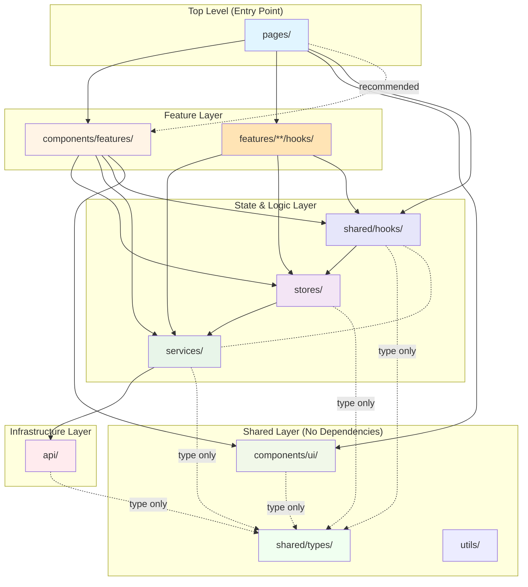

# Frontend Architecture

This document defines the layered architecture and import rules for the WellKorea ERP frontend application.

## Table of Contents

1. [Directory Structure](#directory-structure)
2. [Layer Definitions](#layer-definitions)
3. [Dependency Flow](#dependency-flow)
4. [Import Rules](#import-rules)
5. [ESLint Configuration](#eslint-configuration)
6. [Migration Guide](#migration-guide)

---

## Directory Structure

```
src/
├── app/              (future) Application setup, providers, router config
├── pages/            Route-level components (orchestration layer)
├── components/
│   ├── ui/          Dumb/presentational components (Button, Modal, Table)
│   └── features/    Smart components with data fetching and state
│       ├── users/   User management (forms, hooks, table)
│       │   └── hooks/  Feature hooks (useUserManagementActions, etc.)
│       └── audit/   Audit logging feature
│           └── hooks/  Feature hooks (useAuditLogPage)
├── stores/           Global state management (Zustand)
├── shared/           Shared code across features
│   ├── hooks/       Generic reusable hooks (useAuth, usePaginatedSearch)
│   ├── types/       Shared TypeScript type definitions
│   └── utils/       Pure utility functions
├── services/         Business logic and API abstraction
│   ├── auth/        Authentication service
│   ├── users/       User management service
│   ├── audit/       Audit logging service
│   └── shared/      Shared service utilities (pagination, etc.)
├── api/              HTTP client layer (axios wrapper, interceptors)
└── utils/            Pure utility functions (legacy, prefer shared/utils)
```

---

## Layer Definitions

### 1. `api/` - HTTP/Transport Layer

**Purpose**: HTTP communication infrastructure only.

**Responsibilities**:

- Axios/fetch wrappers
- Base URL configuration
- Request/response interceptors
- Token management and refresh
- Error parsing and normalization

**Characteristics**:

- Minimal domain knowledge
- Generic HTTP operations (GET, POST, PUT, DELETE)
- No business logic

**Examples**: `httpClient.ts`, `tokenStore.ts`, `types.ts`

**Who can import**: Only `services/`

---

### 2. `services/` - Business Logic Layer

**Purpose**: Use cases and domain services that abstract server communication.

**Responsibilities**:

- Call `api/` layer with business context
- Transform DTOs to domain models
- Data normalization (lowercase emails, trim strings, parse dates)
- Hide URL/parameter details from consumers
- Provide meaningful business operations

**Examples**:

- `authService.login(credentials)` - Not just POST /auth/login
- `userService.getUsers(filters)` - Hides pagination, transforms response
- `projectService.createProject(data)` - Business validation, DTO mapping

**Who can import**: `api/`, `services/shared/*`

**Who imports this**: `stores/`, `components/features/`, `pages/`, `hooks/`

---

### 3. `stores/` - Global State Management

**Purpose**: Application-wide state and state transitions.

**Responsibilities**:

- Auth state (user, tokens, isAuthenticated)
- App settings, session data
- Cache for frequently accessed data
- State orchestration (can call services)

**Patterns**:

- Zustand stores with actions
- Store actions can call `services/` (common pattern)
- Emit events for async state changes (token refresh, session expiry)

**Examples**: `authStore.ts`

**Who can import**: `services/`, `types/`

**Who imports this**: `hooks/`, `pages/`, `components/features/`

---

### 4. `shared/hooks/` - Shared React Hooks

**Purpose**: Generic, reusable React hooks that don't depend on features.

**Categories**:

1. **Store accessor hooks**: `useAuth` - Wraps Zustand store with convenient API
2. **Generic UI hooks**: `usePaginatedSearch` - Reusable pagination/search state

**Characteristics**:

- Can import from `stores/` (to wrap store access)
- **Cannot** import from `services/` (that would make them feature-specific)
- Generic enough to use across any feature

**Examples**: `useAuth.ts`, `usePaginatedSearch.ts`

**Who can import**: `stores/`, `shared/types/`, `utils/`

**Who imports this**: `pages/`, `components/`

---

### 4b. `components/features/**/hooks/` - Feature Hooks

**Purpose**: Feature-specific hooks that encapsulate service calls and complex state.

**Categories**:

1. **Action hooks**: `useUserManagementActions` - Encapsulates CRUD service calls
2. **Page hooks**: `useAuditLogPage` - Combines pagination state with data fetching

**Characteristics**:

- **Can** import from `services/` (feature-specific logic)
- **Can** import from `stores/` and `shared/hooks/`
- Located within feature directories (not globally shared)

**Examples**:

- `components/features/users/hooks/useUserManagementActions.ts`
- `components/features/audit/hooks/useAuditLogPage.ts`

**Who can import**: `services/`, `stores/`, `shared/hooks/`, `shared/types/`

**Who imports this**: `pages/` (the feature's parent page)

---

### 5. `components/ui/` - Dumb UI Components

**Purpose**: Reusable, presentational components only.

**Characteristics**:

- **No data fetching** - Receive all data via props
- **No store access** - Props only
- **No business logic** - Pure UI rendering
- Highly reusable across features

**Examples**: `Button`, `Modal`, `Table`, `Card`, `Badge`

**Who can import**: `types/` (type-only), `utils/` (pure functions)

**Who imports this**: Everyone

---

### 6. `components/features/` - Smart Feature Components

**Purpose**: Feature-specific components that fetch data and manage complex state.

**Characteristics**:

- **Can fetch data** - Call `services/` directly
- **Can access stores** - Use `stores/` via hooks
- **Can manage complex state** - Form state, modal open/close, validation
- Feature-specific (not necessarily reusable)

**Examples**:

- `UserCreateForm` - Fetches roles, submits to userService
- `UserCustomersForm` - Fetches customer assignments, saves changes
- Feature wizards, data tables with inline editing

**Who can import**: `services/`, `stores/`, `hooks/`, `components/ui/`, `types/`, `utils/`

**Who imports this**: `pages/` only

---

### 7. `pages/` - Route Components

**Purpose**: Route-level orchestration and layout.

**Responsibilities**:

- Compose features and UI components
- Handle page-level routing and navigation
- Apply page-level permissions (ProtectedRoute)
- Coordinate multiple features on a page

**Characteristics**:

- **Top-level** - Nothing else imports from pages
- Can import from anywhere (except other pages)
- Thin orchestration layer (composition, not logic)

**Who can import**: Everything except other `pages/`

**Who imports this**: Nobody (pages are top-level)

---

### 8. `shared/types/` - Shared Type Definitions

**Purpose**: TypeScript types used across multiple layers.

**Examples**: `auth.ts` (User, RoleName, LoginRequest), shared interfaces

**Who can import**: Nobody (types have no dependencies)

**Who imports this**: Everyone

**Import path**: `@/shared/types/auth` or via barrel export `@/shared/types`

---

### 9. `utils/` - Pure Utility Functions

**Purpose**: Helper functions with no dependencies.

**Examples**: `storage.ts` (localStorage wrapper), `format.ts`, `validation.ts`

**Who can import**: Nobody (utils are dependency-free)

**Who imports this**: Everyone

---

## Dependency Flow

### Visual Diagram



**Legend**:

- **Solid arrows**: Full imports allowed (runtime dependencies)
- **Dotted arrows**: Type-only imports allowed (compile-time only)
- **Dashed red line**: NOT allowed (shared/hooks cannot import services)
- **No reverse arrows**: Dependencies flow downward only (no circular deps)

### Key Architectural Decisions

1. **Pages should prefer feature imports**: Pages orchestrate via `features/` and `features/**/hooks/`
2. **Shared hooks are generic**: `shared/hooks/` wraps stores but NOT services
3. **Feature hooks encapsulate services**: `features/**/hooks/` is where service calls live
4. **Clean separation**: Pages don't call services directly; they use feature hooks

---

### Dependency Rules Summary

| From ↓ / To →     | pages | features | feature hooks | stores | shared hooks | services | api | ui | types | utils |
|-------------------|-------|----------|---------------|--------|--------------|----------|-----|----|-------|-------|
| **pages**         | ❌     | ✅        | ✅             | ⚠️*    | ✅            | ⚠️*      | ❌   | ✅  | ✅     | ✅     |
| **features**      | ❌     | ❌        | ✅             | ✅      | ✅            | ✅        | ❌   | ✅  | ✅     | ✅     |
| **feature hooks** | ❌     | ❌        | ❌             | ✅      | ✅            | ✅        | ❌   | ❌  | ✅     | ✅     |
| **stores**        | ❌     | ❌        | ❌             | ❌      | ❌            | ✅        | ❌   | ❌  | ✅     | ✅     |
| **shared hooks**  | ❌     | ❌        | ❌             | ✅      | ❌            | ❌        | ❌   | ❌  | ✅     | ✅     |
| **services**      | ❌     | ❌        | ❌             | ❌      | ❌            | ✅**      | ✅   | ❌  | ✅     | ✅     |
| **api**           | ❌     | ❌        | ❌             | ❌      | ❌            | ❌        | ❌   | ❌  | ✅     | ✅     |
| **ui**            | ❌     | ❌        | ❌             | ❌      | ❌            | ❌        | ❌   | ❌  | ✅     | ✅     |
| **types**         | ❌     | ❌        | ❌             | ❌      | ❌            | ❌        | ❌   | ❌  | ❌     | ❌     |
| **utils**         | ❌     | ❌        | ❌             | ❌      | ❌            | ❌        | ❌   | ❌  | ❌     | ❌     |

\* `pages/` can technically import `stores/` and `services/`, but should prefer using `feature hooks` which encapsulate
these calls. This keeps pages as thin orchestration layers.

\** `services/` can import from `services/shared/*` (shared utilities like pagination)

---

## Import Rules

### Mandatory Rules (Enforced by ESLint)

#### Rule 1: Nobody imports from pages (pages는 최상위)

```typescript
// ❌ NEVER - Pages are top-level orchestrators
import {UserManagementPage} from '@/pages/admin/UserManagementPage';

// ✅ CORRECT - Pages compose other layers, never imported
// (No imports from pages allowed)
```

**Rationale**: Pages are entry points. If other modules import pages, you create circular dependencies and coupling.

---

#### Rule 2: UI components stay dumb (재사용 UI는 dumb)

```typescript
// ❌ NEVER in components/ui/
import {userService} from '@/services';
import {useAuthStore} from '@/stores';

// ✅ CORRECT in components/ui/ - Props only
interface ButtonProps {
    onClick: () => void;
    children: React.ReactNode;
}

export function Button({onClick, children}: ButtonProps) {
    return <button onClick = {onClick} > {children} < /button>;
}
```

**Rationale**: UI components should be reusable. Data fetching and store access make them feature-specific.

**For smart components**: Use `components/features/` instead.

---

#### Rule 3: API only imported by services (HTTP 계층 격리)

```typescript
// ❌ NEVER in pages/components/stores/hooks
import {httpClient} from '@/api';

const users = await httpClient.get('/users');

// ✅ CORRECT - Use services layer
import {userService} from '@/services';

const {data: users} = await userService.getUsers();
```

**Exception**: Type-only imports from `@/api/types` are allowed everywhere.

```typescript
// ✅ OK - Types only
import type {ApiError, PaginationMetadata} from '@/api/types';
```

**Rationale**: Services provide business context. Direct HTTP calls bypass domain logic and create coupling.

---

#### Rule 4: Shared layers cannot import upward (shared는 아무도 모름)

```typescript
// ❌ NEVER in utils/types/components/ui
import {userService} from '@/services';
import {UserManagementPage} from '@/pages';

// ✅ CORRECT - Shared utilities are dependency-free
// No imports from features/pages/stores/services
```

**Rationale**: Shared code should be reusable everywhere. Dependencies on features create circular coupling.

---

### Recommended Rules (Best Practices)

#### Rule 5: Use barrel exports in services

```typescript
// ⚠️  NOT RECOMMENDED
import {userService} from '@/services/users/userService';

// ✅ BETTER - Use barrel export
import {userService} from '@/services';
```

**Rationale**: Barrel exports provide a stable public API. Internal file structure can change without breaking imports.

---

#### Rule 6: Stores can use services (allowed pattern)

```typescript
// ✅ ALLOWED - Common pattern
import {authService} from '@/services';

export const authStore = create((set) => ({
    login: async (credentials) => {
        const {user, tokens} = await authService.login(credentials);
        set({user, tokens, isAuthenticated: true});
    },
}));
```

**Rationale**: Stores orchestrate business logic. Calling services from store actions is standard practice.

---

#### Rule 7: Feature components can use services/stores (allowed pattern)

```typescript
// ✅ ALLOWED in components/features/
import {userService} from '@/services';
import {useAuth} from '@/hooks';

export function UserCreateForm({onSuccess}: Props) {
    const {user} = useAuth();

    const handleSubmit = async (data) => {
        await userService.createUser(data);
        onSuccess();
    };

    return <form onSubmit = {handleSubmit} >
...
    </form>;
}
```

**Rationale**: Feature components are smart by definition. They encapsulate feature-specific logic.

---

## ESLint Configuration

The architecture is enforced by ESLint rules in `eslint.config.js` using `@typescript-eslint/no-restricted-imports`.

> **Note**: We use `@typescript-eslint/no-restricted-imports` instead of `import/no-restricted-paths` because the latter
> doesn't support TypeScript path aliases (`@/services`, `@/stores`, etc.).
> See [eslint-plugin-import#1872](https://github.com/import-js/eslint-plugin-import/issues/1872).

### Rule Configuration

```javascript
// Layer encapsulation rules (excluding tests)
// See eslint.config.js for full configuration

// Rule 1: Pages cannot import stores or services directly
// (Use feature hooks from @/components/features/**/hooks instead)
{
    files: ['src/pages/**/*.{ts,tsx}'],
        rules
:
    {
        '@typescript-eslint/no-restricted-imports'
    :
        ['error', {
            patterns: [
                {
                    group: ['@/services', '@/services/*'],
                    message: '❌ Pages should not import services directly. Use feature hooks from @/components/features/**/hooks instead.',
                    allowTypeImports: true,  // Type-only imports are OK
                },
                {
                    group: ['@/stores', '@/stores/*'],
                    message: '❌ Pages should not import stores directly. Use @/shared/hooks (e.g., useAuth) instead.',
                    allowTypeImports: true,
                },
                {
                    group: ['@/api', '@/api/*'],
                    message: '❌ Pages should not import from @/api. Use @/services via feature hooks.',
                    allowTypeImports: true,
                },
            ],
        }],
    }
,
}
,

// Rule 2: UI components must stay dumb (no services/stores)
{
    files: ['src/components/ui/**/*.{ts,tsx}'],
        rules
:
    {
        '@typescript-eslint/no-restricted-imports'
    :
        ['error', {
            patterns: [
                {
                    group: ['@/services', '@/services/*'],
                    message: '❌ UI components must receive data via props. Move to @/components/features/ for smart components.',
                },
                {
                    group: ['@/stores', '@/stores/*'],
                    message: '❌ UI components must receive data via props. Move to @/components/features/ for smart components.',
                },
                {
                    group: ['@/api', '@/api/*'],
                    message: '❌ UI components should not import from @/api.',
                    allowTypeImports: true,
                },
            ],
        }],
    }
,
}
,

// Rule 3: Shared hooks can only use stores, not services
{
    files: ['src/shared/hooks/**/*.{ts,tsx}'],
        rules
:
    {
        '@typescript-eslint/no-restricted-imports'
    :
        ['error', {
            patterns: [
                {
                    group: ['@/services', '@/services/*'],
                    message: '❌ Shared hooks should only use stores. Feature-specific hooks go in @/components/features/**/hooks.',
                    allowTypeImports: true,
                },
            ],
        }],
    }
,
}
,

// Rule 4: Shared layers cannot import upward
{
    files: ['src/shared/{types,utils}/**/*.{ts,tsx}', 'src/components/ui/**/*.{ts,tsx}'],
        rules
:
    {
        '@typescript-eslint/no-restricted-imports'
    :
        ['error', {
            patterns: [
                {
                    group: ['@/pages', '@/pages/*'],
                    message: '❌ Shared utilities cannot depend on pages.',
                },
                {
                    group: ['@/components/features', '@/components/features/*'],
                    message: '❌ Shared utilities cannot depend on feature components.',
                },
            ],
        }],
    }
,
}
,
```

### Key Features

1. **Type imports allowed**: Rules use `allowTypeImports: true` to permit `import type` statements
2. **Test files excluded**: All rules ignore `**/*.test.{ts,tsx}` and `**/*.spec.{ts,tsx}`
3. **Pattern matching**: Uses import specifier patterns (works with TypeScript aliases)

### Running ESLint

```bash
# Check for violations
npm run lint

# Auto-fix violations (where possible)
npm run lint -- --fix
```

---

## Migration Guide

### Moving Components to `features/`

If you create a component that needs to fetch data or access stores:

1. **Create in `components/features/`**, not `components/ui/`
2. **Group by feature**: `components/features/users/`, `components/features/projects/`
3. **Update imports**: `@/components/features/users` instead of `@/components/forms`

**Example**:

```bash
# Before
src/components/forms/UserCreateForm.tsx

# After
src/components/features/users/UserCreateForm.tsx
```

### Converting Dumb to Smart Components

If a UI component needs data fetching:

1. **Keep original in `components/ui/`** (props-based)
2. **Create smart wrapper in `components/features/`** (data fetching)

**Example**:

```typescript
// components/ui/UserTable.tsx (dumb)
export function UserTable({users, onEdit, onDelete}: Props) {
    return <Table data = {users} >
...
    </Table>;
}

// components/features/users/UserTableContainer.tsx (smart)
export function UserTableContainer() {
    const [users, setUsers] = useState([]);

    useEffect(() => {
        userService.getUsers().then(({data}) => setUsers(data));
    }, []);

    return <UserTable users = {users}
    onEdit = {...}
    onDelete = {...}
    />;
}
```

---

## Examples

### ✅ Correct Patterns

```typescript
// Page orchestrates via feature hooks (preferred pattern)
// pages/admin/UserManagementPage.tsx
import {useUserManagementActions, UserCreateForm, UserManagementTable} from '@/components/features/users';
import {usePaginatedSearch} from '@/shared/hooks';
import {PageHeader, Button} from '@/components/ui';

export function UserManagementPage() {
    const {page, search, setPage, handleSearchSubmit} = usePaginatedSearch();
    const {createUser, refreshTrigger} = useUserManagementActions();

    return (
        <>
            <PageHeader title = "User Management" / >
        <UserCreateForm onSubmit = {createUser}
    />
    < UserManagementTable
    page = {page}
    search = {search}
    refreshTrigger = {refreshTrigger}
    onPageChange = {setPage}
    />
    < />
)
    ;
}

// Feature hook encapsulates service calls
// components/features/users/hooks/useUserManagementActions.ts
import {userService} from '@/services';
import {useCallback, useReducer} from 'react';

export function useUserManagementActions() {
    const [refreshTrigger, triggerRefresh] = useReducer((x) => x + 1, 0);

    const createUser = useCallback(async (data) => {
        await userService.createUser(data);
        triggerRefresh();
    }, []);

    return {createUser, refreshTrigger};
}

// Feature component fetches data
// components/features/users/UserCreateForm.tsx
import {type CreateUserRequest} from '@/services';
import {Button, FormField, Modal} from '@/components/ui';

export function UserCreateForm({onSubmit}: { onSubmit: (data: CreateUserRequest) => Promise<void> }) {
    // Pure component - receives callback, doesn't call services directly
    const handleSubmit = async (data) => {
        await onSubmit(data);  // Delegates to parent
    };

    return <form onSubmit = {handleSubmit} >
...
    </form>;
}

// Store calls service
// stores/authStore.ts
import {authService} from '@/services';

export const authStore = create((set) => ({
    login: async (credentials) => {
        const result = await authService.login(credentials);
        set({user: result.user, isAuthenticated: true});
    },
}));

// Shared hook wraps store (not services)
// shared/hooks/useAuth.ts
import {useAuthStore} from '@/stores/authStore';

export function useAuth() {
    const store = useAuthStore();
    return {
        user: store.user,
        isAuthenticated: store.isAuthenticated,
        hasRole: store.hasRole,
        // ... delegates to store
    };
}

// Service calls API
// services/users/userService.ts
import {httpClient} from '@/api';

export const userService = {
    async getUsers(params) {
        const response = await httpClient.requestWithMeta({
            method: 'GET',
            url: '/users',
            params,
        });
        return transformPagedResponse(response.data, response.metadata);
    },
};
```

### ❌ Anti-Patterns

```typescript
// ❌ Page calls service directly (should use feature hooks)
// pages/admin/UserManagementPage.tsx
import {userService} from '@/services';  // Avoid in pages!

export function UserManagementPage() {
    const handleCreate = async (data) => {
        await userService.createUser(data);  // BAD: page calls service
    };
}

// FIX: Create useUserManagementActions hook in features/users/hooks/

// ❌ UI component fetches data
// components/ui/UserTable.tsx
import {userService} from '@/services';  // WRONG!

export function UserTable() {
    const [users, setUsers] = useState([]);
    useEffect(() => {
        userService.getUsers().then(setUsers);  // WRONG!
    }, []);
    return <Table data = {users}
    />;
}

// FIX: Move to components/features/users/

// ❌ Shared hook imports services
// shared/hooks/useUsers.ts
import {userService} from '@/services';  // WRONG!

export function useUsers() {
    // This belongs in features/users/hooks/, not shared/hooks/
}

// FIX: Move to components/features/users/hooks/

// ❌ Page imports from another page
// pages/DashboardPage.tsx
import {UserManagementPage} from './admin/UserManagementPage';  // WRONG!
// FIX: Extract shared components to components/

// ❌ Component directly calls httpClient
// components/features/users/UserForm.tsx
import {httpClient} from '@/api';  // WRONG!

const handleSubmit = async (data) => {
    await httpClient.post('/users', data);  // WRONG!
};
// FIX: Use userService.createUser(data)

// ❌ Shared utility imports feature code
// utils/formatting.ts
import {userService} from '@/services';  // WRONG!
// FIX: Keep utils pure, pass data as parameters
```

---

## Benefits of This Architecture

1. **Clear boundaries**: Each layer has one responsibility
2. **Scalable**: Add features without affecting core infrastructure
3. **Testable**: Mock dependencies at layer boundaries
4. **Reusable**: Shared code has no dependencies
5. **Maintainable**: Changes localized to one layer
6. **Enforced**: ESLint prevents architectural violations

---

## Further Reading

- [CLAUDE.md](../CLAUDE.md) - Project conventions and patterns
- [Service Layer Pattern](./src/services/README.md) - Service implementation guide
- [Component Design System](./src/components/ui/README.md) - UI component guidelines

---

**Last Updated**: 2025-12-17
**Maintained By**: Development Team
