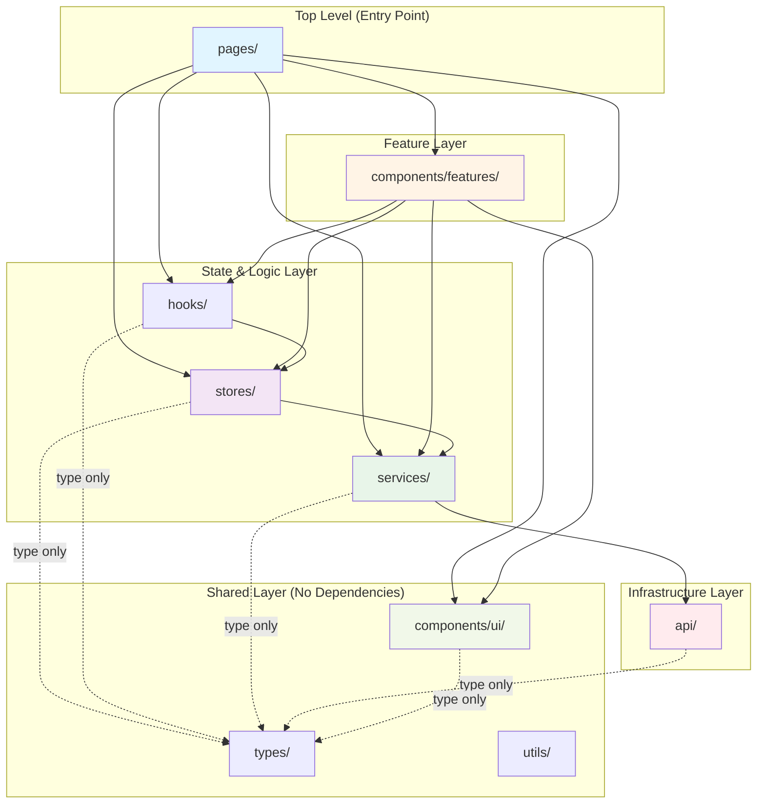

# Frontend Architecture

This document defines the layered architecture and import rules for the WellKorea ERP frontend application.

## Table of Contents

1. [Directory Structure](#directory-structure)
2. [Layer Definitions](#layer-definitions)
3. [Dependency Flow](#dependency-flow)
4. [Import Rules](#import-rules)
5. [ESLint Configuration](#eslint-configuration)
6. [Migration Guide](#migration-guide)

---

## Directory Structure

```
src/
├── app/              (future) Application setup, providers, router config
├── pages/            Route-level components (orchestration layer)
├── components/
│   ├── ui/          Dumb/presentational components (Button, Modal, Table)
│   └── features/    Smart components with data fetching and state
│       └── users/   User management forms
├── stores/           Global state management (Zustand)
├── hooks/            Custom React hooks
├── services/         Business logic and API abstraction
│   ├── auth/        Authentication service
│   ├── users/       User management service
│   ├── audit/       Audit logging service
│   └── shared/      Shared service utilities (pagination, etc.)
├── api/              HTTP client layer (axios wrapper, interceptors)
├── types/            Shared TypeScript type definitions
└── utils/            Pure utility functions
```

---

## Layer Definitions

### 1. `api/` - HTTP/Transport Layer

**Purpose**: HTTP communication infrastructure only.

**Responsibilities**:
- Axios/fetch wrappers
- Base URL configuration
- Request/response interceptors
- Token management and refresh
- Error parsing and normalization

**Characteristics**:
- Minimal domain knowledge
- Generic HTTP operations (GET, POST, PUT, DELETE)
- No business logic

**Examples**: `httpClient.ts`, `tokenStore.ts`, `types.ts`

**Who can import**: Only `services/`

---

### 2. `services/` - Business Logic Layer

**Purpose**: Use cases and domain services that abstract server communication.

**Responsibilities**:
- Call `api/` layer with business context
- Transform DTOs to domain models
- Data normalization (lowercase emails, trim strings, parse dates)
- Hide URL/parameter details from consumers
- Provide meaningful business operations

**Examples**:
- `authService.login(credentials)` - Not just POST /auth/login
- `userService.getUsers(filters)` - Hides pagination, transforms response
- `projectService.createProject(data)` - Business validation, DTO mapping

**Who can import**: `api/`, `services/shared/*`

**Who imports this**: `stores/`, `components/features/`, `pages/`, `hooks/`

---

### 3. `stores/` - Global State Management

**Purpose**: Application-wide state and state transitions.

**Responsibilities**:
- Auth state (user, tokens, isAuthenticated)
- App settings, session data
- Cache for frequently accessed data
- State orchestration (can call services)

**Patterns**:
- Zustand stores with actions
- Store actions can call `services/` (common pattern)
- Emit events for async state changes (token refresh, session expiry)

**Examples**: `authStore.ts`

**Who can import**: `services/`, `types/`

**Who imports this**: `hooks/`, `pages/`, `components/features/`

---

### 4. `hooks/` - React Reusable Logic

**Purpose**: Extract and reuse React logic.

**Categories**:
1. **Shared hooks**: UI/domain independent (`useDebounce`, `useMediaQuery`)
2. **Store hooks**: Zustand store accessors (`useAuth`)
3. **Feature hooks**: Specific features (`useLogin`, `useCustomersQuery`)

**Who can import**: `stores/`, `services/`, `utils/`, `types/`

**Who imports this**: `pages/`, `components/`

---

### 5. `components/ui/` - Dumb UI Components

**Purpose**: Reusable, presentational components only.

**Characteristics**:
- **No data fetching** - Receive all data via props
- **No store access** - Props only
- **No business logic** - Pure UI rendering
- Highly reusable across features

**Examples**: `Button`, `Modal`, `Table`, `Card`, `Badge`

**Who can import**: `types/` (type-only), `utils/` (pure functions)

**Who imports this**: Everyone

---

### 6. `components/features/` - Smart Feature Components

**Purpose**: Feature-specific components that fetch data and manage complex state.

**Characteristics**:
- **Can fetch data** - Call `services/` directly
- **Can access stores** - Use `stores/` via hooks
- **Can manage complex state** - Form state, modal open/close, validation
- Feature-specific (not necessarily reusable)

**Examples**:
- `UserCreateForm` - Fetches roles, submits to userService
- `UserCustomersForm` - Fetches customer assignments, saves changes
- Feature wizards, data tables with inline editing

**Who can import**: `services/`, `stores/`, `hooks/`, `components/ui/`, `types/`, `utils/`

**Who imports this**: `pages/` only

---

### 7. `pages/` - Route Components

**Purpose**: Route-level orchestration and layout.

**Responsibilities**:
- Compose features and UI components
- Handle page-level routing and navigation
- Apply page-level permissions (ProtectedRoute)
- Coordinate multiple features on a page

**Characteristics**:
- **Top-level** - Nothing else imports from pages
- Can import from anywhere (except other pages)
- Thin orchestration layer (composition, not logic)

**Who can import**: Everything except other `pages/`

**Who imports this**: Nobody (pages are top-level)

---

### 8. `types/` - Shared Type Definitions

**Purpose**: TypeScript types used across multiple layers.

**Examples**: `auth.ts` (User, RoleName), shared interfaces

**Who can import**: Nobody (types have no dependencies)

**Who imports this**: Everyone

---

### 9. `utils/` - Pure Utility Functions

**Purpose**: Helper functions with no dependencies.

**Examples**: `storage.ts` (localStorage wrapper), `format.ts`, `validation.ts`

**Who can import**: Nobody (utils are dependency-free)

**Who imports this**: Everyone

---

## Dependency Flow

### Visual Diagram



**Legend**:
- **Solid arrows**: Full imports allowed (runtime dependencies)
- **Dotted arrows**: Type-only imports allowed (compile-time only)
- **No reverse arrows**: Dependencies flow downward only (no circular deps)

---

### Dependency Rules Summary

| From ↓ / To → | pages | features | stores | hooks | services | api | ui | types | utils |
|---------------|-------|----------|--------|-------|----------|-----|----|----|------|
| **pages**     | ❌    | ✅       | ✅     | ✅    | ✅       | ❌  | ✅ | ✅ | ✅   |
| **features**  | ❌    | ❌       | ✅     | ✅    | ✅       | ❌  | ✅ | ✅ | ✅   |
| **stores**    | ❌    | ❌       | ❌     | ❌    | ✅       | ❌  | ❌ | ✅ | ✅   |
| **hooks**     | ❌    | ❌       | ✅     | ❌    | ✅       | ❌  | ❌ | ✅ | ✅   |
| **services**  | ❌    | ❌       | ❌     | ❌    | ✅*      | ✅  | ❌ | ✅ | ✅   |
| **api**       | ❌    | ❌       | ❌     | ❌    | ❌       | ❌  | ❌ | ✅ | ✅   |
| **ui**        | ❌    | ❌       | ❌     | ❌    | ❌       | ❌  | ❌ | ✅ | ✅   |
| **types**     | ❌    | ❌       | ❌     | ❌    | ❌       | ❌  | ❌ | ❌ | ❌   |
| **utils**     | ❌    | ❌       | ❌     | ❌    | ❌       | ❌  | ❌ | ❌ | ❌   |

\* `services/` can import from `services/shared/*` (shared utilities like pagination)

---

## Import Rules

### Mandatory Rules (Enforced by ESLint)

#### Rule 1: Nobody imports from pages (pages는 최상위)

```typescript
// ❌ NEVER - Pages are top-level orchestrators
import { UserManagementPage } from '@/pages/admin/UserManagementPage';

// ✅ CORRECT - Pages compose other layers, never imported
// (No imports from pages allowed)
```

**Rationale**: Pages are entry points. If other modules import pages, you create circular dependencies and coupling.

---

#### Rule 2: UI components stay dumb (재사용 UI는 dumb)

```typescript
// ❌ NEVER in components/ui/
import { userService } from '@/services';
import { useAuthStore } from '@/stores';

// ✅ CORRECT in components/ui/ - Props only
interface ButtonProps {
  onClick: () => void;
  children: React.ReactNode;
}

export function Button({ onClick, children }: ButtonProps) {
  return <button onClick={onClick}>{children}</button>;
}
```

**Rationale**: UI components should be reusable. Data fetching and store access make them feature-specific.

**For smart components**: Use `components/features/` instead.

---

#### Rule 3: API only imported by services (HTTP 계층 격리)

```typescript
// ❌ NEVER in pages/components/stores/hooks
import { httpClient } from '@/api';
const users = await httpClient.get('/users');

// ✅ CORRECT - Use services layer
import { userService } from '@/services';
const { data: users } = await userService.getUsers();
```

**Exception**: Type-only imports from `@/api/types` are allowed everywhere.

```typescript
// ✅ OK - Types only
import type { ApiError, PaginationMetadata } from '@/api/types';
```

**Rationale**: Services provide business context. Direct HTTP calls bypass domain logic and create coupling.

---

#### Rule 4: Shared layers cannot import upward (shared는 아무도 모름)

```typescript
// ❌ NEVER in utils/types/components/ui
import { userService } from '@/services';
import { UserManagementPage } from '@/pages';

// ✅ CORRECT - Shared utilities are dependency-free
// No imports from features/pages/stores/services
```

**Rationale**: Shared code should be reusable everywhere. Dependencies on features create circular coupling.

---

### Recommended Rules (Best Practices)

#### Rule 5: Use barrel exports in services

```typescript
// ⚠️  NOT RECOMMENDED
import { userService } from '@/services/users/userService';

// ✅ BETTER - Use barrel export
import { userService } from '@/services';
```

**Rationale**: Barrel exports provide a stable public API. Internal file structure can change without breaking imports.

---

#### Rule 6: Stores can use services (allowed pattern)

```typescript
// ✅ ALLOWED - Common pattern
import { authService } from '@/services';

export const authStore = create((set) => ({
  login: async (credentials) => {
    const { user, tokens } = await authService.login(credentials);
    set({ user, tokens, isAuthenticated: true });
  },
}));
```

**Rationale**: Stores orchestrate business logic. Calling services from store actions is standard practice.

---

#### Rule 7: Feature components can use services/stores (allowed pattern)

```typescript
// ✅ ALLOWED in components/features/
import { userService } from '@/services';
import { useAuth } from '@/hooks';

export function UserCreateForm({ onSuccess }: Props) {
  const { user } = useAuth();

  const handleSubmit = async (data) => {
    await userService.createUser(data);
    onSuccess();
  };

  return <form onSubmit={handleSubmit}>...</form>;
}
```

**Rationale**: Feature components are smart by definition. They encapsulate feature-specific logic.

---

## ESLint Configuration

The architecture is enforced by ESLint rules in `eslint.config.js`:

```javascript
{
  zones: [
    // Rule 1: Nobody imports from pages
    {
      target: './src/!(pages)/**',
      from: './src/pages',
      message: '❌ Pages are top-level orchestrators. Never import from pages.',
    },

    // Rule 2: UI components stay dumb
    {
      target: './src/components/ui',
      from: './src/{services,stores,components/features}',
      message: '❌ UI components must receive data via props. Use components/features/ for smart components.',
    },

    // Rule 3: API only imported by services
    {
      target: './src/{components,hooks,stores,pages}',
      from: './src/api',
      except: ['./src/api/types.ts'],
      message: '❌ Use @/services instead of importing @/api directly.',
    },

    // Rule 4: Shared layers cannot import upward
    {
      target: './src/{utils,types,components/ui}',
      from: './src/{components/features,pages,stores,services}',
      message: '❌ Shared utilities cannot depend on features/pages/stores/services.',
    },

    // Rule 5: Encourage barrel exports
    {
      target: './src/{pages,components,stores}',
      from: './src/services/{auth,users,audit}',
      except: ['./index.ts'],
      message: '⚠️  Use barrel export: import from @/services instead.',
    },
  ],
}
```

### Running ESLint

```bash
# Check for violations
npm run lint

# Auto-fix violations (where possible)
npm run lint -- --fix
```

---

## Migration Guide

### Moving Components to `features/`

If you create a component that needs to fetch data or access stores:

1. **Create in `components/features/`**, not `components/ui/`
2. **Group by feature**: `components/features/users/`, `components/features/projects/`
3. **Update imports**: `@/components/features/users` instead of `@/components/forms`

**Example**:

```bash
# Before
src/components/forms/UserCreateForm.tsx

# After
src/components/features/users/UserCreateForm.tsx
```

### Converting Dumb to Smart Components

If a UI component needs data fetching:

1. **Keep original in `components/ui/`** (props-based)
2. **Create smart wrapper in `components/features/`** (data fetching)

**Example**:

```typescript
// components/ui/UserTable.tsx (dumb)
export function UserTable({ users, onEdit, onDelete }: Props) {
  return <Table data={users}>...</Table>;
}

// components/features/users/UserTableContainer.tsx (smart)
export function UserTableContainer() {
  const [users, setUsers] = useState([]);

  useEffect(() => {
    userService.getUsers().then(({ data }) => setUsers(data));
  }, []);

  return <UserTable users={users} onEdit={...} onDelete={...} />;
}
```

---

## Examples

### ✅ Correct Patterns

```typescript
// Page orchestrates features
// pages/admin/UserManagementPage.tsx
import { UserCreateForm, UserTable } from '@/components/features/users';
import { PageHeader, Button } from '@/components/ui';

export function UserManagementPage() {
  return (
    <>
      <PageHeader title="User Management" />
      <UserCreateForm />
      <UserTable />
    </>
  );
}

// Feature component fetches data
// components/features/users/UserCreateForm.tsx
import { userService } from '@/services';
import { Button, Input } from '@/components/ui';

export function UserCreateForm() {
  const handleSubmit = async (data) => {
    await userService.createUser(data);
  };

  return <form onSubmit={handleSubmit}>...</form>;
}

// Store calls service
// stores/authStore.ts
import { authService } from '@/services';

export const authStore = create((set) => ({
  login: async (credentials) => {
    const result = await authService.login(credentials);
    set({ user: result.user, isAuthenticated: true });
  },
}));

// Service calls API
// services/users/userService.ts
import { httpClient } from '@/api';

export const userService = {
  async getUsers(params) {
    const response = await httpClient.requestWithMeta({
      method: 'GET',
      url: '/users',
      params,
    });
    return transformPagedResponse(response.data, response.metadata);
  },
};
```

### ❌ Anti-Patterns

```typescript
// ❌ UI component fetches data
// components/ui/UserTable.tsx
import { userService } from '@/services';  // WRONG!

export function UserTable() {
  const [users, setUsers] = useState([]);
  useEffect(() => {
    userService.getUsers().then(setUsers);  // WRONG!
  }, []);
  return <Table data={users} />;
}
// FIX: Move to components/features/users/

// ❌ Page imports from another page
// pages/DashboardPage.tsx
import { UserManagementPage } from './admin/UserManagementPage';  // WRONG!
// FIX: Extract shared components to components/

// ❌ Component directly calls httpClient
// components/features/users/UserForm.tsx
import { httpClient } from '@/api';  // WRONG!

const handleSubmit = async (data) => {
  await httpClient.post('/users', data);  // WRONG!
};
// FIX: Use userService.createUser(data)

// ❌ Shared utility imports feature code
// utils/formatting.ts
import { userService } from '@/services';  // WRONG!
// FIX: Keep utils pure, pass data as parameters
```

---

## Benefits of This Architecture

1. **Clear boundaries**: Each layer has one responsibility
2. **Scalable**: Add features without affecting core infrastructure
3. **Testable**: Mock dependencies at layer boundaries
4. **Reusable**: Shared code has no dependencies
5. **Maintainable**: Changes localized to one layer
6. **Enforced**: ESLint prevents architectural violations

---

## Further Reading

- [CLAUDE.md](../CLAUDE.md) - Project conventions and patterns
- [Service Layer Pattern](./src/services/README.md) - Service implementation guide
- [Component Design System](./src/components/ui/README.md) - UI component guidelines

---

**Last Updated**: 2025-12-17
**Maintained By**: Development Team
