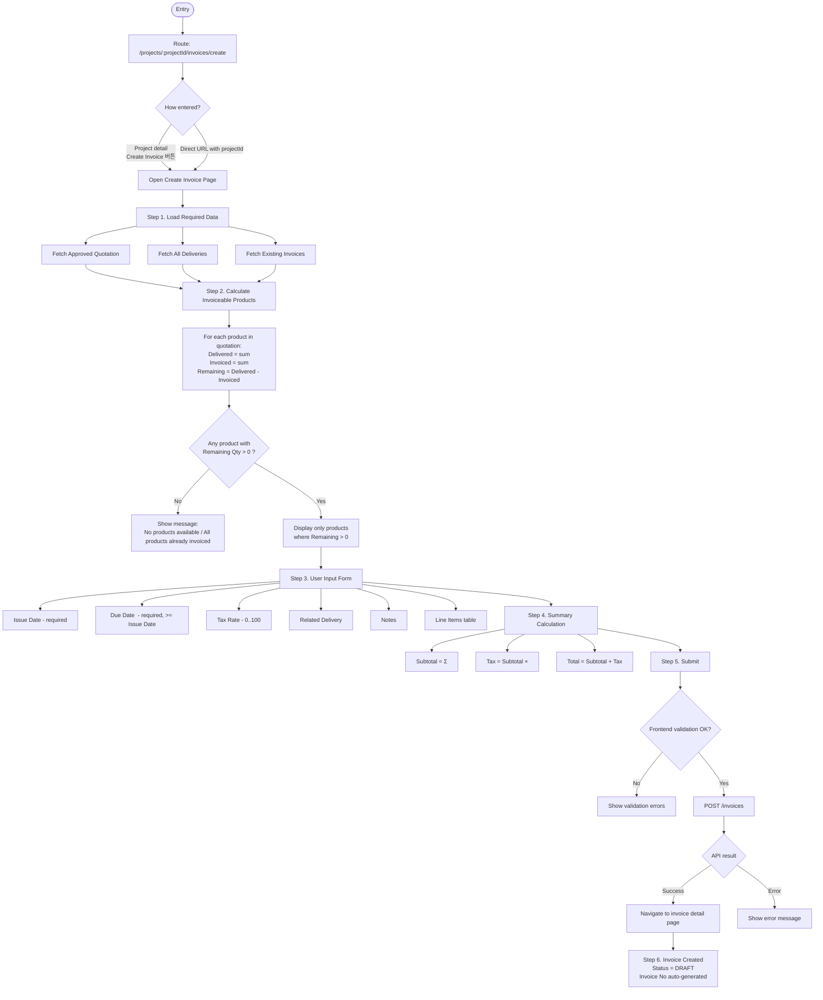

# Invoice Creation User Flow Design

## Overview

Invoice creation allows users to bill customers for products that have been delivered. The system must prevent
double-billing by tracking what has been delivered vs. what has been invoiced.

## Prerequisites

Before an invoice can be created:

1. **Project** must exist
2. **Quotation** must be APPROVED for the project
3. **Deliveries** should exist (products must be delivered before invoicing)

## User Flow



### Entry Point

**Route**: `/projects/:projectId/invoices/create`

User navigates to invoice creation from:

- Project detail page → "Create Invoice" button
- OR directly via URL with projectId

### Step 1: Load Required Data

The page fetches:

1. **Approved Quotation** for the project → source of products and unit prices
2. **All Deliveries** for the project → what has been delivered
3. **Existing Invoices** for the project → what has already been invoiced

### Step 2: Calculate Invoiceable Products

For each product in the quotation:

```
Delivered Qty = SUM of quantityDelivered from all deliveries for this product
Invoiced Qty = SUM of quantityInvoiced from all non-cancelled invoices for this product
Remaining Qty = Delivered Qty - Invoiced Qty
```

**Display only products where Remaining Qty > 0**

### Step 3: User Input Form

| Field            | Type   | Default         | Validation              |
|------------------|--------|-----------------|-------------------------|
| Issue Date       | Date   | Today           | Required                |
| Due Date         | Date   | Today + 30 days | Required, >= Issue Date |
| Tax Rate         | Number | 10 (%)          | 0-100                   |
| Related Delivery | Select | None            | Optional                |
| Notes            | Text   | Empty           | Optional                |
| **Line Items**   | Table  | From quotation  | At least 1 with qty > 0 |

#### Line Items Table

| Column             | Source     | Editable             |
|--------------------|------------|----------------------|
| Product Name       | Quotation  | No                   |
| SKU                | Quotation  | No                   |
| Unit Price         | Quotation  | No                   |
| Quotation Qty      | Quotation  | No                   |
| Delivered Qty      | Calculated | No                   |
| Already Invoiced   | Calculated | No                   |
| Remaining Qty      | Calculated | No                   |
| **Qty to Invoice** | User input | Yes (0 to Remaining) |
| Line Total         | Calculated | No                   |

### Step 4: Summary Calculation

```
Subtotal = SUM(Qty to Invoice × Unit Price) for all products
Tax Amount = Subtotal × (Tax Rate / 100)
Total = Subtotal + Tax Amount
```

### Step 5: Submit

On submit:

1. Validate all inputs
2. Call `POST /invoices` with payload
3. On success → Navigate to invoice detail page
4. On error → Show error message

### Step 6: Invoice Created

New invoice is created with:

- Status: **DRAFT**
- Invoice Number: Auto-generated (e.g., INV-2024-0001)

---

## Invoice Lifecycle

```
┌─────────┐
│  DRAFT  │ ← Initial state after creation
└────┬────┘
     │ Issue Invoice
     ▼
┌─────────┐
│ ISSUED  │
└────┬────┘
     │ Record Payment
     ▼
┌─────────────────┐     ┌────────┐
│ PARTIALLY_PAID  │────►│  PAID  │ (Full payment received)
└─────────────────┘     └────────┘

Any state except PAID can be CANCELLED
```

---

## Critical Validations

### Frontend Validations

1. At least 1 product with quantity > 0
2. Quantity per product ≤ Remaining invoiceable quantity
3. Due Date ≥ Issue Date
4. Tax Rate between 0 and 100

### Backend Validations (REQUIRED)

1. Project exists
2. User has permission (ROLE_ADMIN or ROLE_FINANCE)
3. **Prevent over-invoicing**: For each line item:
    - Fetch total delivered quantity from deliveries
    - Fetch total invoiced quantity from non-cancelled invoices
    - Validate: `quantityInvoiced <= (totalDelivered - totalAlreadyInvoiced)`

---

## API Contract

### Create Invoice Request

```typescript
POST / invoices

{
    "projectId"
:
    number,
        "deliveryId"
:
    number | null,       // Optional link to specific delivery
        "issueDate"
:
    "YYYY-MM-DD",
        "dueDate"
:
    "YYYY-MM-DD",
        "taxRate"
:
    number,                 // 0-100
        "notes"
:
    string | null,
        "lineItems"
:
    [
        {
            "productId": number,
            "productName": string,
            "productSku": string | null,
            "quantityInvoiced": number,
            "unitPrice": number
        }
    ]
}
```

### Response

```typescript
{
    "success"
:
    true,
        "data"
:
    {
        "id"
    :
        number,
            "message"
    :
        "Invoice created successfully"
    }
}
```

---

## Known Issues and Resolutions

### Issue 1: ✅ RESOLVED - Incomplete Line Item Tracking

**Problem**: `invoiceQueries.byProject()` returns `InvoiceSummary[]` without line items. Cannot calculate per-product invoiced quantities.

**Resolution**: Updated `InvoiceCreatePage.tsx` to use `useQueries` to fetch full invoice details for each non-cancelled invoice, then aggregate line items to calculate invoiced quantities per product.

### Issue 2: ⚠️ PENDING - No Backend Validation

**Problem**: Backend `InvoiceCommandService.createInvoice()` doesn't validate against delivery/invoice records.

**Impact**: Can over-invoice products, bypassing frontend validation.

**Required Fix**: Add validation in backend before creating invoice:
- For each line item, verify `quantityInvoiced <= (totalDelivered - totalAlreadyInvoiced)`

### Issue 3: ✅ RESOLVED - Delivery Auto-population

**Problem**: Selecting a delivery doesn't auto-fill quantities from that delivery.

**Resolution**: Added `useEffect` in `InvoiceCreatePage.tsx` that watches `selectedDeliveryId` and auto-populates quantities from the selected delivery's line items, capped at remaining invoiceable quantity.

---

## Test Scenarios

### Happy Path

1. Project has approved quotation with 3 products
2. Delivery created for 2 products (qty: 10, 5)
3. User creates invoice for qty: 5, 3
4. Remaining invoiceable: 5, 2
5. User creates second invoice for remaining qty

### Edge Cases

1. No deliveries exist → Show "No products available to invoice"
2. All delivered products already invoiced → Show "All products already invoiced"
3. Some products partially invoiced → Show only remaining quantities
4. Cancelled invoice → Its quantities should be "released" back to invoiceable pool

### Error Cases

1. Try to invoice more than remaining → Frontend prevents
2. Backend receives invalid quantities → Return 400 error
3. No approved quotation → Show error message
